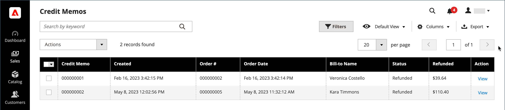

# Avisos de crédito

Um _memorando de crédito_ é um documento que mostra o valor devido pelo cliente para um reembolso total ou parcial. O valor pode ser aplicado a uma compra ou reembolsado ao cliente. Você pode imprimir um aviso de crédito para uma única ordem ou para várias ordens como um lote. Antes de imprimir um aviso de crédito, ele deve ser gerado para a ordem. A página _Avisos de Crédito_ lista os avisos de crédito que foram emitidos para clientes.

{width="700" zoomable="yes"}

## Método de reembolso

O [método de pagamento](payments.md) para o pedido determina, em certa medida, o método pelo qual você reembolsa um pedido.

Você pode reembolsar pedidos de três maneiras:

- Crédito da conta — As ordens pagas usando uma conta de crédito podem ser reembolsadas como um crédito de conta:
   -  (somente Adobe Commerce) [Crédito da Loja](../customers/store-credit-using.md)
   -  (Disponível com Adobe Commerce B2B) [Pagamento na Conta](../b2b/enable-basic-features.md#configure-payment-on-account) (método offline)
   -  (Disponível com Adobe Commerce B2B) [Crédito da Empresa](../b2b/credit-company.md)
- [Reembolso online](payments.md#online-payment-methods)—Pedidos pagos com cartão de crédito através de um gateway de pagamento, como PayPal ou Braintree, são reembolsados online através do processador de pagamento.
- [Reembolso offline](payments.md#offline-payment-methods)—Os pedidos pagos com Dinheiro na Entrega ([CQO](cash-on-delivery.md)) ou por [cheque ou ordem de pagamento](check-money-order.md) são reembolsados offline.

Você pode emitir uma restituição ou crédito de conta off-line (se ativado) para qualquer método de pagamento.

Um pedido pago por Dinheiro na Entrega ([COD](cash-on-delivery.md)) ou por [cheque ou ordem de pagamento](check-money-order.md) é reembolsado offline.

## Fluxo de trabalho de reembolso

1. **Ação de pagamento** - Se a configuração de [Ação de pagamento](credit-memo-create.md#payment-action-setting) estiver definida como `Authorize`, você deverá gerar uma fatura antes de criar um memorando de crédito - prossiga para a etapa 2. Se definido como `Authorize and Capture`, uma fatura já foi gerada — vá para a etapa 3.

1. **Gerar fatura** - [Criar uma fatura](invoices.md#create-an-invoice) para o pedido, para que você possa enviar um reembolso ao cliente por meio de um aviso de crédito.

1. **Criar memorando de crédito** - [Emitir um memorando de crédito](credit-memo-create.md) no Administrador para uma [compra de crédito](credit-memo-create.md#issue-a-refund-for-a-credit-purchase) ou um [cheque ou ordem de pagamento](credit-memo-create.md#issue-an-offline-refund-for-check-or-money-order).

## Descrições da coluna

| Coluna | Descrição |
|--- |--- |
| [!UICONTROL Select] | Marque as caixas de seleção dos itens de aviso de crédito que estarão sujeitos a uma ação ou use o controle de seleção no cabeçalho da coluna. Opções: `Select All` / `Deselect All` |
| [!UICONTROL Credit Memo] | Um identificador numérico exclusivo que é atribuído quando uma solicitação de um aviso de crédito é submetida. |
| [!UICONTROL Created] | A data e a hora em que o comprador submeteu pela primeira vez a solicitação de um aviso de crédito. |
| [!UICONTROL Order#] | ID do pedido cujos produtos estão sendo devolvidos. |
| [!UICONTROL Order Date] | A data e a hora em que o comprador colocou uma ordem. |
| [!UICONTROL Bill-to Name] | O nome da pessoa responsável pelo pagamento da ordem. |
| [!UICONTROL Status] | Indica o estado atual de uma solicitação de aviso de crédito. |
| [!UICONTROL Refunded] | O valor total reembolsado do pedido. |
| [!UICONTROL Actions] | **[!UICONTROL View]** - Abre a solicitação de um memorando de crédito e mantém um registro da negociação entre comprador e vendedor. |
| [!UICONTROL Order Status] | Indica o status do pedido. |
| [!UICONTROL Purchased From] | Indica o site, a loja e a exibição da loja em que o pedido foi feito. |
| [!UICONTROL Billing Address] | O endereço de faturamento do cliente que fez o pedido. |
| [!UICONTROL Shipping Address] | O endereço para onde o pedido deve ser enviado. |
| [!UICONTROL Customer Name] | O nome e o sobrenome do cliente que fez o pedido. |
| [!UICONTROL Email] | O endereço de email da pessoa que fez o pedido. |
| [!UICONTROL Customer Group] | O grupo de clientes ao qual o cliente está atribuído. |
| [!UICONTROL Payment Method] | O método de pagamento a ser usado para o pagamento. |
| [!UICONTROL Shipping Information] | O método a ser usado para enviar o pedido. |
| [!UICONTROL Subtotal] | O subtotal do pedido, sem remessa, manuseio e imposto. |
| [!UICONTROL Shipping & Handling] | O valor cobrado para remessa e manuseio. |
| [!UICONTROL Adjustment Refund] | O valor adicionado ao valor total reembolsado como um reembolso extra. |
| [!UICONTROL Adjustment Fee] | O valor que é subtraído do valor total reembolsado. |
| [!UICONTROL Grand Total] | O total do pedido. |

{style="table-layout:auto"}
