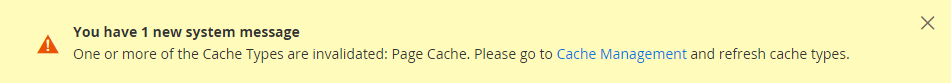

# Configuração de moeda

Antes de configurar taxas de câmbio individuais, você deve primeiro definir o escopo da [moeda base](../configuration-reference/general/currency-setup.md). Está definida como global por padrão, o que aplica a configuração da moeda base a toda a [hierarquia de armazenamento](../getting-started/websites-stores-views.md). Se você tiver uma instalação de Adobe Commerce ou Magento Open Source multissite, poderá gerenciar várias moedas base definindo o escopo para o nível do site.

Você também especifica as moedas que aceita e qual moeda deseja usar para a exibição de [preços](../catalog/catalog-price-scope.md) em sua loja. No diagrama a seguir, o escopo da moeda base é definido no nível do site, para que cada site possa ter uma moeda base diferente.

{width="600" zoomable="yes"}

## Fase 1: Escolher as moedas aceitas

1. Na barra lateral _Admin_, vá para **[!UICONTROL Stores]** > _[!UICONTROL Settings]_>**[!UICONTROL Configuration]**.

1. No canto superior esquerdo, defina **[!UICONTROL Scope]** para a exibição de loja onde a configuração se aplica.

1. No painel esquerdo, em _Geral_, escolha **[!UICONTROL Currency Setup]**.

1. Expanda  a seção **[!UICONTROL Currency Options]** e defina as seguintes opções:

   - **[!UICONTROL Base Currency]** — Defina para a moeda principal que você usa para transações online.

   - **[!UICONTROL Default Display Currency]** — Defina para a moeda que você usa para exibir preços na exibição de loja.

   - **[!UICONTROL Allowed Currencies]** — Selecione todas as moedas que você aceita como pagamento na exibição de loja. Selecione também a moeda principal.

     Para várias moedas, mantenha pressionada a tecla Ctrl (PC) ou Command (Mac) e clique em cada opção.

   {width="600" zoomable="yes"}

   Para obter uma descrição detalhada de cada uma dessas configurações, consulte [Opções de Moeda](../configuration-reference/general/currency-setup.md) no _Guia de Referência de Configuração_.

1. Quando solicitado a atualizar o cache, clique em _Fechar_ (  ) no canto superior direito da mensagem do sistema.

   Você pode [atualizar o cache](../systems/cache-management.md) mais tarde.

1. Defina o escopo da moeda base:

   - No painel esquerdo, expanda **[!UICONTROL Catalog]** e escolha **[!UICONTROL Catalog]** abaixo de.

   - Role para baixo e expanda  na seção **[!UICONTROL Price]**. (Esta seção só aparecerá se o escopo estiver definido como **[!UICONTROL Store View:]** _Configuração padrão_.)

   - Defina **[!UICONTROL Catalog Price Scope]** como `Global` ou `Website`.

   {width="600" zoomable="yes"}

## Etapa 2: configurar a conexão de importação

1. Role até a parte superior da página.

1. No painel esquerdo, expanda **[!UICONTROL General]** e escolha **[!UICONTROL Currency Setup]**.

1. Configure sua conexão com o serviço de moeda:

   Há três opções de serviço: _[!UICONTROL Fixer.io (legacy)]_,_[!UICONTROL Fixer Api (APILayer)]_ e _[!UICONTROL Currency Converter API]_

   >[!IMPORTANT]
   >
   >A partir da versão 2.4.6, o serviço [[!DNL Fixer.io]](https://fixer.io/) será substituído pelo serviço [[!DNL Fixer API] (APILayer)](https://apilayer.com/marketplace/fixer-api). É altamente recomendável usar uma conta APILayer em vez de uma conta [!DNL Fixer.io] obsoleta.

   - _Para se conectar ao [serviço fixer.io](https://fixer.io/):_

      - Expandir  a seção **[!UICONTROL Fixer.io]**.

      - Insira seu fixer.io **[!UICONTROL API key]**.

      - Para **[!UICONTROL Connection Timeout in Seconds]**, insira o número de segundos de inatividade permitidos antes que a conexão expire.

     {width="600" zoomable="yes"}

   - _Para se conectar ao [[!DNL Fixer Api (APILayer)] serviço](https://apilayer.com/):_

      - Expandir  a seção **[!UICONTROL Fixer Api (APILayer)]**.

      - Insira seu [!DNL APILayer] **[!UICONTROL API key]**.

      - Para **[!UICONTROL Connection Timeout in Seconds]**, insira o número de segundos de inatividade permitidos antes que a conexão expire.

     {width="600" zoomable="yes"}

   - _Para se conectar ao [[!DNL Currency Convertor API] serviço](https://free.currencyconverterapi.com/):_

      - Expandir  a seção **[!UICONTROL Currency Convertor API]**.

      - Insira seu Conversor de Moeda **[!UICONTROL API key]**.

      - Para **[!UICONTROL Connection Timeout in Seconds]**, insira o número de segundos de inatividade permitidos antes que a conexão expire.

     {width="600" zoomable="yes"}

## Etapa 3: definir as configurações de importação programadas

1. Continuando com a Configuração de Moeda, expanda  a seção **[!UICONTROL Scheduled Import Settings]**.

   {width="600" zoomable="yes"}

1. Para atualizar automaticamente as taxas de câmbio, defina **[!UICONTROL Enabled]** como `Yes`.

1. Defina as opções de atualização:

   - **[!UICONTROL Service]** — Definido para o provedor de taxa. O valor padrão é `Fixer.io (legacy)`.

   - **[!UICONTROL Start Time]** — Defina como a hora, os minutos e o segundo que as taxas serão atualizadas de acordo com o agendamento.

   - **[!UICONTROL Frequency]** — Para determinar com que frequência as taxas são atualizadas, defina como uma das seguintes opções:

      - `Daily`
      - `Weekly`
      - `Monthly`

   - **[!UICONTROL Error Email Recipient]** — Digite o endereço de email da pessoa que receberá a notificação por email se ocorrer um erro durante o processo de importação.

     Para inserir vários endereços de email, separe cada um com vírgula.

   - **[!UICONTROL Error Email Sender]** — Defina para o [contato de armazenamento](../getting-started/store-details.md#store-email-addresses) que aparece como remetente da notificação de erro.

   - **[!UICONTROL Error Email Template]** — Defina para o modelo de email usado para a notificação de erro.

1. Quando terminar, clique em **[!UICONTROL Save Config]**.

1. Quando solicitado a atualizar o cache, clique no link **[!UICONTROL Cache Management]** e atualize o cache inválido.

   {width="600" zoomable="yes"}

## Etapa 4: Atualizar as taxas de câmbio

As taxas de câmbio devem ser atualizadas com os valores atuais antes de entrarem em vigor. [Atualize as taxas](currency-update.md) manualmente ou para importar as taxas automaticamente.

## Etapa 5: Personalizar símbolos de moeda (opcional)

O Gerenciamento de Símbolos de Moeda oferece a capacidade de personalizar o símbolo associado a cada moeda que é aceita como pagamento em sua loja.

{width="600" zoomable="yes"}

1. Na barra lateral _Admin_, vá para **[!UICONTROL Stores]** > _[!UICONTROL Currency]_>**[!UICONTROL Currency Symbols]**.

   Cada moeda habilitada para sua loja aparece na lista _[!UICONTROL Currency]_.

1. Altere as configurações na lista conforme necessário:

   - Insira um símbolo personalizado para cada moeda que deseja usar ou marque a caixa de seleção **[!UICONTROL Use Standard]** para cada moeda.

   - Para substituir o símbolo padrão, desmarque a caixa de seleção _[!UICONTROL Use Standard]_e insira o símbolo que deseja usar.

   >[!NOTE]
   >
   >Não é possível alterar o alinhamento do símbolo de moeda da esquerda para a direita.

1. Quando terminar, clique em **[!UICONTROL Save Currency Symbols]**.

1. Quando solicitado a atualizar o cache, clique no link **[!UICONTROL Cache Management]** e atualize qualquer cache inválido.
