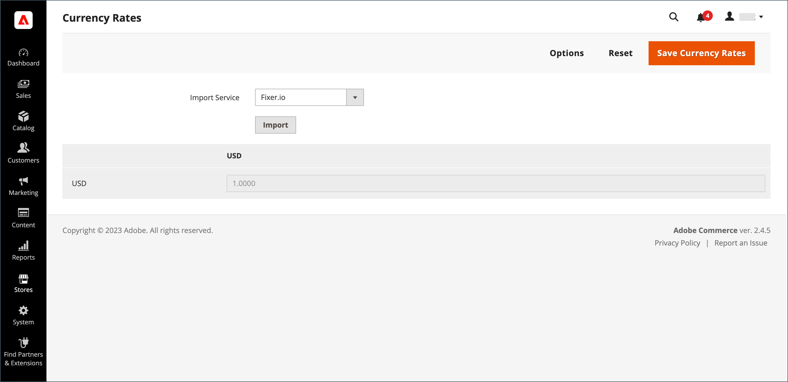

# Atualizar taxas de câmbio

As taxas de moeda podem ser definidas manualmente ou importadas para o armazenamento. Para garantir que sua loja tenha as taxas mais atuais, você pode configurar as taxas de moeda para serem atualizadas automaticamente de acordo com o agendamento.

Antes de importar taxas de câmbio, conclua a [configuração da taxa de câmbio](currency-configuration.md) para especificar as moedas que você aceita e para estabelecer a conexão e a programação de importação.

{width="600" zoomable="yes"}

## Atualizar uma taxa de câmbio manualmente

1. No _Admin_ barra lateral, vá para **[!UICONTROL Stores]** > _[!UICONTROL Currency]_>**[!UICONTROL Currency Rates]**.

1. Clique na taxa que você deseja alterar e insira o novo valor para cada moeda compatível.

1. Quando terminar, clique em **[!UICONTROL Save Currency Rates]**.

## Importar taxas de moeda

1. No _Admin_ barra lateral, vá para **[!UICONTROL Stores]** > _[!UICONTROL Currency]_>**[!UICONTROL Currency Rates]**.

1. Definir **[!UICONTROL Import Service]** ao provedor de taxa de câmbio.

   O provedor padrão é `fixer.io (legacy)`.

   >[!IMPORTANT]
   >
   >A partir da versão 2.4.6, a variável [[!DNL Fixer.io]](https://fixer.io/) serviço está obsoleto e foi substituído pelo [[!DNL Fixer API] (APILayer)](https://apilayer.com/marketplace/fixer-api) serviço. É altamente recomendável usar uma conta APILayer em vez de uma conta obsoleta [!DNL Fixer.io] conta.

1. Clique em **[!UICONTROL Import]**.

   As taxas atualizadas aparecem no _[!UICONTROL Currency Rates]_lista. Se as taxas foram alteradas desde a última atualização, a taxa antiga aparece abaixo para referência.

1. Quando terminar, clique em **[!UICONTROL Save Currency Rates]**.

1. Quando for solicitado que você atualize o cache, clique na guia **[!UICONTROL Cache Management]** vincular e atualizar o cache inválido.

   {width="600" zoomable="yes"}

## Importar taxas de moeda de acordo com a programação

1. Verifique se [Cron](../systems/cron.md) está habilitado para sua loja.

1. Para especificar as moedas que você aceita e estabelecer a conexão e a programação de importação, complete as [Configuração da taxa de moeda](currency-configuration.md).

1. Para verificar se as taxas foram importadas de acordo com a programação, verifique _[!UICONTROL Currency Rates]_lista.

1. Aguarde o período de tempo da configuração de frequência estabelecida para o agendamento e verifique as taxas novamente.
