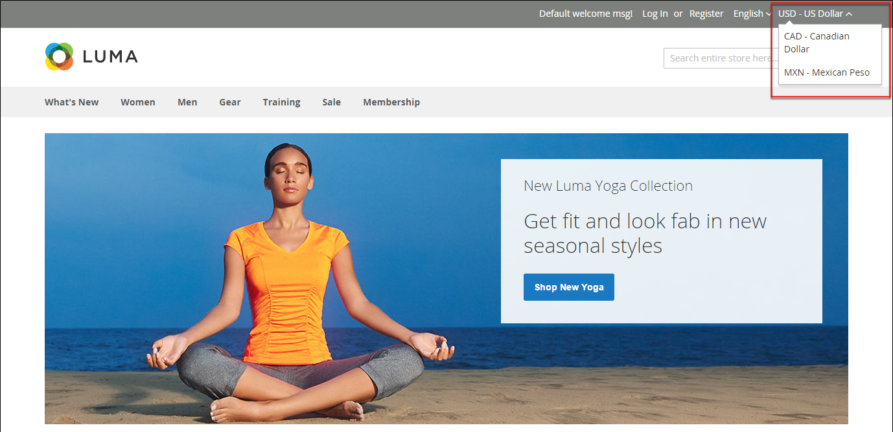

# Moeda

O Adobe Commerce oferece a capacidade de aceitar moedas de mais de 200 países ao redor do mundo. Se o armazenamento suportar várias moedas, um _seletor de moedas_ aparecerá no cabeçalho depois que as taxas de moeda forem [atualizadas](currency-update.md).

>[!NOTE]
>
>Se você aceitar o pagamento em várias moedas, certifique-se de monitorar as configurações de taxa de câmbio, pois qualquer flutuação pode afetar sua margem de lucro.

Os símbolos de moeda são exibidos nos preços dos produtos e nos documentos de venda, como pedidos e faturas. Você pode personalizar os símbolos de moeda conforme necessário e também definir a exibição do preço separadamente para cada loja ou exibição.

{width="700" zoomable="yes"}
