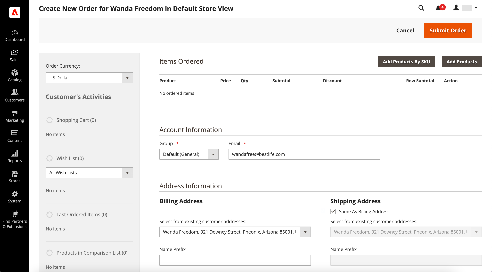
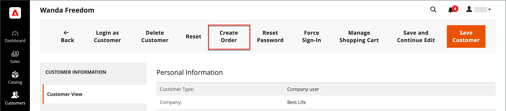

# Criar um pedido

Para clientes registrados que precisam de assistência, você pode criar um pedido inteiro diretamente do administrador. A variável _[!UICONTROL Create New Order]_O formulário inclui todas as informações necessárias para o processo normal de finalização, com resumos de atividades no painel de contas do cliente.

{width="700" zoomable="yes"}

## Etapa 1: criar um pedido

1. No _Admin_ barra lateral, clique **[!UICONTROL Customers]**.

1. Encontre o cliente na grade.

1. No _Ação_ clique em **[!UICONTROL Edit]**.

1. No cabeçalho do espaço de trabalho, clique em **[!UICONTROL Create Order]**.

   {width="700" zoomable="yes"}

   Você também pode criar um pedido no [Solicitar espaço de trabalho](orders.md#orders-workspace) clicando em **[!UICONTROL Create New Order]**.

## Etapa 2: adicionar produtos

Se a loja tiver várias exibições, escolha a exibição da loja onde o pedido será feito.

### Adicionar produtos da [!UICONTROL Customer's Activities] barra lateral

Você pode transferir itens para o carrinho da lista de desejos de um cliente ou de qualquer item exibido, comparado ou solicitado recentemente.

1. Expandir  uma das seguintes seções:

   - **[!UICONTROL Wish List]**
   - **[!UICONTROL Last Ordered Items]**
   - **[!UICONTROL Products in Comparison List]**
   - **[!UICONTROL Recently Compared Products]**
   - **[!UICONTROL Recently Viewed Products]**

1. Marque a caixa de seleção de cada produto no painel esquerdo.

1. Role para baixo e clique em **[!UICONTROL Update Changes]**.

   O item aparece no formulário de pedido.

   {width="600" zoomable="yes"}

### Adicionar produtos do catálogo

1. Clique em **[!UICONTROL Add Products]**.

   {width="600" zoomable="yes"}

1. Na grade, marque a caixa de seleção de cada produto a ser adicionado ao carrinho e insira o **[!UICONTROL Qty]** a ser comprados.

   {width="600" zoomable="yes"}

   >[!NOTE]
   >
   >A grade de seleção de produtos sempre mostra preços base regulares para produtos, sem descontos e quaisquer regras de preço de carrinho ou grupo aplicadas. O preço do produto final é calculado somente quando o produto é adicionado a um pedido/carrinho.

1. Configure as opções de produto disponíveis:

   - Clique em **[!UICONTROL Configure]**.

   - Preencha as opções conforme necessário.

   - Clique em **[!UICONTROL OK]**.

   - Clique em **[!UICONTROL Add Selected Product(s) to Order]** para atualizar o carrinho.

1. Se um produto estiver configurado para [opções de presente](../catalog/product-gift-options.md), defina as opções conforme necessário.

1. Sobrepor o preço de um item, se necessário:

   - Selecione o **[!UICONTROL Custom Price]** e insira o novo preço na caixa abaixo.

   - Para atualizar os totais do carrinho, clique em **[!UICONTROL Update Items and Quantities]**.

   {width="600" zoomable="yes"}

1. Preencha as seguintes seções conforme necessário para o pedido:

   - [!UICONTROL Order Currency]
   - [!UICONTROL Apply Coupon Codes / Gift Card Code]
   - [!UICONTROL Payment Method]
   - [!UICONTROL Shipping Method]
   - [!UICONTROL Order Comments]

>[!NOTE]
>
>Consulte a [Guia dos serviços de pagamento](https://experienceleague.adobe.com/docs/commerce-merchant-services/payment-services/create-order.html) para obter mais informações sobre os métodos de pagamento compatíveis com essa funcionalidade, quando a extensão Serviços de Pagamento estiver instalada e configurada.

## Etapa 3: enviar o pedido

Clique em **[!UICONTROL Submit Order]**.

Uma confirmação será enviada ao cliente, que poderá ver os detalhes do pedido em sua conta.
