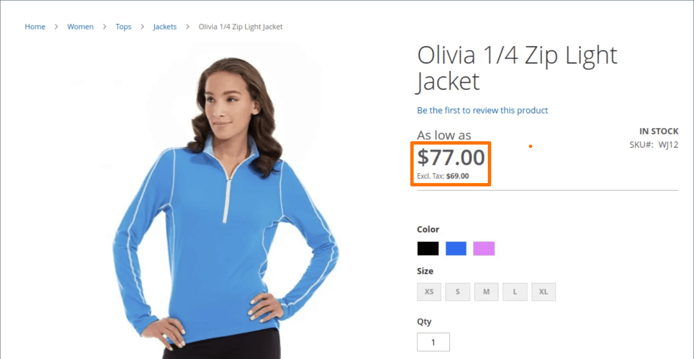
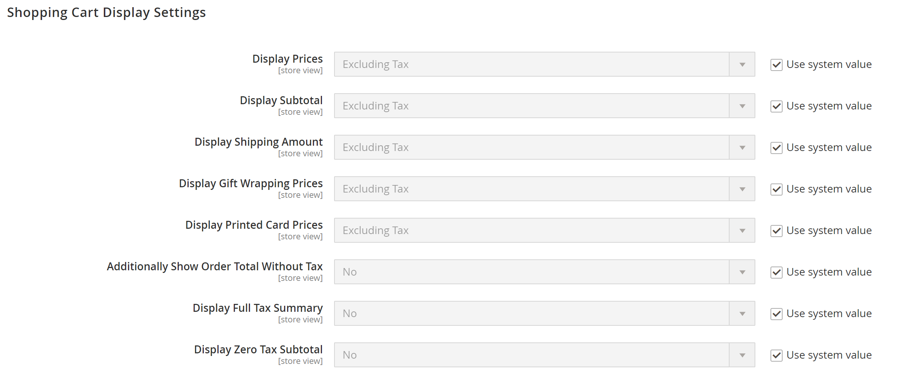

# Configurações de exibição de preço

As configurações de exibição de preço determinam se os preços do produto e do envio incluem ou excluem imposto, ou mostram duas versões do preço: uma com e outra sem imposto.

Se o preço do produto incluir imposto, o imposto será exibido somente se houver uma regra de imposto que corresponda à origem do imposto ou se um endereço do cliente corresponder à regra de imposto. Os eventos que podem acionar uma correspondência incluem quando um cliente cria uma conta, faz logon ou gera uma estimativa de imposto e remessa do carrinho de compras.

>[!IMPORTANT]
>
>Mostrar preços que incluem e excluem imposto pode ser confuso para o cliente. Para evitar o disparo de uma mensagem de aviso, consulte as [diretrizes](international-tax-guidelines.md) para o seu país e as [configurações recomendadas](taxes.md#warning-messages) para evitar mensagens de aviso.

{width="600" zoomable="yes"}

Para obter uma descrição detalhada de cada uma dessas configurações, consulte [Configurações de Preço de Exibição](../configuration-reference/sales/tax.md#price-display-settings) no _Guia de Referência de Configuração_.

## Definir configurações de exibição de preço

Quando a configuração do cálculo de impostos, taxas e classes é concluída, os impostos são calculados de acordo com essas configurações. No entanto, a exibição de impostos no catálogo, carrinho de compras, pedidos, faturas e avisos de crédito também deve ser configurada para oferecer suporte à experiência do cliente na loja.

É uma prática recomendada exibir preços com os impostos associados (incluindo impostos ou ambos, incluindo impostos e excluindo impostos) para que os clientes saibam como esses cálculos são aplicados antes de fazer um pedido.

### Etapa 1: definir configurações de exibição de preços de catálogo

1. Na barra lateral _Admin_, vá para **[!UICONTROL Stores]** > _[!UICONTROL Settings]_>**[!UICONTROL Configuration]**.

1. No painel esquerdo, expanda **[!UICONTROL Sales]** e escolha **[!UICONTROL Tax]**.

1. Expandir  a seção **[!UICONTROL Price Display Settings]**.

1. Para **[!UICONTROL Display Product Prices in Catalog]**, escolha uma das seguintes opções:

   - `Excluding Tax`
   - `Including Tax`
   - `Including and Excluding Tax`

   >[!NOTE]
   >
   >Se você definir esta opção como `Including Tax`, o imposto aparecerá somente se houver uma regra de imposto que corresponda à origem do imposto ou se houver um endereço de cliente que corresponda à regra de imposto. Os eventos que podem acionar uma correspondência incluem a criação da conta do cliente, o logon ou o uso da ferramenta de estimativa de Imposto e Remessa no carrinho de compras.

1. Para **[!UICONTROL Display Shipping Prices]**, escolha uma das seguintes opções:

   - `Excluding Tax`
   - `Including Tax`
   - `Including and Excluding Tax`

Se você optar por exibir ambos os preços (com e sem imposto), a loja terá a seguinte aparência:

{width="700" zoomable="yes"}

### Etapa 2: definir configurações de exibição do carrinho de compras

1. Expandir  a seção **[!UICONTROL Shopping Cart Display Settings]**.

   {width="600" zoomable="yes"}

1. Para **[!UICONTROL Display Prices]**, escolha uma das seguintes opções:

   - `Excluding Tax`
   - `Including Tax`
   - `Including and Excluding Tax`

1. Para **[!UICONTROL Display Subtotal]**, escolha uma das seguintes opções:

   - `Excluding Tax`
   - `Including Tax`
   - `Including and Excluding Tax`

1. Para **[!UICONTROL Display Shipping Amount]**, escolha uma das seguintes opções:

   - `Excluding Tax`
   - `Including Tax`
   - `Including and Excluding Tax`

1.  (somente Adobe Commerce) Para **[!UICONTROL Display Gift Wrapping Prices]**, escolha uma das seguintes opções:

   - `Excluding Tax`
   - `Including Tax`
   - `Including and Excluding Tax`

1.  (somente Adobe Commerce) Para **[!UICONTROL Display Printed Card Prices]**, escolha uma das seguintes opções:

   - `Excluding Tax`
   - `Including Tax`
   - `Including and Excluding Tax`

1. Para cada uma dessas opções restantes, alterne para `Yes` ou `No` de acordo com sua preferência:

   - **[!UICONTROL Include Tax in Order Total]**
   - **[!UICONTROL Display Full Tax Summary]**
   - **[!UICONTROL Display Zero Tax Subtotal]**

### Etapa 3: definir configurações de exibição de ordem, fatura e aviso de crédito

1. Expandir  a seção **[!UICONTROL Orders, Invoices, Credit Memos Display Settings]**.

   {width="600" zoomable="yes"}

1. Para **[!UICONTROL Display Prices]**, escolha uma das seguintes opções:

   - `Excluding Tax`
   - `Including Tax`
   - `Including and Excluding Tax`

1. Para **[!UICONTROL Display Subtotal]**, escolha uma das seguintes opções:

   - `Excluding Tax`
   - `Including Tax`
   - `Including and Excluding Tax`

1. Para **[!UICONTROL Display Shipping Amount]**, escolha uma das seguintes opções:

   - `Excluding Tax`
   - `Including Tax`
   - `Including and Excluding Tax`

1.  (somente Adobe Commerce) Para **[!UICONTROL Display Gift Wrapping Prices]**, escolha uma das seguintes opções:

   - `Excluding Tax`
   - `Including Tax`
   - `Including and Excluding Tax`

1.  (somente Adobe Commerce) Para **[!UICONTROL Display Printed Card Prices]**, escolha uma das seguintes opções:

   - `Excluding Tax`
   - `Including Tax`
   - `Including and Excluding Tax`

1. Para cada uma dessas opções restantes, alterne para `Yes` ou `No` de acordo com sua preferência:

   - **[!UICONTROL Include Tax in Order Total]**
   - **[!UICONTROL Display Full Tax Summary]**
   - **[!UICONTROL Display Zero Tax Subtotal]**

1. Quando terminar, clique em **[!UICONTROL Save Config]**.
