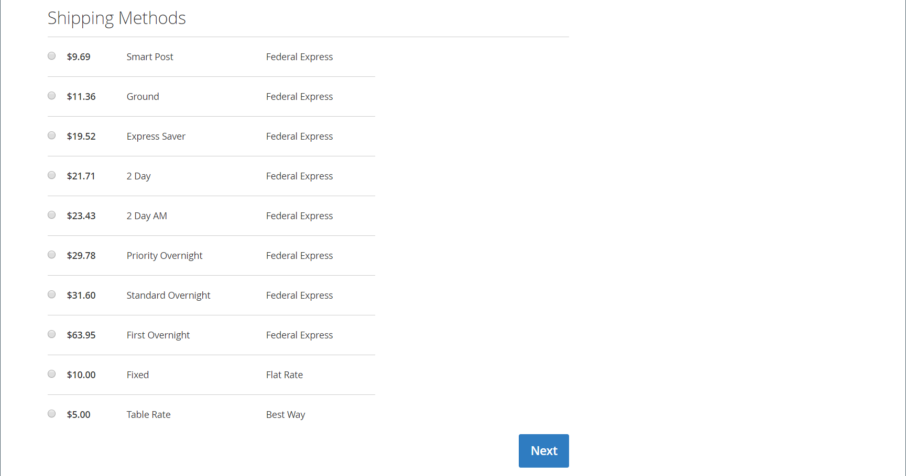

# FedEx

A FedEx é uma das maiores empresas de serviços de transporte marítimo do mundo, fornecendo serviços de transporte aéreo, de carga e terrestre com vários níveis de prioridade.

{width="700" zoomable="yes"}

>[!NOTE]
>
>A FedEx pode usar [peso dimensional](carriers.md#dimensional-weight) para determinar algumas taxas de envio. No entanto, o Adobe Commerce e o Magento Open Source suportam apenas o cálculo de custos de envio baseado em peso.

## Etapa 1: Registrar-se para produção dos serviços Web FedEx

Uma [conta de comerciante da FedEx][1] e o registro para o Acesso de Produção dos Serviços Web da FedEx são necessários. Depois de criar uma conta FedEx, leia a página de informações da conta de produção e clique no link _Obter Chave de Produção_ na parte inferior da página para se registrar e obter uma chave.

>[!NOTE]
>
>Certifique-se de copiar ou anotar a chave de autenticação. É necessário configurar o FedEx nas configurações de envio do Commerce.

## Etapa 2: Ativar o FedEx para sua loja

1. Na barra lateral _Admin_, vá para **[!UICONTROL Stores]** > _[!UICONTROL Settings]_>**[!UICONTROL Configuration]**.

1. No painel esquerdo, expanda **[!UICONTROL Sales]** e escolha **[!UICONTROL Delivery Methods]**.

1. Expandir  a seção **[!UICONTROL FedEx]**.

1. Defina **[!UICONTROL Enabled for Checkout]** como `Yes`.

1. Para **[!UICONTROL Title]**, insira um título que identifique o método de envio FedEx durante o check-out.

1. Insira as seguintes informações da sua conta FedEx:

   - **[!UICONTROL Account ID]**
   - **[!UICONTROL Api Key]**
   - **[!UICONTROL Secret Key]**

1. Se você configurou uma sandbox FedEx e deseja trabalhar no ambiente de teste, defina **[!UICONTROL Sandbox Mode]** como `Yes`.

   >[!NOTE]
   >
   >Lembre-se de definir o Modo Sandbox como `No` quando estiver pronto para oferecer o FedEx como um método de envio aos seus clientes.

   {width="600" zoomable="yes"}

## Etapa 3: Descrição do pacote e taxas de manuseio

1. Defina **[!UICONTROL Pickup Type]** para o método de retirada usado para remessas.

   - `DropOff at Fedex Location` - (Padrão) Indica que você entrega remessas em sua estação FedEx local.
   - `Contact Fedex to Schedule` - Indica que você contatou o FedEx para solicitar uma retirada.
   - `Use Scheduled Pickup` - Indica que a remessa foi retirada como parte de uma retirada regular agendada.
   - `On Call` - Indica que a coleta está agendada ao chamar FedEx.
   - `Package Return Program` - Indica que a remessa foi recebida pelo Programa de Devoluções de Pacotes Terrestres do FedEx.
   - `Regular Stop` - Indica que a remessa foi retirada na programação de coleta regular.
   - `Tag` - Indica que a retirada da remessa é específica para uma solicitação de retirada de etiqueta expressa ou de chamada em terra. Isso é aplicável somente para uma etiqueta de remessa de devolução.

1. Para **[!UICONTROL Packages Request Type]**, selecione o tipo de solicitação que melhor descreve sua preferência ao dividir um pedido em várias remessas:

   - `Divide to equal weight (one request)`
   - `Use origin weight (few requests)`

1. Para **[!UICONTROL Packaging]**, selecione o tipo de embalagem de FedEx que você normalmente usa para enviar produtos da sua loja.

1. Defina **[!UICONTROL Weight Unit]** para a unidade de medida usada na sua localidade.

   - `Pounds`
   - `Kilograms`

1. Insira o **[!UICONTROL Maximum Package Weight]** permitido para remessas FedEx.

   O peso máximo padrão do FedEx é de 150 lb. Consulte sua transportadora para obter mais informações. O valor padrão é recomendado, a menos que você tenha feito acordos especiais com o FedEx. Consulte [Peso dimensional](carriers.md#dimensional-weight) para obter mais informações.

   {width="600" zoomable="yes"}

1. Configure as opções de taxa de manuseio de acordo com suas necessidades.

   A taxa de tratamento é opcional e não é visível durante o check-out. Se quiser incluir uma taxa de manuseio, faça o seguinte:

   - Conjunto **[!UICONTROL Calculate Handling Fee]**:

      - `Fixed Fee`
      - `Percentage`

   - Para **[!UICONTROL Handling Applied]**, escolha um dos seguintes métodos para gerenciar taxas de manuseio:

      - `Per Order`
      - `Per Package`

   - Insira o **[!UICONTROL Handling Fee]** como um valor de `fixed` ou `percentage`, dependendo do método de cálculo.

1. Defina **[!UICONTROL Residential Delivery]** como um dos seguintes, dependendo se você vende B2C (Business-to-Consumer) ou B2B (Business-to-Business).

   - `Yes` - Para entregas B2C residenciais.
   - `No` - Para entregas B2B residenciais.

   {width="600" zoomable="yes"}

## Etapa 4: Métodos permitidos e países aplicáveis

1. Defina **[!UICONTROL Allowed Methods]** para cada método de remessa que você deseja oferecer.

   Ao escolher métodos, considere sua conta FedEx, a frequência e o tamanho de suas remessas e se você permitir remessas internacionais. Você pode oferecer quantos métodos quiser, como:

   - A Europa é a primeira prioridade
   - Opções de dia de entrega: Frete de 1 dia, Frete de 2 dias, 2 dias, AM de 2 dias, Frete de 3 dias
   - Opções domésticas - Economizador expresso, terra, primeiro, durante a noite, entrega em casa, padrão durante a noite
   - Opções internacionais-Economia Internacional, Intl Economia Frete, Internacional Primeiro, Terreno Internacional, Internacional, Prioridade Intl
   - Opções de prioridade - Frete, Prioridade noite
   - Smart Post-If que oferece o método Smart Post (insira a **ID do Hub**)
   - Opções de frete - Frete, Frete Nacional

1. Se você deseja fornecer uma opção de [Envio gratuito](shipping-free.md) por meio do FedEx, defina as opções de envio gratuito.

   - Defina **[!UICONTROL Free Method]** com o método que deseja usar para envio gratuito. Se você não quiser oferecer frete grátis por meio do FedEx, escolha `None`.

   - Para exigir um valor de pedido mínimo que qualifique um pedido para envio gratuito com FedEx, defina **[!UICONTROL Enable Free Shipping Threshold]** como `Enable`. Em seguida, insira o valor mínimo em **[!UICONTROL Free Shipping Amount Threshold]**.

   Essa configuração é semelhante à do método de envio gratuito padrão, mas é exibida na seção FedEx durante a finalização da compra, para que os clientes saibam qual método é usado para seu pedido.

1. Se necessário, altere o **[!UICONTROL Displayed Error Message]**.

   Essa caixa de texto é predefinida com uma mensagem padrão, mas você pode inserir uma mensagem diferente que deseja exibir se o FedEx não estiver disponível.

   {width="600" zoomable="yes"}

1. Conjunto **[!UICONTROL Ship to Applicable Countries]**:

   - `All Allowed Countries` - Clientes de todos os [países](../getting-started/store-details.md#country-options) especificados na sua configuração de loja podem usar este método de entrega.

   - `Specific Countries` - Ao escolher essa opção, a lista _Remeter para Países Específicos_ é exibida. Selecione cada país na lista onde esse método de entrega pode ser usado.

1. Se quiser manter um log de todas as comunicações entre seu armazenamento e o sistema FedEx, defina **[!UICONTROL Debug]** como `Yes`.

1. Conjunto **[!UICONTROL Show Method if Not Applicable]**:

   - `Yes` - Mostra todos os métodos de envio FedEx para os clientes, independentemente de sua disponibilidade.
   - `No` - Mostra apenas os métodos de envio FedEx que se aplicam ao pedido.

1. Para **[!UICONTROL Sort Order]**, insira um número para determinar a sequência em que o FedEx aparece quando listado com outros métodos de entrega durante o check-out.

   `0` = primeiro, `1` = segundo, `2` = terceiro e assim por diante.

1. Clique em **[!UICONTROL Save Config]**.

   {width="600" zoomable="yes"}

>[!NOTE]
>
>A Commerce sempre declara o preço total do pedido para a FedEx ao calcular as despesas de envio. Esse comportamento não pode ser alterado.

[1]: https://www.fedex.com/login/web/jsp/contactInfo1.jsp
