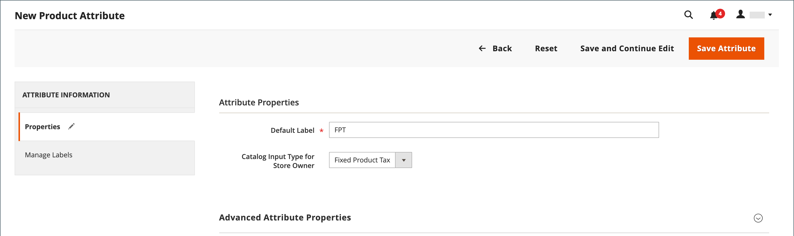

# Imposto fixo sobre o produto (FPT)

Algumas jurisdições de imposto têm um imposto fixo que deve ser adicionado a determinados tipos de produtos. Você pode configurar um _imposto fixo sobre o produto_ (FPT) conforme necessário para os cálculos de imposto da loja. Em alguns países, a FPT pode ser usada para criar um imposto sobre resíduos de equipamentos elétricos e eletrônicos (WEEE). Este imposto é também conhecido como _imposto ecológico_ ou _imposto eco_ e é recolhida em certos tipos de equipamentos eletrônicos para compensar o custo da reciclagem. É uma quantidade fixa, em vez de uma porcentagem do preço do produto.

Impostos fixos do produto se aplicam no nível do item, com base no produto. Em algumas jurisdições, esse imposto está sujeito a um cálculo de imposto de % extra. Sua jurisdição de imposto também pode ter regras sobre como o preço do produto aparece para os clientes, com ou sem imposto. Compreenda as regras e defina as opções de exibição do FPT de acordo.

Tenha cuidado ao cotar os preços da FPT no email, pois a diferença de preço pode afetar a confiança do cliente em seus pedidos. Por exemplo, se você exibir os preços de Revisão da Ordem sem mostrar FPT, os clientes que compram itens com FPT associado verão um total que inclui a quantia de imposto FPT, mas sem uma divisão discriminada. A diferença de preço pode levar alguns clientes a abandonar seus carrinhos porque o total difere do valor esperado.

## Preços de exibição do FPT

| FPT | Exibir configuração e cálculo | |
|--- |--- |---|
| Não Tributado | **[!UICONTROL Excluding FPT]** | O FPT aparece como uma linha separada no carrinho e o valor é usado nos cálculos de imposto apropriados. |
| | **[!UICONTROL Including FPT]** | O FPT é adicionado ao preço base de um item, mas não é incluído nos cálculos baseados em regra de imposto. |
| | **[!UICONTROL Excluding FPT, FPT Description, Final Price]** | Os preços aparecem sem a quantia ou descrição FPT. O FPT não está incluído nos cálculos baseados em regras de imposto. |
| Tributado | **[!UICONTROL Excluding FPT]** | O FPT aparece como uma linha separada no carrinho e o valor é usado nos cálculos de imposto apropriados. |
| | **[!UICONTROL Including FPT]** | FPT é incluído no preço de um item, e nenhuma alteração nos cálculos de imposto é necessária. |
| | **[!UICONTROL Excluding FPT, FPT Description, Final Price]** | Os preços aparecem sem a quantia ou descrição do FPT. No entanto, o FPT é incluído nos cálculos baseados em regras de imposto. |

{style="table-layout:auto"}

## Configurar FPT

O imposto fixo do produto (FPT) [tipo de entrada](../catalog/attributes-input-types.md) cria uma seção de campos para gerenciar impostos para cada região.

As instruções a seguir mostram como configurar um imposto de produto fixo para sua loja, usando &quot;imposto ecológico&quot; como exemplo. Após definir o escopo do imposto e os países e estados onde o imposto se aplica, e dependendo das opções escolhidas, os campos de entrada podem mudar de acordo com os requisitos locais. Para saber mais, consulte [Criar atributos de produto](../catalog/attribute-product-create.md).

### Etapa 1: Ativar imposto fixo sobre o produto

1. No _Admin_ barra lateral, vá para **[!UICONTROL Stores]** > _[!UICONTROL Settings]_>**[!UICONTROL Configuration]**.

1. No painel esquerdo, expanda **[!UICONTROL Sales]** e escolha **[!UICONTROL Tax]**.

1. Expandir  o **[!UICONTROL Fixed Product Taxes]** seção.

1. Definir **[!UICONTROL Enable FPT]** para `Yes`.

1. Para determinar como os impostos fixos do produto são usados nos preços de armazenamento, escolha a configuração FPT para cada um dos seguintes locais de exibição de preço:

   - **[!UICONTROL Display Prices in Product Lists]**
   - **[!UICONTROL Display Prices on Product View Page]**
   - **[!UICONTROL Display Prices in Sales Modules]**
   - **[!UICONTROL Display Prices in Emails]**

   Opções (as mesmas para cada uma):

   - `Including FPT Only`
   - `Including FPT and FPT description`
   - `Excluding FPT. Including FPT description and final price`
   - `Excluding FPT`

1. Definir **[!UICONTROL Apply Tax to FPT]** conforme necessário.

1. Definir **[!UICONTROL Include FPT in Subtotal]** conforme necessário.

   {width="600" zoomable="yes"}

   Para obter uma descrição detalhada de cada uma dessas configurações, consulte [Impostos Fixos sobre Produtos](../configuration-reference/sales/tax.md#fixed-product-taxes) no _Guia de referência de configuração_.

1. Quando terminar, clique em **[!UICONTROL Save Config]**.

### Etapa 2: Criar um atributo FPT

1. No _Admin_ barra lateral, vá para **[!UICONTROL Stores]** > _[!UICONTROL Attributes]_>**[!UICONTROL Product]**.

1. No canto superior direito, clique em **[!UICONTROL Add New Attribute]** e faça o seguinte:

   - Para **[!UICONTROL Default Label]**, insira um rótulo que identifique o atributo.

   - Definir **[!UICONTROL Catalog Input for Store Owner]** para `Fixed Product Tax`.

   {width="600" zoomable="yes"}

1. Expandir  o **[!UICONTROL Advanced Attribute Properties]** e defina as opções de propriedade:

   - **[!UICONTROL Attribute Code]** - Insira um identificador exclusivo em minúsculas, sem espaços ou caracteres especiais. O comprimento máximo é de 30 caracteres. É possível deixar o campo em branco para o texto do campo Rótulo padrão.

   - **[!UICONTROL Add to Column Options]** - Se quiser que o campo FPT apareça no campo [Lista de produtos](../catalog/products-list.md), defina como `Yes`.

   - **[!UICONTROL Use in Filter Options]** - Se quiser ser capaz de [filtro](../getting-started/admin-workspace.md) produtos na grade com base no valor do campo FPT, definido como `Yes`.

   {width="600" zoomable="yes"}

1. (Opcional) No painel esquerdo, escolha **[!UICONTROL Manage Labels]** e insira um rótulo para usar em vez do rótulo padrão para cada visualização de loja.

   {width="600" zoomable="yes"}

1. Quando terminar, clique em **[!UICONTROL Save Attribute]**.

1. Quando solicitado, atualize a [cache](../systems/cache-management.md).

### Etapa 3: Adicionar o atributo FPT a um conjunto de atributos

1. No _Admin_ barra lateral, vá para **[!UICONTROL Stores]** > _[!UICONTROL Attributes]_>**[!UICONTROL Attribute Set]**.

1. Na lista, clique no conjunto de atributos para abrir o registro no modo de edição.

   {width="600" zoomable="yes"}

1. Arraste o atributo FPT da lista de **[!UICONTROL Unassigned Attributes]** à direita para a **[!UICONTROL Groups]** na coluna central.

   Cada pasta de grupo corresponde a uma seção de informações do produto. Você pode colocar o atributo onde quiser que ele apareça quando o produto estiver aberto no modo de edição.

   {width="600" zoomable="yes"}

1. Quando terminar, clique em **[!UICONTROL Save]**.

1. Repita esta etapa para cada conjunto de atributos que deve incluir o imposto fixo do produto.

### Etapa 4: Aplicar o FPT a produtos específicos

1. No _Admin_ barra lateral, vá para **[!UICONTROL Catalog]** > **[!UICONTROL Products]**.

1. Abra o produto que precisa de um imposto de produto fixo no modo de edição.

1. Localize o **[!UICONTROL FPT]** seção de campos que você adicionou ao conjunto de atributos e clique **[!UICONTROL Add Tax]**.

1. Especifique o imposto aplicável ao produto:

   {width="600" zoomable="yes"}

   - Se a instância do Commerce tiver vários sites, escolha a **[!UICONTROL Website]** e moeda de base. Neste exemplo, o campo é definido por padrão como `All Websites [USD]`.

   - Definir **[!UICONTROL Country/State]** para a região onde o imposto fixo sobre o produto é aplicável.

   - Para **[!UICONTROL Tax]**, insira o imposto fixo do produto como um valor decimal.

1. Para adicionar impostos sobre produtos fixos, clique em **[!UICONTROL Add Tax]** e repita o processo.

1. Quando terminar, clique em **[!UICONTROL Save]**.
