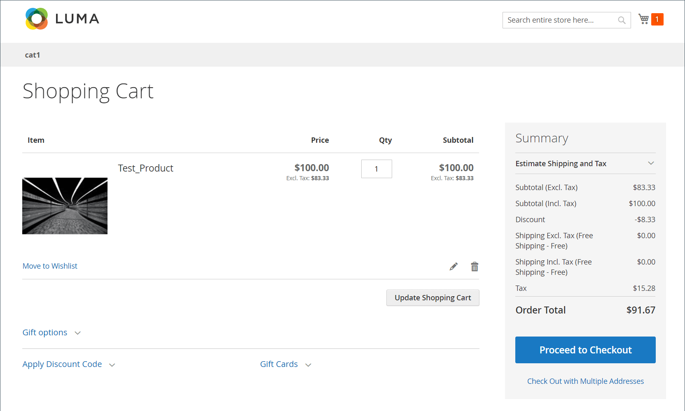

# Cálculo de imposto oculto

_Imposto Oculto_ é a quantia de IVA que um valor de desconto tem. Será diferente de zero quando todas essas condições forem verdadeiras:

- Os preços do catálogo incluem imposto
- A taxa de IVA não é zero
- Há um desconto presente

Quando há um desconto com imposto incorporado, o Commerce calcula um _imposto oculto_ que é adicionado de volta para calcular o preço com desconto.

`discountedItemPrice = fullPriceWithoutTax - discountAmountOnFullPriceWithoutTax + vatAmountOnDiscountedPrice + hiddenTax`

## Exemplo

1. Preço total do item, com imposto incluído: US$ 100
1. IVA a: 20%
1. Desconto de 10% aplicado no preço do item sem impostos:

### Resultado esperado inválido

- Preço do item após impostos sem desconto=US$ 100
- Preço do item antes de impostos sem desconto=100/1,2=83,33 USD
- Desconto=83,33 \ *0,1=8,33 USD
- Imposto=(83,33-8,33) \ *0,2=**15 USD (inválido)**
- Total do Pedido Excluindo Imposto=83,33-8,33=**75 USD (inválido)**
- Total do Pedido Incluindo Imposto=75+15=**90 USD (inválido)**

### Resultado Real Válido no Carrinho

{width="700" zoomable="yes"}

### Cálculos Válidos

1. O preço total do item sem impostos é: $100 / 1,2 = **$83,33**

1. A quantia de IVA no preço total do item é: US$ 100 - US$ 83,33 = US$ 16,67

   _Também pode ser calculado como: $100 \ * (1 - 1/1.2)._

1. O desconto de 10% sobre US$ 83,33 é: **$8,33** (quando você não desconta imposto)

1. O preço com desconto do item com imposto é: US$ 100 - US$ 8,33 = US$ 91,67

   >[!NOTE]
   >
   >Essa equação ilustra a percepção do cliente sobre como os descontos são aplicados.

1. O preço com desconto do item sem impostos é: $91,67 / 1,2 = $76,39

1. O valor de IVA no preço com desconto é: $ 91,67 - $ 76,39 = **$ 15,28 (válido)**

   _Também pode ser calculado como: $91,67 \ * (1 - 1/1,2)._

1. Imposto oculto ou _Compensação de Imposto sobre Desconto_ é a diferença entre o valor de IVA do preço total versus o preço com desconto: $16,67 - $15,28 = **$1,39**

   _Outra maneira de ver isso: o imposto oculto é o valor do IVA pago com o desconto de US$ 8,33: US$ 8,33 \* (1 - 1/1,2)._

1. Como o cliente geralmente entende o preço com desconto (Total do pedido):

   _Preço total do item incluindo impostos **menos**o valor do desconto: US$100 - US$8,33 = US$91,67_

1. **Como o Commerce calcula o preço com desconto** (consulte a fórmula anteriormente):

   _$83.33 - $8.33 + 15.28 + 1.39 =**$91.67***_
