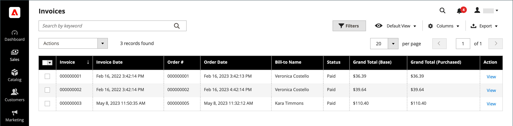

# Faturas

Uma fatura é um registro do registro de pagamento de um pedido. Várias faturas podem ser [criadas](#create-an-invoice) para um único pedido e cada uma pode incluir a mesma quantidade ou quantidade de produtos comprados que você especificar. Você também pode criar [faturas de PDF prontas para impressão](#print-invoices) como documentos de vendas para seus clientes.

Na barra lateral _Admin_, vá para **[!UICONTROL Sales]** > _Operações_ > **Faturas** para abrir a grade _Faturas_ e acessar as faturas criadas.

{width="700" zoomable="yes"}

## Descrições da coluna

| Coluna | Descrição |
|--- |--- |
| [!UICONTROL Select] | Marque as caixas de seleção para que as cotas fiquem sujeitas a uma ação ou use o controle de seleção no cabeçalho da coluna. Opções: `Select All` / `Deselect All` |
| [!UICONTROL Invoice] | Um identificador numérico exclusivo que é atribuído quando uma fatura é enviada do Administrador. Ao exibir os detalhes da NFF, esse número aparece na parte superior da página, em vez do nome da cota. |
| [!UICONTROL Invoice Date] | A data e a hora em que o administrador enviou a fatura pela primeira vez. |
| [!UICONTROL Order#] | Um identificador numérico exclusivo que é atribuído quando um pedido é colocado por um comprador. Ao exibir os detalhes da fatura, esse número aparece como um link no bloco Informações da conta e do pedido. |
| [!UICONTROL Order Date] | A data e a hora em que o cliente fez um pedido com êxito pela primeira vez. |
| [!UICONTROL Bill-to Name] | O nome da pessoa responsável pelo pagamento da ordem. |
| [!UICONTROL Status] | Indica o estado atual de uma fatura. O status só pode ser alterado por ação do comprador ou do vendedor. |
| [!UICONTROL Grand Total (Base)] | O preço total dos produtos a serem comprados. O valor total aparece na moeda base do site e na moeda da loja. |
| [!UICONTROL Grand Total (purchase)] | O total geral de produtos comprados no pedido. O valor total aparece na moeda base do site e na moeda da loja. |
| [!UICONTROL Purchased From] | A exibição de site/loja/loja da qual a fatura foi criada. |
| [!UICONTROL Billing Address] | O endereço de faturamento do cliente que fez o pedido. |
| [!UICONTROL Shipping Address] | O endereço para onde o pedido deve ser enviado. |
| [!UICONTROL Customer Name] | O nome e sobrenome do cliente que recebe a fatura. |
| [!UICONTROL Email] | O endereço de email do cliente que recebe a fatura. |
| [!UICONTROL Customer Group] | O grupo de clientes atribuído ao cliente que recebe a fatura. |
| [!UICONTROL Payment Method] | O método de pagamento a ser usado para o pagamento. |
| [!UICONTROL Shipping Information] | O método a ser usado para enviar o pedido. |
| [!UICONTROL Subtotal] | O subtotal do pedido, sem remessa, manuseio e imposto. |
| [!UICONTROL Shipping and Handling] | O valor cobrado para remessa e manuseio. |
| [!UICONTROL Action] | **[!UICONTROL View]** - abre a fatura no modo de edição. |

{style="table-layout:auto"}

## Criar uma fatura

A criação de uma fatura para um pedido a move para um estado em que não pode ser cancelada ou alterada. Uma nova página de fatura é semelhante a um pedido concluído, com alguns campos adicionais. Todas as atividades relacionadas a um pedido são anotadas na seção Comentários da fatura.

Normalmente, os pedidos são faturados e capturados quando o processo de envio começa. Se o método de pagamento for uma ordem de compra ou se a [ação de pagamento](../configuration-reference/sales/payment-methods.md#payment-actions) estiver definida como `Authorize and Capture`, a ordem será faturada e o pagamento será capturado durante o check-out. Você pode gerar uma fatura com uma guia de remessa e também imprimir etiquetas de remessa da conta da transportadora. Uma única ordem pode ser dividida em entregas parciais, que são faturadas separadamente, se necessário.

Quando o estado de novos pedidos é definido como `Processing`, a opção de _Faturar automaticamente todos os itens_ fica disponível na configuração. Alguns métodos de pagamento de cartão de crédito concluem a etapa de faturamento como parte do processo quando a [ação de pagamento](../configuration-reference/sales/payment-methods.md#payment-actions) está definida como `Authorize and Capture`. Nesse caso, o botão NFF não é exibido e o pedido está pronto para entrega.

>[!NOTE]
>
>As faturas não são criadas automaticamente para pedidos feitos usando `Gift Card`, `Store Credit`, `Reward Points` ou outros métodos de pagamento offline.

Uma fatura para o pedido deve ser gerada antes de ser impressa. Para exibir ou imprimir o PDF, primeiro baixe e instale um leitor de PDF como o [Adobe Acrobat Reader][1].

**_Para faturar um pedido:_**

1. Na barra lateral _Admin_, vá para **[!UICONTROL Sales]** > _[!UICONTROL Operations]_>**[!UICONTROL Orders]**.

1. Localizar a ordem de venda com o status `Processing` na grade. Em seguida, faça o seguinte:

1. Na coluna _Ação_, clique em **[!UICONTROL View]**.

1. No cabeçalho da ordem de venda, escolha a opção **[!UICONTROL Invoice]**.

   >[!NOTE]
   >
   >A opção _[!UICONTROL Invoice]_não aparece quando a [ação de pagamento](../configuration-reference/sales/payment-methods.md#payment-actions) para o seu [método de pagamento](../configuration-reference/sales/payment-methods.md) específico está definida como `Authorize and Capture`, que gera automaticamente uma fatura. Esse também é o caso se o pedido for feito e a ação de pagamento para seu método de pagamento estiver definida como `Authorize` e o pedido for faturado.

   {width="700" zoomable="yes"}

   A nova página de fatura é semelhante a uma página de pedido concluída, com campos adicionais que podem ser editados.

1. Se os itens estiverem prontos para entrega, gere uma guia de remessa para a entrega ao mesmo tempo em que você cria a NFF:

   - Na seção _Informações de Remessa_, clique na caixa de seleção **[!UICONTROL Create Shipment]** para selecioná-la.

     O registro de remessa é criado ao mesmo tempo em que a fatura é gerada.

   - Incluir um número de rastreamento:

      - Clique em **[!UICONTROL Add Tracking Number]**.
      - Insira as informações de rastreamento: _[!UICONTROL Carrier]_,_[!UICONTROL Title]_ e _[!UICONTROL Number]_

     {width="600" zoomable="yes"}

   - Opcionalmente, gere uma NFF parcial:

      - Na seção _Itens a faturar_, atualize a coluna **[!UICONTROL Qty to Invoice]** para incluir somente itens específicos na fatura.
      - Em seguida, clique em **[!UICONTROL Update Qty's]**.

        {width="600" zoomable="yes"}

1. Se um método de pagamento online foi usado para o pedido, defina **[!UICONTROL Amount]** para a opção apropriada.

1. Para notificar os clientes por email quando a fatura for gerada, faça o seguinte:

   - Marque a caixa de seleção **[!UICONTROL Email Copy of Invoice]**.

   - Digite qualquer **[!UICONTROL Invoice Comments]**. Para incluir os comentários no email de notificação, marque a caixa de seleção **[!UICONTROL Append Comments]**.

1. Quando terminar, clique em **[!UICONTROL Submit Invoice]** na parte inferior da página.

   **_Método de pagamento online:_**

   {width="600" zoomable="yes"}

   **_Método de pagamento offline:_**

   {width="600" zoomable="yes"}

   O status do pedido muda de `Pending` para `Complete`.

   {width="600" zoomable="yes"}

## Imprimir faturas

As faturas podem ser impressas individualmente ou em lote. No entanto, antes que uma fatura possa ser impressa, ela deve ser gerada primeiro para o pedido. Você pode carregar um logotipo de alta resolução para uma fatura de PDF pronto para impressão e incluir a [ID do pedido](../stores-purchase/sales-documents.md#add-reference-ids) no cabeçalho. Para personalizar o modelo da fatura com seu logotipo e endereço, consulte [Requisitos de logotipo do PDF](../stores-purchase/sales-documents.md#image-formats).

>[!NOTE]
>
>Para visualizar ou imprimir o PDF, é necessário ter um leitor de PDF. Você pode baixar o [Adobe Reader][1] gratuitamente.

### Imprimir uma única fatura

1. Na barra lateral _Admin_, vá para **[!UICONTROL Sales]** > _[!UICONTROL Operations]_>**[!UICONTROL Invoices]**.

1. Na grade _[!UICONTROL Invoices]_, localize a fatura e clique em **[!UICONTROL View]**na coluna_ Ação _.

1. Na parte superior da fatura, clique em **[!UICONTROL Print]** para gerar uma PDF da fatura.

1. Salve o PDF gerado em um arquivo ou imprima-o.

### Imprimir várias faturas

1. Na barra lateral _Admin_, vá para **[!UICONTROL Sales]** > _[!UICONTROL Operations]_>**[!UICONTROL Invoices]**.

1. Na grade _[!UICONTROL Invoices]_, marque a caixa de seleção de cada fatura a ser impressa.

1. Defina o controle **[!UICONTROL Actions]** como `PDF Invoices`.

   {width="600" zoomable="yes"}

As faturas são salvas em um único arquivo PDF que pode ser enviado para uma impressora ou salvo.

[1]: https://www.adobe.com/acrobat/pdf-reader.html "Obter o Adobe Reader"
