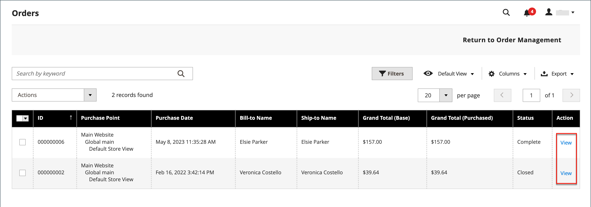

# Arquivar ordens

{{ee-feature}}

O arquivamento de pedidos melhora regularmente o desempenho e mantém seu espaço de trabalho livre de informações desnecessárias, para que você possa se concentrar nos negócios atuais. NFFs, entregas e avisos de crédito podem ser arquivados automática ou manualmente e podem ser exibidos a qualquer momento.

>[!NOTE]
>
>A variável _[!UICONTROL Archive]_aparece na caixa de diálogo [[!UICONTROL Sales] menu](sales-menu.md) somente quando o arquivamento for [habilitado](../configuration-reference/sales/sales.md).

## Configurar o arquivo de pedidos

Sua loja pode ser configurada para arquivar ordens, NFFs, entregas e avisos de crédito após um número definido de dias. Você pode mover pedidos e seus documentos associados para o arquivo morto ou restaurá-los ao estado anterior. Os pedidos arquivados não são excluídos e permanecem disponíveis no Administrador. Os dados arquivados podem ser exportados para um arquivo CSV e abertos em uma planilha. Quando ativado, a variável _Arquivar_ é exibida na parte superior do espaço de trabalho.

1. No _Admin_ barra lateral, vá para **[!UICONTROL Stores]** > _[!UICONTROL Settings]_>**[!UICONTROL Configuration]**.

1. No painel esquerdo, expanda a **[!UICONTROL Sales]** e escolha **[!UICONTROL Sales]** por baixo.

1. Expandir  o **[!UICONTROL Orders, Invoices, Shipments, Credit Memos Archiving]** seção.

   {width="600" zoomable="yes"}

1. Definir **[!UICONTROL Enable Archiving]** para `Yes`.

   >[!NOTE]
   >
   >Se você decidir desativar o arquivamento posteriormente, todas as ordens arquivadas serão restauradas ao estado anterior.

1. Definir **[!UICONTROL Archive Orders Purchased]** ao número de dias de espera até que os pedidos concluídos sejam arquivados.

   Por padrão, os pedidos são arquivados 30 dias após a compra.

1. No **[!UICONTROL Order Statuses to be Archived]** selecione cada status de pedido a ser usado para identificar pedidos a serem arquivados.

   Para selecionar vários itens, mantenha pressionada a tecla Ctrl (Windows) ou Command (Mac) enquanto clica em cada item.

1. Clique em **[!UICONTROL Save Config]**.

1. Quando solicitado, atualize qualquer cache inválido.

## Visualizar documentos arquivados

1. No _[!UICONTROL Sales]_menu em_[!UICONTROL Archive]_, escolha uma das opções a seguir:

   - **[!UICONTROL Orders]**
   - **[!UICONTROL Invoices]**
   - **[!UICONTROL Shipments]**
   - **[!UICONTROL Credit Memos]**

1. Para exibir detalhes, clique em qualquer documento arquivado na lista.

## Aplicar uma ação a um documento arquivado

Selecione cada documento para ser o destino da ação e escolha uma das seguintes opções **[!UICONTROL Actions]**:

- `Cancel`
- `Hold`
- `Unhold`
- `Print`
- `Move to Orders Management`

## Arquivar documentos manualmente

1. Selecione o tipo do documento a ser arquivado a partir do seguinte:

   - **[!UICONTROL Orders]**
   - **[!UICONTROL Invoices]**
   - **[!UICONTROL Shipments]**
   - **[!UICONTROL Credit Memos]**

1. Marque a caixa de seleção de cada item que você deseja arquivar.

1. No canto superior direito, defina **[!UICONTROL Actions]** para `Move to Archive`.

1. Clique em **[!UICONTROL Submit]** para arquivar os documentos selecionados.

## Restaurar documentos arquivados

1. Escolha o tipo de documento que deseja restaurar.

1. Selecione documentos usando uma das seguintes opções:

   - Para selecionar todos os documentos visíveis, no canto superior esquerdo, clique em **[!UICONTROL Select Visible]**.

   - Marque manualmente a caixa de seleção de cada documento que você deseja restaurar.

1. No canto superior direito, defina **[!UICONTROL Action]** para `Move to Orders Management`.

1. Clique em **[!UICONTROL Submit]** para restaurar os documentos.

## Exportar documentos arquivados

1. Escolha o tipo de documento que deseja exportar.

1. No menu superior direito, defina **[!UICONTROL Export to:]** a um dos seguintes valores:

   - `CSV`
   - `Excel`

1. Clique em **[!UICONTROL Export]**.

Sua loja pode ser configurada para arquivar ordens, NFFs, entregas e avisos de crédito após um número definido de dias. Você pode mover pedidos e seus documentos associados para o arquivo morto ou restaurá-los ao estado anterior. Os pedidos arquivados não são excluídos e permanecem disponíveis no Administrador. Os dados arquivados podem ser exportados para um arquivo CSV e abertos em uma planilha. Quando ativado, a variável _[!UICONTROL Archive]_é exibido na parte superior do espaço de trabalho.

## Arquivar ordens manualmente

1. No _Admin_ barra lateral, vá para **[!UICONTROL Sales]** > _[!UICONTROL Operations]_>**[!UICONTROL Orders]**.

1. Para selecionar a ordem na grade, marque a caixa de seleção na primeira coluna.

1. Defina o **[!UICONTROL Actions]** controle para `Move to Archive` e procure a mensagem informando que o pedido foi arquivado.

   {width="700" zoomable="yes"}

>[!TIP]
>
>Para especificar uma lista de status de ordens que podem ser arquivadas, consulte [Configurar o arquivo de pedidos](#configure-the-order-archive).

## Exibir um pedido arquivado

1. Abra a exibição de arquivamento usando um dos seguintes métodos:

   - Na barra de botões acima do _[!UICONTROL Orders]_, clique em **[!UICONTROL Go to Archive]**.

   - No _Admin_ barra lateral, vá para **[!UICONTROL Sales]** > _[!UICONTROL Archive]_>**[!UICONTROL Orders]**.

   >[!NOTE]
   >
   >Assim como a página Pedidos, o título da página Pedidos arquivados é _[!UICONTROL Orders]_. A única diferença visível é a opção, na barra de botões, de_[!UICONTROL Return to Orders Management]_. O URL da página também indica que você está na ordem de arquivamento.

1. No _Ação_ clique em **[!UICONTROL View]**.

   {width="600" zoomable="yes"}

## Restaurar uma ordem arquivada

>[!NOTE]
>
>Um pedido restaurado a partir de um pedido arquivado é arquivado novamente de acordo com o número de dias configurado no [!UICONTROL Archive Orders Purchased] configuração (consulte [Configurar o arquivo de pedidos](#configure-the-order-archive)). O número de dias é calculado em relação ao [!UICONTROL Updated At] data do pedido, que é alterada quando o pedido é movido do arquivo.

1. No _Admin_ barra lateral, vá para **[!UICONTROL Sales]** > _[!UICONTROL Operations]_>**[!UICONTROL Orders]**.

1. Na barra de botões, clique em **[!UICONTROL Go to Archive]**.

1. Localize o registro a ser restaurado e clique na caixa de seleção para selecioná-lo.

   {width="600" zoomable="yes"}

1. Defina o **[!UICONTROL Actions]** valor de controle para `Move to Order Management`.

Procure a mensagem informando que a ordem arquivada foi removida do arquivamento.

## Exportar ordem arquivada

1. No _Admin_ barra lateral, vá para **[!UICONTROL Sales]** > _[!UICONTROL Operations]_>**[!UICONTROL Orders]**.

1. No menu de ações, clique em **[!UICONTROL Export]** e selecione o formato desejado.
