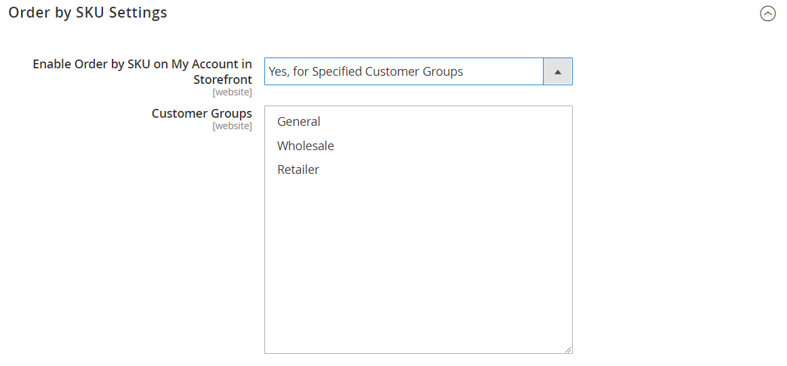
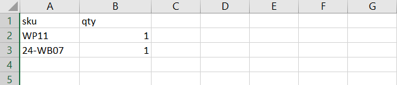

# Solicitar por SKU

{{ee-feature}}

Um &quot;SKU&quot; é uma &quot;Unidade de manutenção de estoque&quot;. As SKUs geralmente ajudam os vendedores online a identificar as características mais importantes do produto, como tamanho, cor, preço e material. As IDs de produto são diferentes das SKUs:

- O `Product ID` é uma série sequencial de números usados internamente para identificar produtos e que não estão disponíveis para clientes.
- O `SKU` é gerado pelo vendedor, normalmente com base no nome do produto e nos atributos para marketing ou rastreamento interno. Por exemplo: Uma camiseta azul de algodão, tamanho médio: T-COT-MED-BL. O SKU pode ser alterado pelo vendedor, se necessário.

Normalmente, um SKU inclui um conjunto de abreviações que indicam as características distintivas do produto. O comprimento máximo do SKU é de 64 caracteres. As SKUs são importantes para rastrear e gerenciar com eficiência o inventário, portanto, configurá-las corretamente é essencial para o comércio eletrônico.

_Pedir por SKU_ é um [widget](../content-design/widgets.md) que pode ser exibido na loja como uma conveniência para todos os compradores, ou disponibilizado apenas para os compradores em grupos específicos de clientes. Os compradores podem inserir as informações de SKU e quantidade diretamente no bloco Pedido por SKU ou carregar um arquivo csv da conta do cliente. Independentemente da configuração, pedir por SKU está sempre disponível para administradores de armazenamento.

{width="700" zoomable="yes"}

## Configurar pedido por SKU

1. Na barra lateral _Admin_, vá para **[!UICONTROL Stores]** > _[!UICONTROL Settings]_>**[!UICONTROL Configuration]**.

1. No painel esquerdo, expanda a seção **[!UICONTROL Sales]** e escolha **[!UICONTROL Sales]** abaixo.

1. Expandir  a seção **[!UICONTROL Order by SKU Settings]**.

1. Defina **[!UICONTROL Enable Order by SKU on my Account in Storefront]** como um dos seguintes:

   - `Yes, for Everyone` - O bloco Ordenar por SKU está disponível na loja para cada comprador.
   - `Yes, for Specified Customer Groups` - Solicitar por SKU está disponível somente para membros de um grupo de clientes específico, como `Wholesale`.
   - `No` - O bloco Ordenar por SKU não aparece na loja e a página Ordenar por SKU não está disponível na conta do cliente.

   {width="600" zoomable="yes"}

1. Clique em **[!UICONTROL Save Config]**.

 (somente Adobe Commerce B2B) _&#x200B;**Para habilitar a função Ordenar por SKU, desabilite a função Ordem Rápida:**&#x200B;_

1. Vá para **[!UICONTROL Stores]** > _[!UICONTROL Settings]_>**[!UICONTROL Configuration]**.

1. No painel esquerdo, em _[!UICONTROL General]_, escolha **[!UICONTROL B2B Features]**

1. Expandir  a seção **[!UICONTROL B2B Features]**.

1. Defina **[!UICONTROL Enable Quick Order]** como `No`.

   O [recurso Pedido rápido](../b2b/quick-order.md) permite que clientes e convidados façam pedidos rapidamente com base no SKU ou no nome do produto.

## Experiência da vitrine

Quando a funcionalidade é configurada para a loja, os clientes podem fazer pedidos por SKU de qualquer página que inclua o widget _Pedir por SKU_ ou do painel da conta.

### Ordenar por SKU do bloco de páginas

1. No bloco _Solicitar por SKU_, o cliente insere os **[!UICONTROL SKU]** e **[!UICONTROL Qty]** do item a ser solicitado.

1. Para adicionar outro item, clique em **[!UICONTROL Add Row]** e repita o processo.

1. Cliques **[!UICONTROL Add to Cart]**.

### Solicitar por SKU de uma conta de cliente

1. Na loja, o cliente faz logon em sua conta.

1. No painel à esquerda, escolha **[!UICONTROL Order by SKU]**.

1. Adiciona itens individuais de acordo com a preferência:

   _&#x200B;**Adiciona cada item por SKU:**&#x200B;_

   - Insira os **[!UICONTROL SKU]** e **[!UICONTROL Qty]** do item a ser ordenado.

   - Para adicionar outros itens, conforme necessário, clique em _Adicionar Linha_  e repita o número necessário de itens.

   - Cliques **[!UICONTROL Add to Cart]**.

   _&#x200B;**Carrega um arquivo CSV de vários itens:**&#x200B;_

   - Prepara um [arquivo CSV de dados de importação](../systems/data-csv.md) (Valor Separado por Vírgula) que inclui colunas para `SKU` e `Qty`.

   {width="500" zoomable="yes"}

   - Para carregar o arquivo CSV, clique em **[!UICONTROL Choose File]** e selecione o arquivo a ser carregado.

   - Cliques **[!UICONTROL Add to Cart]**.

   Se qualquer um dos produtos tiver opções adicionais, o cliente será avisado no carrinho de compras que o produto requer atenção.

   {width="600" zoomable="yes"}

   >[!NOTE]
   >
   >Se houver SKUs duplicadas, as quantidades serão combinadas em um item de linha no carrinho de compras. O cliente pode alterar a quantidade de qualquer item e clicar em **[!UICONTROL Update Shopping Cart]** para recalcular os totais.

