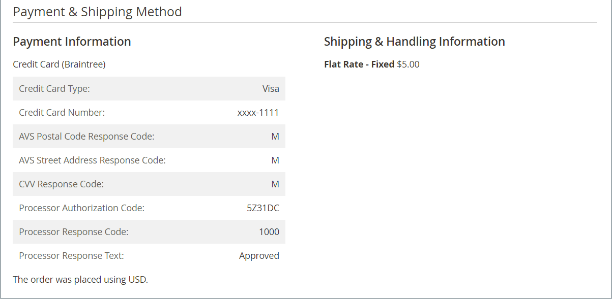

# Fluxo de trabalho e processamento da ordem

Quando um cliente coloca um pedido, uma ordem de venda é criada como um registro temporário da transação. Na grade Pedidos, as ordens de venda têm inicialmente um status de &quot;Pendente&quot; e podem ser canceladas a qualquer momento até que o pagamento seja processado. Depois que o pagamento é confirmado, a ordem pode ser faturada e enviada.

**Etapa 1: Fazer o pedido** - O processo de check-out começa quando o comprador clica em **[!UICONTROL Go to Checkout]** na página do carrinho de compras ou em [reordenações](reorders-allow.md) diretamente da conta do cliente.

**Etapa 2: Pedido pendente** - O status inicial da ordem de venda é `Pending`. Nesse estado, o pagamento não foi processado e o pedido ainda pode ser editado ou cancelado. Esse estado ocorre quando o método de pagamento é configurado para o modo de autorização.

**Etapa 3: Receber Pagamento** - O status do pedido muda para `Processing` quando o pagamento é recebido ou autorizado. Dependendo do método de pagamento, você poderá receber uma notificação quando a transação for autorizada ou processada. Esse estado ocorre automaticamente quando o método de pagamento é configurado para o modo de captura ou venda de intenção.

**Etapa 4: Faturar Ordem** - Uma ordem normalmente é faturada depois que o pagamento é recebido. O método de pagamento determina quais opções de faturamento são necessárias para a ordem. Depois que a fatura é gerada e enviada, uma cópia é enviada ao cliente. Se o método de pagamento estiver configurado com a ação de pagamento `capture` ou `intent sale`, uma fatura será gerada automaticamente quando o pagamento for autorizado e capturado.

>[!NOTE]
>
>As faturas não são criadas automaticamente para pedidos feitos usando `Gift Card`, `Store Credit`, `Reward Points` ou outros métodos de pagamento offline.

**Etapa 5: Registrar uma Única Remessa** - O status da ordem muda para `Complete` quando os detalhes da remessa são concluídos, a remessa é registrada e a remessa é definida. O requisito de remessa foi atendido com uma guia de remessa e uma etiqueta de remessa impressas ou a opção _Notificar Pronto para Remessa_ foi selecionada (método de entrega na loja). O cliente recebe a notificação e o pacote é enviado. Se os números de rastreamento forem usados, a remessa poderá ser rastreada na conta do cliente.

>[!NOTE]
>
>Para obter detalhes sobre o status do pedido e as opções de configuração do método de pagamento, consulte [Status do pedido](order-status.md) e [Pagamentos](payments.md).

## Exibir um pedido

1. Na barra lateral _Admin_, vá para **[!UICONTROL Sales]** > _[!UICONTROL Operations]_>**[!UICONTROL Orders]**.

1. Localize a ordem na grade.

1. Na coluna _[!UICONTROL Action]_, clique em **[!UICONTROL View]**.

1. Verificar status do pedido:

   - Uma ordem `Pending` pode ser modificada, colocada em espera, cancelada ou faturada e enviada.

   - Um pedido `Processing` não pode mais ser substancialmente editado ou cancelado, mas o endereço de cobrança e de entrega pode ser editado.

   - Um pedido de `Completed` pode ser reordenado.

O email do cliente pode ser editado em qualquer ponto do fluxo de trabalho da ordem ao editar o cliente. O email não pode ser editado se o pedido foi feito por um convidado.

O painel esquerdo de um pedido aberto fornece acesso a diferentes tipos de informações relacionadas ao pedido.

{width="700" zoomable="yes"}

## Processar um pedido

Quando um cliente coloca um pedido, uma ordem de venda é criada como um registro temporário da transação. A ordem de venda terá o status de `Pending` até que o pagamento seja recebido. Enquanto estiver no status `Pending`, os pedidos podem ser editados ou cancelados até o momento em que o pagamento for recebido e uma fatura for gerada. Uma maneira fácil de pensar sobre isso é que os pedidos se tornam NFFs e as NFFs se tornam remessas. A grade Pedidos lista todos os pedidos, independentemente de onde estão no fluxo de trabalho. Para saber como ajudar os clientes com um pedido, consulte [Atualizar um pedido](order-update.md).

{width="700" zoomable="yes"}

Para abrir uma ordem de `Pending`, clique em **[!UICONTROL Edit]** no canto superior direito.

>[!NOTE]
>
>Os pedidos só podem ser editados enquanto estiverem no status `Pending`. O botão Editar não está visível para pedidos com status diferente ou para pedidos baseados em uma [cotação negociada](../b2b/quotes.md).

{width="600" zoomable="yes"}

Revise as seções a seguir na ordem de venda, usando as descrições do campo para referência.

### Descrições da visualização de pedidos

| Guia | Descrição |
|--- |--- |
| [!UICONTROL Information] | Exibir informações detalhadas sobre a ordem e a conta, incluindo endereços de faturamento e entrega, métodos de pagamento e entrega, itens, ordens, totais e notas. |
| [!UICONTROL Invoices] | Lista cada NFF associada à ordem. |
| [!UICONTROL Credit Memos] | Lista cada aviso de crédito associado à ordem. |
| [!UICONTROL Shipments] | Lista cada registro de entrega associado à ordem. |
| [!UICONTROL Comments History] | Lista todas as notas relacionadas ao pedido. |

{style="table-layout:auto"}

>[!NOTE]
>
>Um usuário administrador deve ter **[!UICONTROL Sales / Archive]** [permissões](../systems/permissions-user-roles.md) para que seu escopo de função possa ver as guias de ordem _Faturas_, _Avisos de Crédito_ e _Remessas_.

### Barra de botões

| Botão | Descrição |
|--- |--- |
| **[!UICONTROL Back]** | Retorna à página Pedidos sem salvar as alterações. |
| **[!UICONTROL Cancel]** | Cancela a ordem de venda. |
| **[!UICONTROL Send Email]** | Envia um email sobre o pedido para o cliente. |
| **[!UICONTROL Hold]** / **[!UICONTROL Unhold]** | Altera o status da ordem de venda para `On Hold`. Para liberar a retenção da ordem de venda, escolha **[!UICONTROL Unhold]**. |
| **[!UICONTROL Invoice]** | Cria uma fatura da ordem de venda convertendo a ordem em uma fatura. |
| **[!UICONTROL Ship]** | Cria um registro de remessa para a ordem. |
| **[!UICONTROL Notify Order is Ready for Pickup]** | Aparece somente quando um pedido é feito como uma entrega na loja. Notifica ao cliente que o pedido está pronto para retirada. |
| **[!UICONTROL Reorder]** | Cria uma ordem de venda com base na ordem atual. |
| **[!UICONTROL Edit]** | Abre um pedido pendente no modo de edição. O botão Editar não está visível para pedidos com status `Processing` ou pedidos que são baseados em cotações negociadas. |

{style="table-layout:auto"}

### Cancelar um pedido

Você pode [cancelar](order-update.md) pedidos que ainda não foram faturados. Um [memorando de crédito](credit-memos.md) deve ser emitido se um cliente quiser cancelar um pedido depois que ele for faturado (o pagamento é capturado).

Se uma ordem for `Pending` ou `Processing` e o pagamento não for capturado ou não for totalmente capturado, você poderá [anular a ordem](#void-an-order) em vez de cancelá-la.

Para restaurar um pedido cancelado, clique no botão **[!UICONTROL Reorder]** e um novo pedido será criado com o status `Pending`.

>[!NOTE]
>
>Cancelar uma ordem também produz um cancelamento, mas a anulação de uma ordem não aciona um cancelamento.

### Anular um pedido

Somente ordens de venda que não são faturadas, têm um status de `Processing` e uma configuração de integração de pagamento [ de `Authorize`](../configuration-reference/sales/payment-methods.md#payment-actions) podem ser [anuladas](order-update.md#void-a-processing-order). Depois de anular um pedido, você pode cancelá-lo.

### [!UICONTROL Order and Account Information]

{width="600" zoomable="yes"}

#### Informações do pedido

| Campo | Descrição |
|--- |--- |
| [!UICONTROL Order Number] | O número do pedido aparece na parte superior do pedido de venda, seguido de uma nota que indica se o email de confirmação foi enviado. |
| [!UICONTROL Order Date] | A data e a hora em que o pedido foi feito. |
| [!UICONTROL Purchased From] | Indica o site, a loja e a exibição da loja em que o pedido foi feito. |
| [!UICONTROL Placed from IP] | Indica o endereço IP do computador do qual o pedido foi feito. |
| [!UICONTROL Order Placed from Quote] |  (Disponível com Adobe Commerce B2B) Indica a [cotação](../b2b/quotes.md) da qual o pedido foi gerado, se aplicável. O nome da cotação está vinculado à cotação. |

{style="table-layout:auto"}

#### Informações da conta

| Campo | Descrição |
|--- |--- |
| [!UICONTROL Customer Name] | O nome do cliente ou comprador que colocou a ordem. A Nome do cliente está vinculada ao perfil do cliente. |
| [!UICONTROL Email] | O endereço de email do cliente ou comprador. O endereço de email está vinculado para abrir uma nova mensagem de email. |
| [!UICONTROL Customer Group] | O nome do grupo de clientes ou catálogo compartilhado ao qual o cliente está atribuído. |
| [!UICONTROL Company Name] |  (Disponível com Adobe Commerce B2B) O nome da empresa à qual o comprador está associado e em cujo nome o pedido é feito. O nome da empresa está vinculado ao [perfil da empresa](../b2b/account-companies.md). |

{style="table-layout:auto"}

### [!UICONTROL Address Information]

{width="600" zoomable="yes"}

| Campo | Descrição |
|--- |--- |
| [!UICONTROL Billing Address] | O nome do cliente ou comprador que fez o pedido, seguido do endereço para cobrança, número de telefone e [VAT](vat.md), se aplicável. O número de telefone está vinculado à discagem automática em um dispositivo móvel. |
| [!UICONTROL Shipping Address] | O nome da pessoa para cuja atenção o pedido deve ser enviado, seguido do endereço de entrega e do número de telefone. O número de telefone está vinculado à discagem automática em um dispositivo móvel. |

{style="table-layout:auto"}

### [!UICONTROL Payment & Shipping Method]

{width="600" zoomable="yes"}

| Campo | Descrição |
|--- |--- |
| [!UICONTROL Payment Information] | O método de pagamento a ser usado para o pedido e o número do pedido de compra, se aplicável, seguido da moeda usada para fazer o pedido. Se a ordem for debitada do crédito da empresa usando [Pagamento na Conta](../b2b/enable-basic-features.md#configure-payment-on-account), o valor debitado na conta será indicado. |
| [!UICONTROL Shipping & Handling Information] | O método de envio a ser usado e qualquer taxa de manuseio aplicável. |

{style="table-layout:auto"}

### Atributos da Ordem Personalizada

[!BADGE Somente SaaS]{type=Positive url="https://experienceleague.adobe.com/en/docs/commerce/user-guides/product-solutions" tooltip="Aplicável somente a projetos do Adobe Commerce as a Cloud Service (infraestrutura SaaS gerenciada pela Adobe)."}

Os atributos personalizados do pedido permitem associar informações adicionais específicas às suas necessidades comerciais com o pedido.

{width="600" zoomable="yes"}

Na seção **[!UICONTROL Custom Order Attributes]**, são exibidos todos os atributos de ordem personalizados e seus valores atuais.

Para criar um novo atributo de pedido personalizado, insira um **[!UICONTROL Attribute Code]** e **[!UICONTROL Value]**

Para criar atributos personalizados adicionais de pedido, clique em **[!UICONTROL Add Attribute]**.

Para remover um atributo de pedido personalizado, clique no ícone **[!UICONTROL X]**.

>[!NOTE]
>
>Os atributos personalizados da ordem só podem ser editados quando a ordem está no status `Pending`. Para pedidos em outros status, você pode exibir os valores de atributo, mas não pode modificá-los.

### Revisar itens solicitados

{width="600" zoomable="yes"}

Na seção **[!UICONTROL Order Total]**, faça o seguinte:

1. Insira um **[!UICONTROL Comment]** para incluir com o pedido.

1. Se desejar enviar o comentário por email para o cliente, marque a caixa de seleção **[!UICONTROL Notify Customer by Email]**.

1. Para que o comentário fique visível na conta do cliente, marque a caixa de seleção **[!UICONTROL Visible on Storefront]**.

   {width="600" zoomable="yes"}

1. Se você estiver pronto para faturar o pedido, clique em **[!UICONTROL Invoice]** e siga as instruções para [criar uma fatura](invoices.md#create-an-invoice).

#### [!UICONTROL Items Ordered]

| Campo | Descrição |
|--- |--- |
| [!UICONTROL Product] | O nome do produto, SKU e opções, se aplicável. |
| [!UICONTROL Item Status] | Indica o status do item. Valor: `Ordered` |
| [!UICONTROL Original Price] | O preço de catálogo original do item antes dos descontos. |
| [!UICONTROL Price] | O preço de compra do item. Esse valor reflete qualquer desconto aplicado ao item do catálogo compartilhado, se aplicável. |
| [!UICONTROL Qty] | A quantidade solicitada. |
| [!UICONTROL Subtotal] | O subtotal é o preço de compra multiplicado pela quantidade. |
| [!UICONTROL Tax Amount] | O valor do imposto que se aplica ao item como um valor decimal. |
| [!UICONTROL Tax Percent] | A porcentagem de imposto aplicada a este item como uma porcentagem. |
| [!UICONTROL Discount Amount] | O desconto que se aplica a este item. O valor de desconto será zero se o pedido for baseado em uma cotação. |
| [!UICONTROL Row Total] | O total do item de linha, incluindo os impostos aplicáveis devidos no nível do produto, menos os descontos. |

{style="table-layout:auto"}

#### [!UICONTROL Notes for this Order]

| Campo | Descrição |
|--- |--- |
| [!UICONTROL Status] | Exibe o status da ordem de venda. |
| [!UICONTROL Comment] | Uma caixa de texto que é usada para inserir um comentário ao cliente que acompanha o pedido.  **[!UICONTROL Notify Customer by Email]**- Marque a caixa de seleção se desejar enviar o comentário ao cliente como um email separado. **[!UICONTROL Visible on Storefront]** - Marque a caixa de seleção se desejar que o comentário fique visível na conta do cliente.  **[!UICONTROL Update]**- Adiciona o comentário e envia um email, se aplicável. |

{style="table-layout:auto"}

#### [!UICONTROL Order Totals]

| Campo | Descrição |
|--- |--- |
| [!UICONTROL Shipping & Handling] | O valor cobrado pelas taxas de remessa e manuseio. |
| [!UICONTROL Tax] | O valor do imposto aplicado à ordem, se aplicável. |
| [!UICONTROL Grand Total] | O total do pedido. |
| [!UICONTROL Total Paid] | O valor total pago no pedido, se aplicável. |
| [!UICONTROL Total Refunded] | O valor total reembolsado da ordem, se aplicável. |
| [!UICONTROL Total Due] | O valor total devido. |
| [!UICONTROL Store Credit] |  (somente Adobe Commerce) A quantidade de crédito de loja disponível que é aplicada ao pedido, se aplicável. |
| [!UICONTROL Catalog Total Price] |  (Disponível com Adobe Commerce B2B) O preço total dos itens na cotação sem imposto, de acordo com o preço no catálogo compartilhado ou catálogo padrão usado como base da cotação. Se a moeda de exibição da loja for diferente da moeda base, o valor será exibido em ambas as moedas, com a loja em colchetes. |
| [!UICONTROL Negotiated Discount] |  (Disponível com Adobe Commerce B2B) O desconto que é o resultado de uma cotação negociada entre o comprador e o vendedor. Se a moeda de exibição da loja for diferente da moeda base, o valor será exibido em ambas as moedas, com a loja em colchetes. |
| [!UICONTROL Subtotal] |  (Disponível com Adobe Commerce B2B) O Preço Total do Catálogo menos o Desconto Negociado. |

{style="table-layout:auto"}

## Demonstração de processamento de pedido

Assista a este vídeo e saiba mais sobre o processamento de pedidos e o status:

>[!VIDEO](https://video.tv.adobe.com/v/343935/?quality=12&learn=on)
