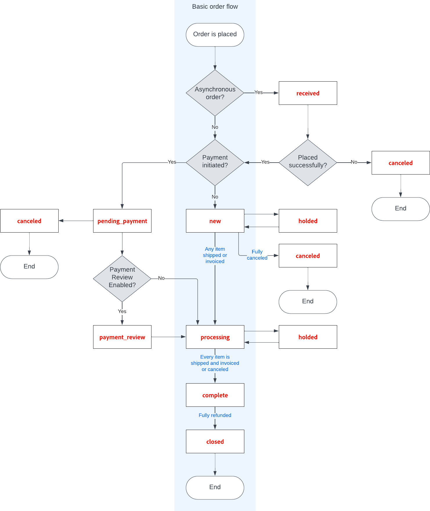

# Status do pedido

Todas as ordens têm um status de ordem associado a um estágio no processamento da ordem [fluxo de trabalho](order-processing.md).\
A diferença entre os estados dos pedidos e os status dos pedidos é que **[!UICONTROL order states]** são usados programaticamente. Eles não estão visíveis para clientes ou usuários administradores. Eles determinam o fluxo de uma ordem e quais operações são possíveis para uma ordem em um determinado estado.\
**[!UICONTROL Order statuses]** são usados para comunicar o status de um pedido a clientes e usuários administradores.
Você pode criar status de pedidos adicionais para se alinhar às suas necessidades operacionais. Os status da ordem são convenientes para exibir o progresso fora do Adobe Commerce, por exemplo, separação de ordens e progresso de distribuição. Eles não têm impacto no workflow do processamento de pedidos.\
Cada status de pedido está associado a um estado de pedido. Sua loja tem um conjunto de configurações predefinidas de status de pedido e estado de pedido.

{width="700" zoomable="yes"}

O status de cada pedido é mostrado no _Status_ coluna da _Pedidos_ grade.

{width="700" zoomable="yes"}

>[!TIP]
>
>Uma ordem parcialmente reembolsada permanece em `Processing` status até **_all_** os itens solicitados (incluindo itens reembolsados) são entregues. O status do pedido não é alterado para `Complete` até que todos os itens da ordem tenham sido entregues.

## Fluxo de trabalho do estado do pedido

## Status predefinido

| Status do pedido | Código de status |                                                                                                                                                                                                                                                                                        |
|--------------------------|----------------------------|----------------------------------------------------------------------------------------------------------------------------------------------------------------------------------------------------------------------------------------------------------------------------------------|
| Recebido | `received` | Esse status é o status inicial para pedidos feitos quando o posicionamento assíncrono de pedidos está ativado. |
| Suspeita de fraude | `fraud` | Às vezes, os pedidos pagos pelo PayPal ou outro gateway de pagamento são marcados como _Suspeita de fraude_. Esse status significa que o pedido não tem uma fatura emitida e o email de confirmação também não é enviado. |
| Processamento | `processing` | Quando o status dos novos pedidos for definido como &#39;Processando&#39;, a variável _Faturar Todos os Itens Automaticamente_ fica disponível na configuração. As faturas não são criadas automaticamente para pedidos feitos usando o Cartão Presente, o Crédito da Loja, os Pontos de Recompensa ou outros métodos de pagamento offline. |
| Pagamento pendente | `pending_payment` | Esse status é usado se o pedido for criado e se PayPal ou um método de pagamento semelhante for usado. Significa que o cliente foi direcionado para o site do gateway de pagamento, mas nenhuma informação de retorno foi recebida ainda. Esse status muda quando o cliente paga. |
| Revisão de pagamento | `payment_review` | Este status aparece quando a revisão de pagamento do PayPal é ativada. |
| Pending | `pending` | Esse status indica que nenhuma NFF e remessa foram enviadas. |
| Em Espera | `holded` | Este status só pode ser atribuído manualmente. Você pode colocar qualquer ordem em espera. |
| Concluído | `complete` | Esse status significa que a ordem foi criada, paga e enviada ao cliente. |
| Fechado | `closed` | Esse status indica que uma ordem recebeu um aviso de crédito e o cliente recebeu uma restituição. |
| Cancelado | `canceled` | Esse status é atribuído manualmente no Admin ou, para alguns gateways de pagamento, quando o cliente não paga dentro do tempo especificado. |
| Rejeitado | `rejected` | Esse status significa que um pedido foi rejeitado durante o processamento assíncrono de pedidos. Isso acontece quando ocorre um erro durante o posicionamento assíncrono de pedidos. |
| Estorno Cancelada de PayPal | `paypay_canceled_reversal` | Esse status significa que o PayPal cancelou a reversão. |
| PayPal pendente | `pending_paypal` | Esse status significa que o pedido foi recebido pelo PayPal, mas o pagamento ainda não foi processado. |
| PayPal revertido | `paypal_reversed` | Esse status significa que o PayPal reverteu a transação. |

{style="table-layout:auto"}

## Status do pedido personalizado

Além das configurações de status de pedido predefinidas, você pode criar suas próprias configurações de status de pedido personalizadas, atribuí-las a estados de pedido e definir status de pedido padrão para estados de pedido. O estado do pedido indica a posição do pedido no fluxo de trabalho de processamento do pedido e o status do pedido atribui um rótulo traduzível significativo à posição do pedido. Por exemplo, você pode precisar de um status de pedido personalizado, como `packaging"`, `backordered`ou um status específico para suas necessidades. Você pode criar um nome descritivo para o status personalizado e atribuí-lo ao estado de pedido associado no fluxo de trabalho.

>[!NOTE]
>
>Somente os valores padrão de status de pedido personalizado são usados no fluxo de trabalho do pedido. Os valores de status personalizados que não estão definidos como padrão podem ser usados somente na seção de comentários do pedido.

{width="700" zoomable="yes"}

### Criar um status de pedido personalizado

1. No _Admin_ barra lateral, vá para **[!UICONTROL Stores]** > _[!UICONTROL Settings]_>**[!UICONTROL Order Status]**.

1. No canto superior direito, clique em **[!UICONTROL Create New Status]**.

   {width="600" zoomable="yes"}

1. Atualize o _[!UICONTROL Order Status Information]_seção:

   - Insira um **[!UICONTROL Status Code]** para referência interna. O primeiro caractere deve ser uma letra (a-z) e o restante pode ser qualquer combinação de letras e números (0-9). Use o caractere sublinhado em vez de um espaço.

   - Para **[!UICONTROL Status Label]**, insira um rótulo que identifique a configuração de status em Admin e na loja.

1. No _[!UICONTROL Store View Specific Labels]_insira os rótulos necessários para diferentes exibições de loja.

1. Clique em **[!UICONTROL Save Status]**.

### Atribuir um status de pedido a um estado

1. No _Status do pedido_ clique em **[!UICONTROL Assign Status to State]**.

   {width="600" zoomable="yes"}

1. Atualize o **[!UICONTROL Assignment Information]** faça o seguinte:

   - Escolha o **[!UICONTROL Order Status]** que deseja atribuir. Elas são listadas pelo rótulo de status.

   - Definir **[!UICONTROL Order State]** ao local do fluxo de trabalho ao qual pertence o status do pedido.

     >[!NOTE]
     >
     >**_[!UICONTROL Order State]_** A lista inclui os status de pedido atribuídos por padrão. Por exemplo, a variável `Pending` o status padrão do pedido é exibido em vez da variável `New` valor do estado do pedido.

   - Para tornar esse status padrão para o estado do pedido, selecione a variável **[!UICONTROL Use Order Status as Default]** caixa de seleção

     >[!NOTE]
     >
     >Somente os status de ordem padrão são usados no workflow de ordem. Os status não padrão só podem ser definidos no **[!UICONTROL Order Comments]** no Admin.

   - Para tornar esse status visível da loja, selecione a **[!UICONTROL Visible On Storefront]** caixa de seleção

   {width="600" zoomable="yes"}

1. Clique em **[!UICONTROL Save Status Assignment]**.

### Editar um status de pedido existente

1. No _[!UICONTROL Order Status]_, abra o registro de status no modo de edição.

1. Atualize as configurações de status conforme necessário.

1. Clique em **[!UICONTROL Save Status]**.

### Remover um status de pedido de um estado atribuído

>[!NOTE]
>
>Uma configuração de status não pode ser desatribuída de um estado se o status estiver em uso.

1. No _[!UICONTROL Order Status]_localizar o registro de status do pedido que terá a atribuição cancelada.

1. No _[!UICONTROL Action]_na extremidade direita da linha, clique na guia **[!UICONTROL Unassign]**link.

   Será exibida uma mensagem na parte superior do espaço de trabalho informando que o status do pedido foi cancelado. Embora a etiqueta de status do pedido ainda apareça na lista, ela não está mais atribuída a um estado. As configurações de status do pedido não podem ser excluídas.

>[!NOTE]
>
>Se o status padrão da ordem não estiver atribuído ao estado da ordem, _**outro**_ o status do pedido é _**definir automaticamente**_ como padrão para esse estado de pedido.

## Notificação

Os clientes podem acompanhar o status de seus pedidos por [RSS feed](../merchandising-promotions/social-rss.md) se o feed RSS do pedido estiver ativado na configuração. Quando ativado, um link para o feed RSS é exibido em cada pedido.

### Ativar notificação de status do pedido

1. No _Admin_ barra lateral, vá para **[!UICONTROL Stores]** > _[!UICONTROL Settings]_>**[!UICONTROL Configuration]**.

1. No painel esquerdo, expanda **[!UICONTROL Catalog]** e escolha **[!UICONTROL RSS Feeds]** por baixo.

1. Expandir  o **[!UICONTROL Order]** seção.

1. Definir **[!UICONTROL Customer Order Status Notification]** para `Enable`.

   {width="600" zoomable="yes"}

1. Quando terminar, clique em **[!UICONTROL Save Config]**.

### Configurar novas notificações por email de pedidos

1. No _Admin_ barra lateral, vá para **[!UICONTROL Stores]** > _[!UICONTROL Settings]_>**[!UICONTROL Configuration]**.

1. No painel esquerdo, expanda **[!UICONTROL Sales]** e escolha **[!UICONTROL Sales Emails]** por baixo.

1. Expandir  o **[!UICONTROL Order]** seção.

   {width="600" zoomable="yes"}

1. Definir **[!UICONTROL New Order Confirmation Email Sender]** a um dos seguintes:

   - `General Contact`
   - `Sales Representative`
   - `Customer Support`
   - `Custom Email 1`
   - `Custom Email 2`

1. Escolha os modelos que deseja usar para cada tipo de cliente:

   - **[!UICONTROL New Order Confirmation Template]** - Escolha um modelo a ser usado para clientes com uma conta de loja registrada.
   - **[!UICONTROL New Order Confirmation Template for Guest]** - Escolha um modelo a ser usado para clientes convidados sem uma conta de loja registrada.

1. Para notificar outra pessoa (como um gerente de negócios) sobre o novo pedido, insira o endereço de email para **[!UICONTROL Send Order Email Copy To]**.

   Você pode adicionar vários endereços de email se mais de um recipient for necessário.

1. Defina o **[!UICONTROL Send Order Email Copy Method]** a um dos seguintes:

   - `Bcc` - Apenas um e-mail sobre o novo pedido é enviado ao cliente e ao destinatário adicional, mas o cliente não vê que o e-mail recebido também foi enviado ao destinatário adicional.
   - `Separate Email` - Dois emails separados são enviados, um para o recipient e outro para o cliente.

1. Quando terminar, clique em **[!UICONTROL Save Config]**.
