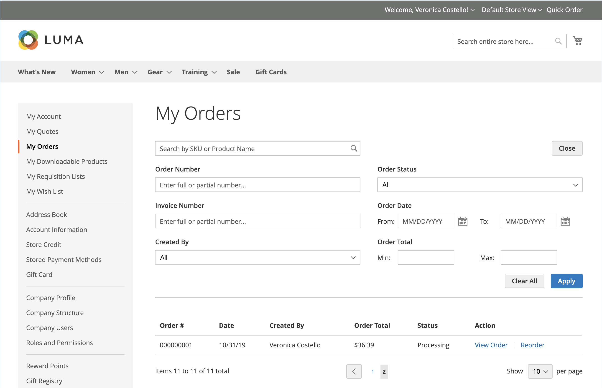
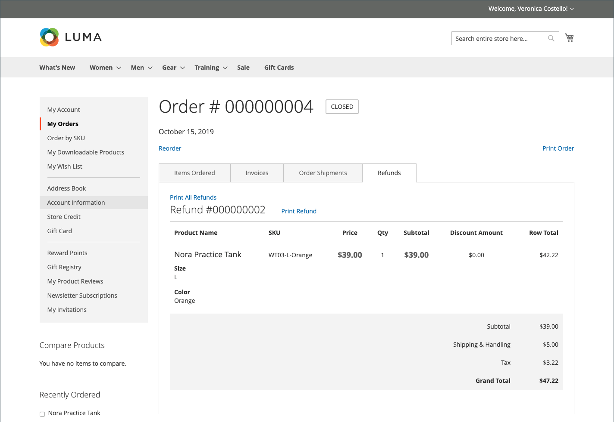

# Gerenciamento de pedidos de vitrine eletrônica

Os clientes têm acesso a todos os seus pedidos por meio de sua conta. Os pedidos podem ser visualizados, filtrados, rastreados e reenviados como novos pedidos. Dependendo do status da ordem, os clientes podem imprimir suas ordens, NFFs, entregas e registros de restituição.

## Filtrar ordens

{{b2b-feature}}

Os resultados iniciais de _[!UICONTROL My Orders]_também contêm pedidos correspondentes de usuários subordinados de todos os sites na instância de comércio. Um cliente associado a uma conta de empresa pode filtrar a lista de pedidos para localizar registros rapidamente nos resultados. Para mostrar as opções de filtro, o cliente clica em **[!UICONTROL Filter]**e em **[!UICONTROL Close]**para ocultar os filtros.

{width="700" zoomable="yes"}

| Filtro | Descrição |
| ------ | ----------- |
| [!UICONTROL SKU or Product Name] | Insira um SKU ou um nome de produto. |
| [!UICONTROL Order Number] | Pode ser um número de pedido completo ou parcial. |
| [!UICONTROL Order Status] | Escolhe um valor na lista suspensa para filtrar por status. |
| [!UICONTROL Invoice Number] | Insere um número de fatura total ou parcial. |
| [!UICONTROL Order Date] | Define um ou ambos os campos de data para filtrar por data do pedido. |
| [!UICONTROL Created by] | Filtra os pedidos da empresa pelo criador do pedido. |
| [!UICONTROL Order Total] | Define os valores mín., máx. ou ambos para filtrar pelo total do pedido. |

## Exibir um pedido

Um cliente encontra o pedido na lista e clica em **[!UICONTROL View Order]**. Na ordem aberta, eles podem executar qualquer um dos seguintes procedimentos:

{width="700" zoomable="yes"}

### Exibir produtos encomendados recentemente

O bloco **[!UICONTROL Recent Orders]** é exibido na barra lateral e na página **[!UICONTROL My Account]** para clientes que estão conectados após fazerem um pedido. Ele exibe cinco produtos da última compra.

O cliente pode ler os produtos no carrinho selecionando os produtos e clicando em **[!UICONTROL Add to Cart]**. Eles também podem exibir a última ordem clicando em **[!UICONTROL View all]**, que redireciona para a página _[!UICONTROL My Account]_e o bloco **[!UICONTROL Recent Orders]**.

### Imprimir ordem

1. O cliente clica em **[!UICONTROL Print Order]**.

1. Siga as instruções na caixa de diálogo Imprimir para concluir a impressão.

### Imprimir faturas

1. Na guia **[!UICONTROL Invoices]**, o cliente clica em uma das opções a seguir:

   - **[!UICONTROL Print All Invoices]**

   - **[!UICONTROL Print Invoice]**

   {width="700" zoomable="yes"}

1. Usa a caixa de diálogo Imprimir para concluir a impressão.

### Imprimir remessas

1. Na guia **[!UICONTROL Order Shipments]**, o cliente clica em uma das opções a seguir:

   - **[!UICONTROL Print All Shipments]**

   - **[!UICONTROL Print Shipment]**

   {width="700" zoomable="yes"}

1. Usa a caixa de diálogo Imprimir para concluir a impressão.

### Rastrear uma remessa

1. Na guia **[!UICONTROL Order Shipments]**, clique em **[!UICONTROL Track this Shipment]**.

   Todas as informações de rastreamento disponíveis são exibidas em uma janela pop-up.

1. Quando estiver pronto, o cliente clica em **[!UICONTROL Close Window]**.

### Imprimir reembolsos

1. Na guia **Reembolsos**, o cliente clica em uma das seguintes opções:

   - **Imprimir Todos Os Reembolsos**

   - **Imprimir Reembolso**

   {width="700" zoomable="yes"}

1. Usa a caixa de diálogo Imprimir para concluir a impressão.

Reordenações estão disponíveis para os clientes quando a opção de configuração [_Permitir Reordenação_](reorders-allow.md) está habilitada.

Um cliente pode iniciar a funcionalidade de reordenação para um pedido específico a partir de duas páginas:

- Página Meus pedidos
- Página de exibição de pedidos

## Reordenações

O link _[!UICONTROL Reorder]_é exibido na lista com pedidos próximos ao link_[!UICONTROL View]_.

{width="700" zoomable="yes"}

**Caso 1.** Todos os produtos do pedido estão disponíveis para reordenação

O cliente é redirecionado ao carrinho de compras e todos os produtos são adicionados ao carrinho.

**Caso 2.** Alguns/todos os produtos do pedido não estão disponíveis para reordenação

>[!NOTE]
>
>É possível reordenar `Not Visible Individually` produtos.

O link _[!UICONTROL Reorder]_não aparece nas páginas_[!UICONTROL My Orders]_ e _[!UICONTROL View Order]_.

{width="700" zoomable="yes"}

>[!TIP]
>
>Se o carrinho não estiver vazio e o cliente clicar em **[!UICONTROL Reorder]** (na página [!UICONTROL My Orders] ou [!UICONTROL Order View]), os produtos existentes permanecerão no carrinho com os produtos de reordenação adicionados.

## Cancelar Pedidos

Cancelar está disponível para clientes quando a opção de configuração [_Permitir Cancelamento_](cancel-allow.md) está habilitada.

Um cliente pode iniciar a funcionalidade de cancelamento para um pedido específico a partir de três páginas:

- Página Meus pedidos
- Página de exibição de pedidos
- Página Minha conta

O link _[!UICONTROL Cancel Order]_é exibido próximo ao link_[!UICONTROL Reorder]_. Se a ordem não puder ser cancelada, o link não será exibido.

{width="700" zoomable="yes"}

Para executar o cancelamento, o cliente:

1. Cliques **[!UICONTROL Cancel Order]**

1. Fornece um motivo de cancelamento

   {width="700" zoomable="yes"}

   Você pode personalizar os motivos do cancelamento na página [_Permitir cancelamento_](cancel-allow.md).

1. Cliques **[!UICONTROL Confirm]**

   {width="700" zoomable="yes"}

   Após o cancelamento, os pedidos que estavam no status _[!UICONTROL Pending]_, mudam para o status_[!UICONTROL Canceled]_, os pedidos que estavam no status _[!UICONTROL Processing]_, mudam para o status_[!UICONTROL Closed]_ e um reembolso será processado.

   Quando o cancelamento for concluído, um email será enviado ao cliente.

   {width="700" zoomable="yes"}

   As informações de cancelamento são adicionadas ao histórico de pedidos do cliente. Ele aparece dentro das notas do pedido e na guia de histórico de comentários.

   {width="700" zoomable="yes"}

   {width="700" zoomable="yes"}

   Se, por algum motivo, o pedido tiver sido alterado para um status que não pode ser cancelado e o cliente não tiver atualizado a página, o link para cancelar o pedido ainda será exibido. No entanto, quando eles tentam cancelar, uma mensagem de erro é exibida.

   {width="700" zoomable="yes"}

   Depois de atualizar a página, você pode ver que o pedido já estava concluído, razão pela qual o cancelamento não funcionou.

   {width="700" zoomable="yes"}
