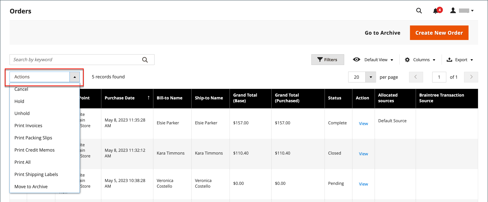

# Pedidos

A grade _Pedidos_ lista todos os pedidos atuais e acompanha seu progresso e o [status do pedido](order-status.md) por meio do [fluxo de trabalho](order-processing.md). Uma maneira fácil de entender o processo básico é que um pedido se torna uma [fatura](invoices.md) e uma fatura se torna uma [remessa](shipments.md). A grade representa o primeiro estágio do processo, e é onde você pode [atualizar](order-update.md) pedidos existentes e criar pedidos.

Normalmente, os pedidos são criados quando os clientes concluem o processo de finalização da loja. No entanto, se um cliente precisar de assistência, você também poderá acessar seu [carrinho de compras](shopping-assisted-cart-manage.md) ou [criar um pedido](customer-account-create-order.md) pela grade _Pedidos_ ou diretamente da conta do cliente.

## Espaço de trabalho Pedidos

O espaço de trabalho Pedidos lista todos os pedidos atuais e oferece a capacidade de editar pedidos existentes e [criar](customer-account-create-order.md) pedidos. Cada linha na grade representa uma ordem de cliente e cada coluna representa um atributo ou campo de dados. Use os [controles](../getting-started/admin-grid-controls.md) padrão para classificar e filtrar a lista, localizar pedidos e aplicar as [ações](../getting-started/admin-actions-control.md) aos pedidos selecionados. Use as guias acima dos controles de paginação para filtrar a lista, alterar a exibição padrão, alterar e reorganizar colunas e exportar dados.

{width="700" zoomable="yes"}

### Layout de grade

A seleção de colunas e sua ordem na grade podem ser alteradas de acordo com sua preferência. O novo layout pode ser salvo como uma grade _exibição_. Por padrão, apenas nove de 20 colunas disponíveis estão incluídas na grade.

{width="600" zoomable="yes"}

#### Alterar a seleção da coluna

No canto superior direito, clique no controle _Colunas_ (  ) e faça o seguinte:

- Marque a caixa de seleção de qualquer coluna que deseja adicionar à grade.
- Desmarque a caixa de seleção de qualquer coluna que você deseja remover da grade.

#### Reinicializa a seleção da coluna

1. Clique no controle _Colunas_ (  ).

1. Para redefinir as colunas da grade, clique em **[!UICONTROL Reset]**.

   O layout da grade muda para exibir somente [colunas padrão](#column-descriptions).

#### Mover uma coluna

1. Clique em e mantenha pressionado o cabeçalho da coluna.

1. Arraste a coluna para a nova posição e solte-a.

#### Salvar uma exibição de grade

1. Clique no controle **[!UICONTROL View]** (  ).

1. Clique em **[!UICONTROL Save Current View]**.

1. Insira um **[!UICONTROL name]** para a exibição.

1. Para salvar todas as alterações, clique na seta (  ).

   O nome da exibição agora aparece como a exibição atual.

#### Alterar a exibição

Clique no controle **[!UICONTROL View]** (  ). Em seguida, siga um destes procedimentos:

- Para usar uma exibição diferente, clique no nome da exibição.

- Para alterar o nome de um modo de exibição, clique no ícone _Editar_ (  ) e atualize o nome.

### Controles do Workspace

| Controle | Descrição |
|--- |--- |
| [!UICONTROL Create New Order] | Cria um pedido. Consulte [Criando uma Ordem](customer-account-create-order.md) para obter mais informações. |
| [!UICONTROL Go to Archive] | Exibe a lista de ordens arquivadas. |
| [!UICONTROL Search] | Inicia uma pesquisa de pedidos com base nos filtros atuais. |
| [!UICONTROL Filters] | Define um conjunto de parâmetros de pesquisa usados para filtrar os registros exibidos na grade. |
| [!UICONTROL Default View] | Determina o layout de coluna padrão da grade. |
| [!UICONTROL Columns] | Determina a seleção das colunas e sua ordem na grade. O layout da coluna pode ser alterado e salvo como uma _exibição_. Por padrão, apenas algumas colunas são incluídas na grade. |
| [!UICONTROL Export] | Exporta os registros selecionados como um arquivo CSV ou XML do Excel. |

{style="table-layout:auto"}

### Ações

Para aplicar uma ação a pedidos específicos, marque a caixa de seleção na primeira coluna de cada pedido. Para selecionar ou desmarcar todas as ordens, use o controle na parte superior da coluna.

{width="600" zoomable="yes"}

| Controle | Descrição |
|--- |--- |
| [!UICONTROL Actions] | Lista todas as ações que podem ser aplicadas às ordens selecionadas. Para aplicar uma ação a uma ordem ou grupo de ordens, marque a caixa de seleção na primeira coluna de cada ordem.  Ações de pedidos: `Cancel` / `Hold` / `Unhold` / `Print Invoices` / `Print Packing Slips` / `Print Credit Memos` / `Print All` / `Print Shipping Labels` / `Move to Archive`  (somente Adobe Commerce) |
| [!UICONTROL Mass Actions] | Pode ser usado para selecionar vários registros como destino da ação. Marque a caixa de seleção na primeira coluna de cada registro que está sujeito à ação. Opções: `Select All` / `Unselect All` / `Select Visible` / `Unselect Visible` |
| [!UICONTROL Submit] | Aplica a ação atual aos registros de ordem selecionados. |
| [!UICONTROL Edit] | Abre a ordem no modo de edição. |

{style="table-layout:auto"}

### Descrições da coluna

| Coluna | Descrição |
|--- |--- |
| [!UICONTROL Select] | Marque as caixas de seleção para que as cotas fiquem sujeitas a uma ação ou use o controle de seleção no cabeçalho da coluna. Opções: Selecionar Tudo / Desmarcar Tudo |
| [!UICONTROL ID] | Um número sequencial exclusivo atribuído quando um novo pedido é salvo pela primeira vez. |
| [!UICONTROL Purchase Point] | Identifica a exibição de loja onde o pedido foi feito. |
| [!UICONTROL Purchase Date] | A data e a hora em que o pedido foi feito. É sempre exibido de acordo com o fuso horário padrão. |
| [!UICONTROL Bill-to Name] | O nome da pessoa responsável pelo pagamento da ordem. |
| [!UICONTROL Ship-to Name] | O nome da pessoa para quem a ordem deve ser entregue. |
| [!UICONTROL Grand Total (Base)] | O total geral do pedido. |
| [!UICONTROL Grand Total (Purchased)] | O total geral de produtos comprados no pedido. |
| [!UICONTROL Status] | O status atual do pedido. |
| [!UICONTROL Action] | _[!UICONTROL View]_abre a ordem no modo de edição. |
| [!UICONTROL Allocated sources] | As origens alocadas para essa ordem específica. |

{style="table-layout:auto"}

Colunas adicionais disponíveis:

| Coluna | Descrição |
|--- |--- |
| [!UICONTROL Billing Address] | O endereço de faturamento do cliente que fez o pedido. |
| [!UICONTROL Shipping Address] | O endereço para onde o pedido deve ser enviado. |
| [!UICONTROL Shipping Information] | O método a ser usado para enviar o pedido. |
| [!UICONTROL Customer Email] | O endereço de email da pessoa que fez o pedido. |
| [!UICONTROL Customer Group] | O grupo de clientes ao qual a pessoa que fez a ordem está atribuída. |
| [!UICONTROL Subtotal] | O subtotal do pedido, sem remessa, manuseio e imposto. |
| [!UICONTROL Shipping and Handling] | O valor cobrado para remessa e manuseio. |
| [!UICONTROL Customer Name] | O nome e o sobrenome do cliente que fez o pedido. |
| [!UICONTROL Payment Method] | O método de pagamento a ser usado para o pedido. |
| [!UICONTROL Total Refunded] | Qualquer valor do pedido que deve ser reembolsado ao cliente. |
| [!UICONTROL Refunded to Store Credit] |  (somente Adobe Commerce) Qualquer valor da ordem que deve ser reembolsado ao crédito de loja do cliente. |
| [!UICONTROL Company Name] |  (Disponível com Adobe Commerce B2B) O nome da [empresa](../b2b/account-companies.md) que fez o pedido. |

{style="table-layout:auto"}

## Pesquisa de pedidos

A caixa Pesquisar no canto superior esquerdo da grade Pedidos pode ser usada para localizar pedidos específicos por palavra-chave ou filtrando os registros de pedido na grade.

{width="600" zoomable="yes"}

### Procurar uma correspondência

1. Insira um termo de pesquisa na caixa de pesquisa da página.

1. Para exibir os resultados, clique em _Pesquisar_ (  ).

### Filtrar a pesquisa

1. Para exibir a seleção de filtros de pesquisa, clique na guia _Filtros_ (  ).

   {width="600" zoomable="yes"}

1. Preencha quantos filtros desejar para descrever os pedidos que deseja localizar.

1. Clique em **[!UICONTROL Apply Filters]** para exibir os resultados.

### Filtros de pesquisa

| Filtro | Descrição |
|--- |--- |
| [!UICONTROL Purchase Date] | Filtra a pesquisa com base na data de compra. Para localizar ordens dentro de um intervalo de datas, insira as datas **[!UICONTROL from]** e **[!UICONTROL to]**. |
| [!UICONTROL ID] | Filtra a pesquisa com base na ID do pedido. |
| [!UICONTROL Grand Total (Base)] | Filtra a pesquisa com base no Total geral de cada pedido, que inclui todos os créditos aplicados ao pedido. |
| [!UICONTROL Grand Total (Purchased)] | Filtra a pesquisa com base no Total geral de itens comprados em cada pedido. |
| [!UICONTROL Bill-to Name] | Filtra a pesquisa de acordo com o nome da pessoa responsável pelo pagamento da ordem. |
| [!UICONTROL Ship-to Name] | Filtra a pesquisa de acordo com o nome da pessoa para quem cada pedido é enviado. |
| [!UICONTROL Purchase Point] | Filtra a pesquisa por site, loja ou exibição de loja onde o pedido foi feito. |
| [!UICONTROL Status] | Filtra a pesquisa com base no status do pedido. Opções: `Canceled` / `Closed` / `Complete` / `Suspected Fraud` / `On Hold` / `Payment Review` / `PayPal Canceled Reversal` /` PayPal Reversed` /` Pending` / `Pending Payment` / `Pending PayPal` / `Processing` |
| [!UICONTROL Braintree Transaction Source] | Filtra a pesquisa com base na origem da transação. |

{style="table-layout:auto"}

### Ferramentas de pesquisa

| Ferramenta | Descrição |
|--- |--- |
| [!UICONTROL Apply Filters] | Aplica todos os filtros aos resultados da pesquisa. |
| [!UICONTROL Cancel] | Cancela a pesquisa atual. |
| [!UICONTROL Clear All] | Limpa todos os filtros de pesquisa. |

{style="table-layout:auto"}

