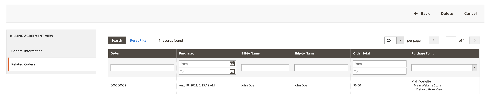
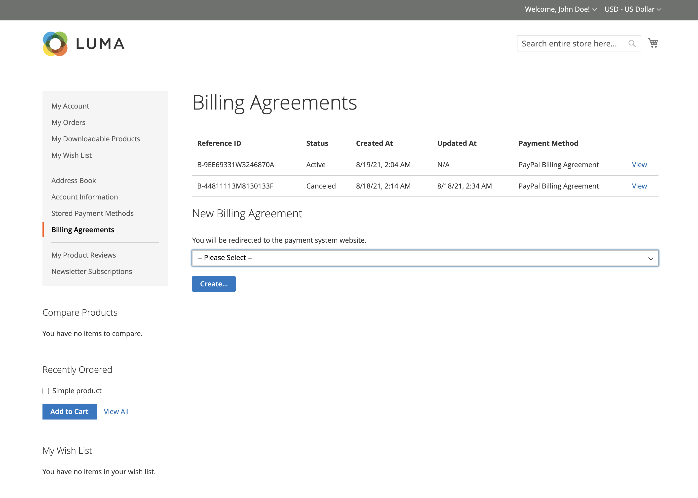

# Contratos de cobrança do PayPal

Para simplificar o processo de finalização, os clientes podem celebrar um contrato de faturamento com o PayPal como provedor de serviços de pagamento. Durante o checkout, o cliente escolhe o contrato de faturamento como método de pagamento. O sistema de pagamento verifica o contrato de faturamento por seu número exclusivo e cobra a conta do cliente. Com um contrato de faturamento em vigor, não é mais necessário que o cliente insira informações de pagamento para cada compra. Os clientes podem gerenciar seus contratos de faturamento no painel da conta do cliente, onde o status de cada um é mostrado como _Ativo_ ou _Cancelado_. Quando um contrato de faturamento é cancelado, ele não pode ser reativado.

## Fluxo de trabalho do contrato de cobrança

1. **O cliente se inscreve em um contrato de faturamento**. Depois que um contrato de faturamento estiver em vigor, os contratos de faturamento adicionais poderão ser adicionados somente da conta do cliente. Não há limite para o número de contratos de faturamento que um cliente pode criar. Os clientes podem usar qualquer um dos seguintes métodos para se inscreverem em contratos de faturamento:

   - **Inscrever-se na conta do cliente** - Os clientes podem se inscrever para um contrato de faturamento a partir de suas contas de cliente.
   - **Inscrever-se no check-out** - Os clientes que pagam por uma compra com o Check-out do PayPal Express podem marcar uma caixa de seleção para criar um contrato de faturamento. Embora o contrato de faturamento não seja usado para o pedido atual, ele fica disponível como uma opção de método de pagamento na próxima vez que o cliente fizer um pedido.
   - **Inscrever-se pelo administrador da loja** - Mediante solicitação do cliente, o administrador da loja pode criar uma ordem de venda usando o contrato de cobrança do cliente.

1. **O PayPal verifica e registra o contrato**. Quando o cliente faz o pedido com pagamento por contrato de faturamento, a ID de referência do contrato de faturamento e os detalhes de pagamento da ordem de venda são transferidos para o PayPal e registrados na conta do cliente, juntamente com as informações de referência. Se o pagamento for autorizado, uma ordem será criada no Commerce. A ID de referência do contrato de cobrança é enviada ao cliente e à loja.

## Gerenciar contratos de cobrança

A variável _[!UICONTROL Billing Agreements]_A página lista todos os contratos de cobrança entre sua loja e seus clientes. Os comerciantes podem filtrar os registros por cliente ou informações de contrato de faturamento, incluindo ID de referência, status e data de criação do contrato de faturamento. Cada registro inclui informações gerais sobre o contrato de faturamento e todas as ordens de venda que o usaram como método de pagamento. Você pode exibir, cancelar ou excluir contratos de faturamento do cliente. Um contrato de cobrança cancelado pode ser excluído somente pelo administrador da loja.

### Exibir um contrato de faturamento

1. No _Admin_ barra lateral, vá para **[!UICONTROL Sales]** > _[!UICONTROL Operations]_>**[!UICONTROL Billing Agreements]**.

1. Localize o contrato de faturamento na lista e clique nele para abri-lo.

Cada página de contrato de faturamento consiste em duas guias: _[!UICONTROL General Information]_e_[!UICONTROL Related Orders]_.

#### Informações gerais

Esta guia inclui as informações gerais sobre o contrato de faturamento:

- [!UICONTROL Reference ID]: um identificador numérico exclusivo que é atribuído ao contrato de faturamento atual.
- [!UICONTROL Customer]: conta do cliente atribuída ao contrato de faturamento atual.
- [!UICONTROL Status]: Status do contrato de pagamento.
- [!UICONTROL Created At]: Data de criação.
- [!UICONTROL Updated At]: data de atualização.

{width="600" zoomable="yes"}

#### Pedidos relacionados

Esta guia exibe a lista dos pedidos feitos usando o contrato de faturamento atual.

{width="600" zoomable="yes"}

### Cancelar um contrato de faturamento

1. No _Admin_ barra lateral, vá para **[!UICONTROL Sales]** > _[!UICONTROL Operations]_>**[!UICONTROL Billing Agreements]**.

1. Localize o contrato de faturamento na lista e clique nele para abri-lo.

1. No canto superior direito, clique em **[!UICONTROL Cancel]**.

1. Para confirmar a ação, clique em **[!UICONTROL OK]**.

### Excluir um contrato de cobrança

1. No _Admin_ barra lateral, vá para **[!UICONTROL Sales]** > _[!UICONTROL Operations]_>**[!UICONTROL Billing Agreements]**.

1. Localize o contrato de faturamento na lista e clique nele para abri-lo.

1. No canto superior direito, clique em **[!UICONTROL Delete]**.

1. Para confirmar a ação, clique em **[!UICONTROL OK]**.

### Descrições da coluna

| Coluna | Descrição |
|--- |--- |
| [!UICONTROL ID] | Um identificador numérico exclusivo atribuído a cada contrato de faturamento |
| [!UICONTROL Email] | Email de contato de um cliente |
| [!UICONTROL First Name] | Nome do cliente |
| [!UICONTROL Last Name] | Sobrenome do cliente |
| [!UICONTROL Reference ID] | Um identificador de referência numérico exclusivo que é atribuído a cada contrato de faturamento |
| [!UICONTROL Status] | Status do contrato de pagamento. Opções: `Active` ou `Canceled` |
| [!UICONTROL Created] | Data de criação |
| [!UICONTROL Updated] | Atualizar data |

{style="table-layout:auto"}

## Experiência da vitrine

Os clientes que celebram um contrato de faturamento com um provedor de serviços de pagamento podem fazer compras agora e pagá-las posteriormente, de acordo com o contrato. A variável

{width="700" zoomable="yes"}

| Coluna | Descrição |
|--- |--- |
| [!UICONTROL Reference ID] | Um identificador de referência numérico exclusivo que é atribuído a cada contrato de faturamento |
| [!UICONTROL Status] | Status do contrato de pagamento. Opções: `Active` ou `Canceled` |
| [!UICONTROL Created At] | Data de criação |
| [!UICONTROL Updated At] | Atualizar data |
| [!UICONTROL Payment Method] | Um provedor de pagamento de um contrato de faturamento |
| [!UICONTROL View] | Botão usado para exibir contratos de faturamento |

{style="table-layout:auto"}

### Criar um contrato de faturamento

1. No painel de contas, o cliente seleciona **[!UICONTROL Billing Agreements]**.

1. Em **[!UICONTROL New Billing Agreement]**, seleciona um provedor de pagamento.

1. Clique em **[!UICONTROL Create]**.

Essa ação redireciona o cliente para o site do sistema de pagamento.

{width="700" zoomable="yes"}

### Exibir um contrato de faturamento

1. No painel de contas, o cliente seleciona **[!UICONTROL Billing Agreements]**.

1. Seleciona o contrato de faturamento e clica em **[!UICONTROL View]**.

{width="700" zoomable="yes"}

### Cancelar um contrato de faturamento

1. No painel de contas, o cliente seleciona **[!UICONTROL Billing Agreements]**.

1. Seleciona o contrato de faturamento e clica em **[!UICONTROL View]**.

1. No canto superior direito, clique em **[!UICONTROL Cancel]** e depois **[!UICONTROL OK]** para confirmar.

>[!NOTE]
>
>Se um usuário administrador (comerciante) cancelar o contrato de faturamento, ele não poderá ser cancelado na loja. A variável _Cancelado_ O status é exibido para este contrato.
