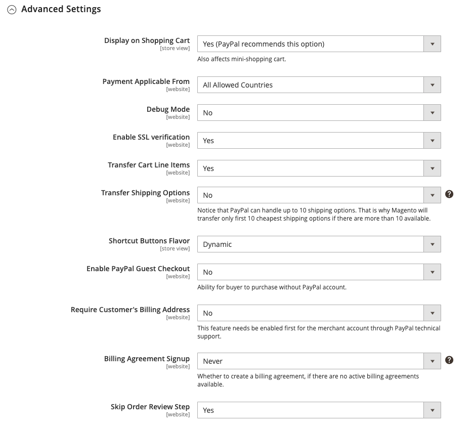

# Check-out do PayPal Express

O Check-out expresso do PayPal ajuda a impulsionar as vendas, oferecendo aos seus clientes a capacidade de pagar com cartão de crédito ou com a segurança de suas contas pessoais do PayPal. Durante a finalização da compra, o cliente é redirecionado para o site seguro do PayPal para preencher as informações de pagamento. O cliente é retornado à sua loja para concluir o restante do processo de finalização. Escolher o Check-out expresso adiciona o familiar botão PayPal à sua loja, que tem sido relatado para aumentar as vendas.

>[!IMPORTANT]
>
>Requisitos do **PSD2:**  
>A partir de 14 de setembro de 2019, os bancos europeus poderão recusar pagamentos que não atendam aos requisitos do [PSD2](../getting-started/compliance-payment-services-directive.md). Nenhuma ação é necessária para que o Check-out do PayPal Express esteja em conformidade com a PSD2, pois todos os requisitos são tratados pelo PayPal.

Os clientes com contas atuais do PayPal podem fazer uma compra em uma única etapa clicando no botão _[!UICONTROL Check out with PayPal]_. O Check-out expresso pode ser usado como um aplicativo independente ou com uma das soluções PayPal all-in-one. Se você já aceita cartões de crédito on-line, você pode oferecer o Check-out expresso como uma opção extra para atrair novos clientes que preferem pagar com PayPal.

>[!NOTE]
>
>O PayPal substituiu o suporte para a venda de bens digitais pelo Check-out do PayPal Express e recomenda que você use o [PayPal Payments Standard](paypal-payments-standard.md) ou outro gateway de pagamento do PayPal para processar qualquer pedido que inclua [produtos virtuais](../catalog/product-create-virtual.md).

## Requisitos

- Comerciante: [Conta do PayPal comercial](https://www.paypal.com/webapps/mpp/how-to-sell-online)
- Cliente: [Conta pessoal do PayPal](https://www.paypal.com/webapps/mpp/buying-online)

## Fluxo de trabalho de finalização expressa

Ao contrário de outros métodos de pagamento, o Check-out expresso do PayPal permite que o cliente faça check-out no início do fluxo de trabalho de check-out usual a partir da página do produto, do minicarrinho e do carrinho de compras.

1. **O cliente faz o pedido** - O cliente clica/toca no botão _[!UICONTROL Check out with PayPal]_.
1. **O cliente foi redirecionado para o site do PayPal** - O cliente foi redirecionado para o site do PayPal para concluir a transação.
1. **O cliente faz logon em sua conta do PayPal** - O cliente deve fazer logon em sua conta do PayPal para concluir a transação. O sistema de pagamento usa as informações de faturamento e envio de sua conta do PayPal.
1. **O cliente retorna à página de check-out** - O cliente é redirecionado de volta à página de check-out em sua loja para examinar o pedido.
1. **O cliente faz o pedido** - O cliente faz o pedido e as informações são enviadas ao PayPal.
1. **PayPal liquida a transação** - O PayPal recebe a ordem e liquida a transação.

>[!NOTE]
>
>O Check-out do PayPal Express não aceita pedidos com vários endereços.

## Checkout no contexto

O _Check-out em Contexto_ do PayPal torna mais fácil do que nunca pagar online. Os clientes nunca perdem de vista sua loja durante esse checkout simplificado, com um ou dois cliques. A verificação no contexto funciona igualmente bem em Macs e PCs e oferece uma experiência consistente em computadores desktop, tablets e dispositivos móveis. Para saber mais, consulte [Check-out em Contexto no Check-out Expresso](https://www.paypal.com/rs/webapps/mpp/express-checkout).

{width="700" zoomable="yes"}

[_Demonstração de check-out no contexto do PayPal_](https://demo.paypal.com/us/demo/navigation?merchant=bigbox&page=incontextProductCheckout)

Ao configurar seu armazenamento para [!DNL PayPal Express Checkout], você pode habilitar essa opção.

## Configurar sua conta do PayPal

Antes de configurar o Check-out expresso do PayPal no Commerce Admin, você deve configurar sua conta de comerciante no site do PayPal.

1. Faça logon na sua conta do PayPal Advanced em [manager.paypal.com](https://manager.paypal.com/).

1. Vá para **[!UICONTROL Service Settings]** > **[!UICONTROL Hosted Checkout Pages]** > **[!UICONTROL Set Up]** e faça as seguintes configurações:

   - **[!UICONTROL AVS]**: `No`
   - **[!UICONTROL CSC]**: `No`
   - **[!UICONTROL Enable Secure Token]**: `Yes`

1. Clique em **[!UICONTROL Save Changes]**.

1. Configurar outro usuário (recomendado pelo PayPal):

   - Vá para [manager.paypal.com](https://manager.paypal.com/) e faça logon em sua conta.

   - Para configurar outro usuário, siga as instruções.

   - Clique em **[!UICONTROL Update]**.

## Configurar o Check-out expresso do PayPal no Commerce

Você pode ter duas soluções PayPal ativas ao mesmo tempo: Check-out do PayPal Express, além de uma solução all-in-one. Se você habilitar uma solução diferente, a solução usada anteriormente será desativada automaticamente.

>[!NOTE]
>
>Clique em **[!UICONTROL Save Config]** a qualquer momento para salvar seu progresso.

### Etapa 1: iniciar a configuração

1. Na barra lateral _Admin_, vá para **[!UICONTROL Stores]** > _[!UICONTROL Settings]_>**[!UICONTROL Configuration]**.

1. No painel esquerdo, expanda **[!UICONTROL Sales]** e escolha **[!UICONTROL Payment Methods]**.

1. Se a sua instalação tiver vários sites, lojas ou modos de exibição, defina **[!UICONTROL Store View]** como o modo de exibição de loja ao qual deseja aplicar essa configuração.

1. Na seção _[!UICONTROL Merchant Location]_, selecione o **[!UICONTROL Merchant Country]**&#x200B;onde sua empresa está localizada.

   Esta configuração determina a seleção das Soluções do PayPal que aparecem na configuração.

   {width="600" zoomable="yes"}

1. Em _[!UICONTROL Recommended Solutions]_, clique em **[!UICONTROL Configure]**&#x200B;para **[!UICONTROL PayPal Express Checkout]**.

   {width="600"}

### Etapa 2: ativar e conectar sua conta do PayPal

1. Se necessário, expanda  a seção **[!UICONTROL Required PayPal Settings]**.

   {width="600" zoomable="yes"}

1. Conectar sua conta para teste ou produção:

   - Para o modo de teste (desenvolvimento), clique em **[!UICONTROL Sandbox Credentials]** e insira suas credenciais da [sandbox do PayPal](https://developer.paypal.com/docs/api-basics/sandbox/).
   - Para o modo de produção, clique em **[!UICONTROL Connect with PayPal]** e insira suas credenciais de conta de produção.

   Quando a conexão for validada, você poderá continuar.

1. Defina **[!UICONTROL Enable this Solution]** como `Yes`.

1. Para habilitar o [Check-out em Contexto Interno do PayPal](#in-context-checkout):

   - Defina **[!UICONTROL Enable In-Context Checkout Experience]** como `Yes`.

   - Insira seu PayPal **[!UICONTROL Merchant Account ID]**.

     Sua ID de Conta de Comerciante está no perfil de conta comercial do PayPal.

>[!NOTE]
>
>O [Crédito do PayPal](paypal.md#paypal-credit-and-pay-later) está habilitado por padrão para esta opção de pagamento.

### Etapa 3: concluir as configurações necessárias do PayPal

1. Se necessário, expanda  a seção **[!UICONTROL Express Checkout]**.

   {width="600" zoomable="yes"}

1. (Opcional) Insira o **[!UICONTROL Email Associated with PayPal Merchant Account]**.

   >[!IMPORTANT]
   >
   >Os endereços de email diferenciam maiúsculas de minúsculas. Para receber o pagamento, o endereço de email inserido deve corresponder ao endereço de email especificado em sua conta de comerciante do PayPal.

   Se você não tiver uma conta do PayPal, clique em **[!UICONTROL Start accepting payments via PayPal]**.

1. Defina **[!UICONTROL API Authentication Methods]** como um dos seguintes:

   - `API Signature` - Este método de autenticação do PayPal é o mais fácil de implementar e baseia-se no seu nome de usuário, senha e uma sequência exclusiva de caracteres e números que identifica a sua conta. As credenciais de assinatura da API não expiram.
   - `API Certificate` - Este método de autenticação do PayPal é mais seguro, baseia-se no seu nome de usuário, senha e um certificado para download. As Credenciais da API expiram após três anos e devem ser renovadas.

   Se necessário, conclua o seguinte:

   - **[!UICONTROL API Username]**
   - **[!UICONTROL API Password]**
   - **[!UICONTROL API Signature]**

1. Se você estiver usando credenciais da sua conta de sandbox, defina **[!UICONTROL Sandbox Mode]** como `Yes`.

   Ao testar a configuração em uma sandbox, use apenas [números de cartão de crédito](https://www.paypalobjects.com/en_AU/vhelp/paypalmanager_help/credit_card_numbers.htm) recomendados pelo PayPal. Quando estiver pronto para entrar na produção, retorne à configuração, defina o Modo de Sandbox como `No` e conecte-se à sua conta de produção do PayPal.

1. Se o sistema usar um servidor proxy para estabelecer a conexão entre o Commerce e o sistema de pagamento do PayPal, defina **[!UICONTROL API Uses Proxy]** como `Yes` e conclua o seguinte:

   - **[!UICONTROL Proxy Host]**
   - **[!UICONTROL Proxy Port]**

No final desta sequência de etapas, as configurações necessárias do PayPal estão concluídas. Você pode continuar com as Configurações Básicas e Avançadas ou clicar em **[!UICONTROL Save Config]** e retornar mais tarde para ajustar a configuração

### Etapa 4: Configurar Crédito do PayPal de Anúncio / Anunciar PayPal PayLater (opcional)

A partir da versão 2.4.3, o PayPal PayLater é compatível com implantações que incluem o PayPal. Esse recurso permite que os compradores paguem um pedido em prestações quinzenais em vez de pagar o valor total no momento da compra. A experiência do PayPal Credit está obsoleta.

Defina **[!UICONTROL Enable PayPal PayLater Experience]** como um dos seguintes:

- `Yes` - Para configurar Anunciar PayPal PayLater
- `No` - Para configurar o Crédito de Anúncio do PayPal

>[!NOTE]
>
>A configuração **[!UICONTROL Enable PayPal PayLater Experience]** não desabilita o recurso [!DNL PayPal PayLater] e não remove os botões **_[!UICONTROL PayPal PayLater]_** da loja. Para desabilitar os botões **_[!UICONTROL PayPal PayLater]_** e **_[!UICONTROL PayPal Credit]_** na vitrine, você deve selecionar o valor `PayPal Credit` para a configuração **[!UICONTROL Disable Funding Options]** ([!UICONTROL Advanced Settings] em [!UICONTROL Frontend Experience Settings]).

#### Anunciar Crédito do PayPal

1. Expandir  a seção **[!UICONTROL Advertise PayPal Credit]**.

1. Para obter as informações da sua conta, clique em **[!UICONTROL Get Publisher ID from PayPal]** e siga as instruções.

1. Insira seu **[!UICONTROL Publisher ID]**.

   {width="600" zoomable="yes"}

1. Expandir  a seção **[!UICONTROL Home Page]**.

1. Para colocar um banner na página, defina **[!UICONTROL Display]** como `Yes`.

1. Defina **[!UICONTROL Position]** como um dos seguintes:

   - `Header (center)`
   - `Sidebar (right)`

1. Defina **[!UICONTROL Size]** como um dos seguintes:

   - `190 x 100`
   - `234 x 60`
   - `300 x 50`
   - `468 x 60`
   - `728 x 90`
   - `800 x 66`

   {width="600" zoomable="yes"}

1. Expanda  as seções restantes e repita as etapas anteriores:

   - [!UICONTROL Catalog Category Page]
   - [!UICONTROL Catalog Product Page]
   - [!UICONTROL Checkout Cart Page]

#### Anunciar PayPal PayLater

1. Expandir  a seção **[!UICONTROL Advertise PayPal PayLater]**.

1. Defina **[!UICONTROL Enable PayPal PayLater]** como `Yes`.

1. Expandir  a seção **[!UICONTROL Home Page]**.

1. Para colocar um banner na página, defina **[!UICONTROL Display]** como `Yes`.

1. Defina **[!UICONTROL Position]** como um dos seguintes:

   - `Header (center)`
   - `Sidebar`

1. Defina **[!UICONTROL Style Layout]** como um dos seguintes:

   - `Text`
   - `Flex`

1. Somente para [!UICONTROL Style Layout] **[!UICONTROL Text]**, defina **[!UICONTROL Logo Type]** como um dos seguintes:

   - `Primary`
   - `Alternative`
   - `Inline`
   - `None`

1. Somente para [!UICONTROL Style Layout] **[!UICONTROL Text]**, defina **[!UICONTROL Logo Position]** como um dos seguintes:

   - `Left`
   - `Right`
   - `Top`

1. Somente para [!UICONTROL Style Layout] **[!UICONTROL Text]**, defina **[!UICONTROL Text Color]** como um dos seguintes:

   - `Black`
   - `White`
   - `Monochrome`
   - `Grayscale`

1. Somente para [!UICONTROL Style Layout] **[!UICONTROL Text]**, defina **[!UICONTROL Text Size]** como um dos seguintes:

   - `10px`
   - `11px`
   - `12px`
   - `13px`
   - `14px`
   - `15px`
   - `16px`

1. Somente para [!UICONTROL Style Layout] **[!UICONTROL Flex]**, defina **[!UICONTROL Ratio]** como um dos seguintes:

   - `1x1`
   - `1x4`
   - `8x1`
   - `20x1`

1. Somente para [!UICONTROL Style Layout] **[!UICONTROL Flex]**, defina **[!UICONTROL Color]** como um dos seguintes:

   - `Blue`
   - `Black`
   - `White`
   - `White No Border`
   - `Gray`
   - `Monochrome`
   - `Grayscale`

   {width="600" zoomable="yes"}

1. Expanda  as seções restantes e repita as etapas anteriores:

   - [!UICONTROL Catalog Product Page]
   - [!UICONTROL Checkout Cart Page]
   - [!UICONTROL Checkout Payment Step]
   - [!UICONTROL Catalog Category Page]

### Etapa 5: concluir as configurações básicas

1. Expandir  a seção **[!UICONTROL Basic Settings - PayPal Express Checkout]**.

   {width="600" zoomable="yes"}

1. Para **[!UICONTROL Title]**, insira um título que identifique este método de pagamento durante o check-out.

   É recomendável usar o título _PayPal_ para todas as exibições de loja.

1. Se você oferecer vários métodos de pagamento, insira um número para **[!UICONTROL Sort Order]** para determinar a sequência em que o Check-out do PayPal Express é exibido quando listado com os outros métodos de pagamento.

   Esse número é relativo aos outros métodos de pagamento. (`0` = primeiro, `1` = segundo, `2` = terceiro e assim por diante.)

1. Defina **[!UICONTROL Payment Action]** como um dos seguintes:

   - `Authorization` - Aprova a compra e suspende os fundos. O valor não é retirado até ser _capturado_ pelo comerciante.
   - `Sale` - O valor da compra é autorizado e imediatamente retirado da conta do cliente.
   - `Order` - O valor do pedido não é capturado ou autorizado no saldo do cliente, na conta bancária ou no cartão de crédito no PayPal. A ação Solicitar pagamento representa um acordo entre o sistema de pagamento do PayPal e o comerciante. Ele permite que o comerciante capture uma ou mais quantias até o total solicitado da conta do comprador do cliente por um período de até 29 dias. Depois que os fundos são solicitados, o comerciante pode capturá-los a qualquer momento durante o período de 29 dias seguinte. A captura do valor do pedido só pode ser feita pelo administrador do Commerce, criando uma ou mais faturas.

1. Para exibir o botão _[!UICONTROL Check out with PayPal]_&#x200B;na página do produto, defina **[!UICONTROL Display on Product Details Page]**&#x200B;como `Yes`.

1. Se a ação de pagamento estiver definida como `Order`, conclua o seguinte

   - **[!UICONTROL Authorization Honor Period (days)]** - Determina por quanto tempo a autorização primária permanece válida. O valor deve ser igual ao valor correspondente na sua conta de comerciante do PayPal. O valor padrão em sua conta de comerciante do PayPal é `3`. Para aumentar esse número, você deve entrar em contato com o PayPal. A autorização se torna inválida às 23h00, Horário do Pacífico dos EUA, do último dia.:49

   - **[!UICONTROL Order Valid Period (days)]** - Determina por quanto tempo o pedido permanece válido. Quando a ordem se tornar inválida, você não poderá mais criar faturas para ela. Especifique o valor igual ao valor do Período Válido do Pedido na conta de comerciante do PayPal. O valor padrão em sua conta de comerciante do PayPal é `29`. Para alterar esse número, você deve entrar em contato com o PayPal.

   - **[!UICONTROL Number of Child Authorizations]** - Especifica o número máximo de autorizações para um único pedido, que determina o número máximo de faturas parciais online que você pode criar para um pedido. Esse valor deve ser igual à configuração correspondente na conta de comerciante do PayPal. O número padrão de autorizações para crianças na sua conta do PayPal é `1`. Para aumentar esse número, você deve entrar em contato com o PayPal.

### Etapa 6: concluir as configurações avançadas

1. Expandir  a seção **[!UICONTROL Advanced Settings]**.

   {width="600" zoomable="yes"}

1. Defina **[!UICONTROL Display on Shopping Cart]** como `Yes`.

1. Defina **[!UICONTROL Payment Applicable From]** como um dos seguintes:

   - `All Allowed Countries` - Clientes de todos os países especificados na sua configuração de loja podem usar esta forma de pagamento.
   - `Specific Countries` - Depois de escolher esta opção, a lista _[!UICONTROL Payment from Specific Countries]_&#x200B;é exibida. Para selecionar vários países, mantenha pressionada a tecla Ctrl (PC) ou a tecla Command (Mac) e clique em cada item.

1. Para gravar comunicações com o sistema de pagamento no arquivo de log, defina **[!UICONTROL Debug Mode]** como `Yes`.

   O arquivo de log do PayPal Payments Advanced é `_payflow_advanced.log`.

   >[!NOTE]
   >
   >De acordo com os padrões de segurança de dados do PCI, as informações de cartão de crédito não são gravadas no arquivo de registro.

1. Para habilitar a verificação de autenticidade do host, defina **[!UICONTROL Enable SSL Verification]** como `Yes`.

1. Para exibir um resumo completo do pedido do cliente por item de linha do site do PayPal, defina **[!UICONTROL Transfer Cart Line Items]** como `Yes`.

1. Para incluir até dez opções de envio no resumo, defina **[!UICONTROL Transfer Shipping Options]** como `Yes`. (Essa opção aparecerá somente se os itens de linha estiverem definidos para transferência.)

1. Para determinar o tipo de imagem usada para o botão de aceitação do PayPal, defina **[!UICONTROL Shortcut Buttons Flavor]** como um dos seguintes:

   - `Dynamic` - (Recomendado) Exibe uma imagem que pode ser alterada dinamicamente do servidor PayPal.
   - `Static` - Exibe uma imagem específica que não pode ser alterada dinamicamente.

1. Para permitir que clientes sem contas do PayPal façam uma compra com este método, defina **[!UICONTROL Enable PayPal Guest Checkout]** como `Yes`.

1. Defina **[!UICONTROL Require Customer's Billing Address]** como um dos seguintes:

   - `Yes` - Requer o endereço de cobrança do cliente para todas as compras.
   - `No` - Não requer o endereço de cobrança do cliente para nenhuma compra.
   - `For Virtual Quotes Only` - Requer o endereço de cobrança do cliente somente para cotações virtuais.

   >[!NOTE]
   >
   >Este recurso deve ser habilitado para a conta do comerciante por meio do suporte técnico do PayPal.

1. (Opcional) Defina o **[!UICONTROL Billing Agreement Signup]** para permitir que os clientes assinem um [contrato de cobrança](paypal-billing-agreements.md) com sua loja no sistema de pagamento PayPal quando não houver contratos de cobrança ativos disponíveis na conta do cliente:

   - `Auto` - O cliente pode assinar um contrato de cobrança durante o fluxo de Finalização Expressa ou usar outro método de pagamento.
   - `Ask Customer` - O cliente pode decidir se deve assinar um contrato de cobrança durante o fluxo de Finalização Expressa.
   - `Never` - O cliente não pode assinar um contrato de cobrança durante o fluxo de Finalização Expressa.

   >[!NOTE]
   >
   >Os comerciantes devem solicitar ao [Suporte Técnico de Comerciante do PayPal](https://developer.paypal.com/support/) que habilite os contratos de cobrança em suas contas. O parâmetro _Assinatura do Contrato de Cobrança_ só será habilitado depois que o PayPal confirmar que os contratos de cobrança estão habilitados para sua conta de comerciante.

1. Para permitir que o cliente conclua a transação no site do PayPal sem retornar ao seu armazenamento para Revisão do Pedido, defina **[!UICONTROL Skip Order Review Step]** como `Yes`.

1. Preencha as seções adicionais, conforme necessário para sua loja:

   - [Configurações do Contrato de Cobrança do PayPall](#paypal-billing-agreement-settings)
   - [Configurações do relatório de liquidação](#settlement-report-settings)
   - [Configurações de experiência de front-end](#frontend-experience-settings)
   - [Personalizar botões inteligentes](#customize-smart-buttons)
   - [Recursos](#features)

1. Quando terminar, clique em **[!UICONTROL Save Config]**.

#### Configurações do Contrato de Cobrança do PayPal

Um [contrato de cobrança](paypal-billing-agreements.md) é um contrato de venda entre o comerciante e o cliente que foi autorizado pelo PayPal para uso com vários pedidos. Durante o processo de finalização, a opção de pagamento Contrato de faturamento é exibida somente para clientes que já firmaram um contrato de faturamento com sua empresa. Depois que o PayPal autoriza o contrato, o sistema de pagamento emite uma ID de referência exclusiva para identificar cada pedido associado ao contrato. Semelhante a uma ordem de compra, não há limite para o número de contratos de faturamento que um cliente pode configurar com sua empresa.

1. Expandir  a seção **[!UICONTROL PayPal Billing Agreement Settings]**.

   {width="600" zoomable="yes"}

1. Defina **[!UICONTROL Enabled]** como `Yes`.

1. Para **[!UICONTROL Title]**, insira um título que identifique o método de Contrato de Cobrança do PayPal durante o check-out.

1. Se você oferecer vários métodos de pagamento, insira um número no campo **[!UICONTROL Sort Order]** para determinar a sequência em que o Contrato de Cobrança aparece quando listado com outros métodos de pagamento durante o check-out.

1. Defina **[!UICONTROL Payment Action]** como um dos seguintes:

   - `Authorization` - Aprova a compra e suspende os fundos. A quantidade não é retirada até que seja &quot;capturada&quot; pelo comerciante.
   - `Sale` - O valor da compra é autorizado e imediatamente retirado da conta do cliente.

1. Defina **[!UICONTROL Payment Applicable From]** como um dos seguintes:

   - `All Allowed Countries` - Clientes de todos os países especificados na sua configuração de loja podem usar esta forma de pagamento.
   - `Specific Countries` - Depois de escolher esta opção, a lista _[!UICONTROL Payment from Specific Countries]_&#x200B;é exibida. Para selecionar vários países, mantenha pressionada a tecla Ctrl (PC) ou a tecla Command (Mac) e clique em cada um.

1. Para registrar comunicações com o sistema de pagamento no arquivo de log, defina **[!UICONTROL Debug Mode]** como `Yes`.

   >[!NOTE]
   >
   >O arquivo de log é armazenado no servidor e pode ser acessado apenas por desenvolvedores. De acordo com os padrões de segurança de dados do PCI, as informações de cartão de crédito não são gravadas no arquivo de registro.

1. Para habilitar a verificação SSL, defina **[!UICONTROL Enable SSL Verification]** como `Yes`.

1. Para exibir um resumo de cada item de linha no pedido do cliente em sua página de pagamentos do PayPal, defina **[!UICONTROL Transfer Cart Line Items]** como `Yes`.

1. Para permitir que os clientes iniciem um contrato de cobrança a partir do painel da conta do cliente, defina **[!UICONTROL Allow in Billing Agreement Wizard]** como `Yes`.

#### Configurações do relatório de liquidação

1. Expandir  a seção **[!UICONTROL Settlement Report Settings]**.

   {width="600" zoomable="yes"}

1. Para **[!UICONTROL SFTP Credentials]**, faça o seguinte:

   - Se você se inscreveu no servidor FTP seguro do PayPal, insira as seguintes credenciais de logon SFTP:

      - Logon
      - Senha

   - Para executar relatórios de teste antes de _entrar em funcionamento_ com o Check-out Expresso no site, defina **[!UICONTROL Sandbox Mode]** como `Yes`.

   - Insira o **[!UICONTROL Custom Endpoint Hostname or IP Address]**.

     O valor padrão é: `reports.paypal.com`

   - Insira o **[!UICONTROL Custom Path]** onde os relatórios são salvos.

     O valor padrão é: `/ppreports/outgoing`

1. Para gerar relatórios de acordo com um agendamento, conclua as configurações de **[!UICONTROL Scheduled Fetching]**:

   - Defina **[!UICONTROL Enable Automatic Fetching]** como `Yes`.

   - Defina **[!UICONTROL Schedule]** como um dos seguintes:

      - `Daily`
      - `Every 3 Days`
      - `Every 7 Days`
      - `Every 10 Days`
      - `Every 14 Days`
      - `Every 30 Days`
      - `Every 40 Days`

     O PayPal retém cada relatório por 45 dias.

   - Defina **[!UICONTROL Time of Day]** como hora, minuto e segundo quando quiser que os relatórios sejam gerados.

#### Configurações de experiência de front-end

Use as Configurações de experiência de front-end para escolher quais logotipos do PayPal aparecem em seu site e para personalizar a aparência das páginas do comerciante do PayPal.

1. Expandir  a seção **[!UICONTROL Frontend Experience Settings]**.

   {width="600" zoomable="yes"}

1. Selecione o **[!UICONTROL PayPal Product Logo]** que você deseja que apareça no bloco PayPal em sua loja.

   Os logotipos PayPal estão disponíveis em quatro estilos e dois tamanhos:

   - `No Logo`
   - `We Prefer PayPal (150 x 60 or 150 x 40)`
   - `Now Accepting PayPal (150 x 60 or 150 x 40)`
   - `Payments by PayPal (150 x 60 or 150 x 40)`
   - `Shop Now Using PayPal (150 x 60 or 150 x 40)`

1. Para personalizar a aparência das páginas do comerciante do PayPal, faça o seguinte:

   - Digite o nome da **[!UICONTROL Page Style]** que você deseja aplicar às páginas de comerciante do PayPal:

      - `paypal` - Usa o estilo de página do PayPal.
      - `primary` - Usa o estilo de página identificado como _primário_ no perfil da conta.
      - `your_custom_value` - Usa um estilo de página de pagamento personalizado, que é especificado no perfil da conta.

   - Para **[!UICONTROL Header Image URL]**, insira a URL da imagem que você deseja que apareça no canto superior esquerdo da página de pagamento. O tamanho máximo do arquivo é de 750 pixels de largura por 90 pixels de altura.

     >[!NOTE]
     >
     >O PayPal recomenda que a imagem resida em um servidor seguro (https). Caso contrário, um navegador pode avisar que _a página contém itens seguros e não seguros_.

   - Para definir a cor das páginas, insira o código hexadecimal de seis caracteres, sem o símbolo `#`, para cada um dos seguintes itens:

      - **[!UICONTROL Header Background Color]** - Cor de fundo do cabeçalho da página de check-out.
      - **[!UICONTROL Header Border Color]** - Cor da borda de dois pixels ao redor do cabeçalho.
      - **[!UICONTROL Page Background Color]** - Cor de fundo da página de check-out e ao redor do cabeçalho e do formulário de pagamento.

#### Personalizar botões inteligentes

O recurso _Botões de Pagamento Inteligente_ permite personalizar o botão PayPal, que pode ser exibido nas páginas Check-out, Detalhes do Produto, Carrinho e Minicarrinho. A pesquisa interna do PayPal sugere que as opções padrão são altamente reconhecíveis e podem levar a um aumento nas taxas de compra, mas seus padrões podem não corresponder ao estilo da sua loja. Você pode escolher:

- O tamanho, a cor e o formato do botão PayPal
- O texto que aparece no botão PayPal
- O layout, quando vários botões são exibidos (horizontal ou vertical)

Para personalizar botões, expanda  cada uma das seções a seguir e ajuste as configurações:

- **[!UICONTROL Checkout Page]**
- **[!UICONTROL Product Pages]**
- **[!UICONTROL Cart Page]**
- **[!UICONTROL Mini Cart]**

{width="600" zoomable="yes"}

**_Para configurar a exibição de botão para cada tipo de página:_**

1. Expanda  a seção.

1. Defina **[!UICONTROL Customize Button]** como `Yes`.

1. Para definir o texto que o PayPal exibe no Botão Pagamento Inteligente, defina **[!UICONTROL Label]** como um dos seguintes:

   - `Checkout` - Check-out do PayPal
   - `Pay` - Check-out do PayPal
   - `Buy Now` - Compre agora com o PayPal
   - `PayPal` - PayPal
   - `Installment` - PayPal
   - `Credit` - Crédito do PayPal

1. Defina **[!UICONTROL Layout]** como um dos seguintes:

   - `Vertical` - (Padrão) Exibe os Botões Inteligentes do PayPal verticalmente. O comprador deve fazer logon no PayPal ou criar uma conta do PayPal, independentemente de **[!UICONTROL Enable Guest Checkout]** estar selecionado.
   - `Horizontal` - Exibe botões inteligentes do PayPal horizontalmente. Quando **[!UICONTROL Enable Guest Checkout]** é selecionado, o botão **[!UICONTROL Pay with Debit Card or Credit Card]** é exibido na janela pop-up PayPal. Caso contrário, o comprador deve fazer logon no PayPal ou criar uma conta do PayPal.

1. Defina **[!UICONTROL Size]** como um dos seguintes:

   - `Medium` - 250 pixels por 35 pixels.
   - `Large` - 350 pixels por 40 pixels.
   - `Responsive` - (Padrão) Ajusta à largura do contêiner. A largura mínima é de 100 pixels e a máxima é de 500 pixels. A altura é ajustada dinamicamente com base na largura.

1. Defina **[!UICONTROL Shape]** como um dos seguintes:

   - `Pill` - (Padrão) O botão tem a forma de uma pílula (longa no centro e curva nas extremidades).
   - `Rectangle` - Forma elevada ao quadrado, sem curvas, em um retângulo.

1. Defina **[!UICONTROL Color]** como um dos seguintes:

   - `Gold` (Padrão)
   - `Blue`
   - `Silver`
   - `Black`

#### Recursos

As configurações de recursos permitem desabilitar determinados recursos relacionados a esta solução do PayPal.

1. Expandir  a seção **[!UICONTROL Features]**.

   {width="600" zoomable="yes"}

1. Defina o **[!UICONTROL Disable Funding Options]** para determinar quais outras opções de financiamento do PayPal são exibidas na página _Check-out_.

   As opções selecionadas não são exibidas na página _Check-out_. As opções não selecionadas são exibidas somente se o PayPal oferecer suporte à moeda da loja e ao local do comprador. As opções incluem:

   - Crédito do PayPal
   - Venmo
   - Ícones de Cartão de Crédito de Check-out de Convidado do PayPal
   - Elektronisches Lastschriftverfahren - VLE alemão
