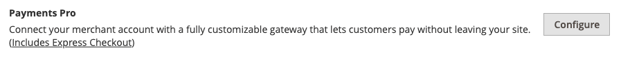

# PayPal Payments Pro

[PayPal Payments Pro][3] O traz todos os benefícios de uma conta de comerciante e de um gateway de pagamento em um, além da capacidade de criar sua própria experiência de finalização totalmente personalizada. O Check-out expresso do PayPal é ativado automaticamente com o PayPal Payments Pro, para que você possa acessar mais de 110 milhões de usuários ativos do PayPal.

{width="700" zoomable="yes"}

>[!IMPORTANT]
>
>**Requisitos de PSD2:**  
>A partir de 14 de setembro de 2019, os bancos europeus poderão recusar pagamentos que não atendam [PSD 2](../getting-started/compliance-payment-services-directive.md) requisitos. Para estar em conformidade com o PSD2, o PayPal Payments Pro deve ser integrado a um plug-in de terceiros.

>[!NOTE]
>
>Atualmente, o PayPal Payments Pro está disponível nos EUA, Reino Unido e Canadá.

## Requisitos

- [Conta de Comerciante do PayPal][1] (com Pagamentos Diretos ativados)

## Fluxo de trabalho de check-out

1. **O cliente vai ao check-out** - O cliente adiciona produtos ao carrinho e cliques/toques _Prosseguir para o check-out_.|
1. **O cliente escolhe o método de pagamento** - Durante o checkout, o cliente escolhe a _Pagamento direto do PayPal_ e especifica as informações sobre o cartão de crédito.
   - Se você estiver pagando com o PayPal Payments Pro, o cliente permanecerá em seu site durante o processo de finalização.
   - Se você estiver pagando com o Check-out do PayPal Express, o cliente será redirecionado para o site do PayPal para concluir a transação.

A pedido do cliente, o administrador da loja também pode criar um pedido do Administrador e processar a transação com o PayPal Payments Pro.

## Fluxo de trabalho de processamento de pedidos

1. **Pedido feito** - O pedido pode ser processado pelo administrador da sua loja, ou a partir da sua conta de comerciante PayPal.

1. **[!UICONTROL Payment Action]** - A ação de pagamento especificada na configuração é aplicada à ordem. As opções incluem:

   - **Autorizar** - O Commerce cria uma ordem de venda com o _Processando_ status. Nesse caso, o montante a ser autorizado está pendente de aprovação.
   - **Venda** - O Commerce cria uma ordem de venda e uma NFF.
   - **Capture** - O PayPal transfere o valor do pedido do saldo do cliente, da conta bancária ou do cartão de crédito para a conta do comerciante.

1. **Faturamento** - Uma fatura é criada no Commerce depois que o PayPal envia uma mensagem de notificação de pagamento instantâneo ao Commerce.

   Certifique-se de que as notificações de pagamento instantâneo estejam ativadas em sua conta de comerciante do PayPal.

   >[!NOTE]
   >
   >Se necessário, um pedido pode ser parcialmente faturado para uma quantidade especificada de produtos. Para cada NFF parcial enviada, uma transação de Captura separada com uma ID exclusiva torna-se disponível e uma NFF separada é gerada.

   As transações de pagamento somente com autorização são fechadas somente depois que a quantia total da ordem é capturada.

   Um pedido pode ser anulado on-line a qualquer momento até que o valor do pedido seja totalmente faturado.

1. **Devoluções** - Se o cliente devolver os produtos comprados e solicitar um reembolso, como no caso da captura do valor do pedido e da criação de faturas, você poderá criar um reembolso online do Administrador ou da sua conta de comerciante do PayPal.

## Configurar sua conta do PayPal

Antes de configurar o PayPal Payments Pro no Commerce, você deve configurar sua conta de comerciante no site do PayPal.

1. Faça logon no [Conta comercial do PayPal](https://manager.paypal.com/).

1. No menu do PayPal Manager, escolha **[!UICONTROL Service Settings]**.

1. Em **[!UICONTROL Hosted Checkout Pages]**, clique em **[!UICONTROL Set Up]**.

1. Em **[!UICONTROL Choose your settings]**, definir **[!UICONTROL Transaction Process Mode]** para `Live`.

1. Em **[!UICONTROL Display options on payment page]**, definir **[!UICONTROL Cancel URL Method]** para `POST`.

1. Em **[!UICONTROL Billing Information]**, selecione o código de segurança do cartão **[!UICONTROL CSC]** caixas de seleção para campos obrigatórios e editáveis.

1. Em **[!UICONTROL Payment Confirmation]**, definir **[!UICONTROL Return URL Method]** para `POST`.

1. Em **[!UICONTROL Security Options]**, configure o seguinte:

   - **[!UICONTROL AVS]**: `No`
   - **[!UICONTROL CSC]**: `No`
   - **[!UICONTROL Enable Secure Token]**: `Yes`

1. Clique em **[!UICONTROL Save Changes]**.

1. No _PayPal Manager_ escolha **[!UICONTROL Service Settings]** e sob _Páginas de check-out hospedadas_, escolha **[!UICONTROL Customize]**.

1. Escolher **[!UICONTROL Layout C]**.

   O layout C mostra apenas campos de cartão de crédito e débito, e pode ser emoldurado em seu site ou usado como um pop-up independente. O tamanho é fixado em 490 x 565 pixels, com espaço extra para mensagens de erro. Em alguns sistemas, essa configuração corrige um problema de redirecionamento transparente.

1. Clique em **[!UICONTROL Save and Publish]**.

1. No menu do PayPal Manager, escolha **[!UICONTROL Account Administration]**. Em **[!UICONTROL Manage Security]**, clique em **[!UICONTROL Transaction Settings]**.

1. Definir **[!UICONTROL Allow reference transactions]** para `Yes`.

1. Clique em **[!UICONTROL Confirm]**.

   >[!NOTE]
   >
   >Se você tiver vários sites do Commerce, deverá criar uma conta separada do PayPal Payments Pro para cada um.

1. Configurar outro usuário (recomendado pelo PayPal):

   - Na segunda linha do menu principal, clique em **[!UICONTROL Manage Users]**.

   - Para adicionar outro usuário à conta, clique em **[!UICONTROL Add User]**. O link está localizado logo acima do título Gerenciar usuários.

   - Preencha os campos obrigatórios nas seções a seguir do _[!UICONTROL Add User]_formulário:

      - [!UICONTROL Admin Confirmation]
      - [!UICONTROL User Information]
      - [!UICONTROL User Login Information]
      - [!UICONTROL Assign Privilege to User]

   - Clique em **[!UICONTROL Update]**.

1. Faça logout da sua conta do PayPal.

## Configurar PayPal Payments Pro no Commerce

>[!NOTE]
>
>Você pode ter duas soluções PayPal ativas ao mesmo tempo: [Check-out do PayPal Express](paypal-express-checkout.md), mais qualquer um dos [soluções multifuncionais](paypal.md#paypal-all-in-one-payment-solutions). Se você alterar as soluções de pagamento, aquela usada anteriormente será automaticamente desabilitada.

>[!TIP]
>
>Clique em **[!UICONTROL Save Config]** a qualquer momento para salvar seu progresso.

### Etapa 1: iniciar a configuração

1. No _Admin_ barra lateral, vá para **[!UICONTROL Stores]** > _[!UICONTROL Settings]_>**[!UICONTROL Configuration]**.

1. No painel esquerdo, expanda **[!UICONTROL Sales]** e escolha **[!UICONTROL Payment Methods]**.

1. Se a sua instalação do Commerce tiver vários sites, lojas ou visualizações, defina **[!UICONTROL Store View]** à exibição de loja onde você deseja aplicar essa configuração.

1. No _[!UICONTROL Merchant Location]_, selecione a **[!UICONTROL Merchant Country]**onde sua empresa está localizada.

   Esta configuração determina a seleção das Soluções do PayPal que aparecem na configuração.

   {width="600" zoomable="yes"}

1. Expandir **[!UICONTROL PayPal All-in-One Payment Solution]** e clique em **[!UICONTROL Configure]** para **[!UICONTROL Payments Pro]**.

   {width="600" zoomable="yes"}

### Etapa 2: concluir as configurações necessárias do PayPal

1. Expandir  o **[!UICONTROL Payments Pro and Express Checkout]** seção.

   {width="600" zoomable="yes"}

1. (Opcional) Insira o **[!UICONTROL Email Associated with your PayPal Merchant Account]**.

   >[!IMPORTANT]
   >
   >Os endereços de email diferenciam maiúsculas de minúsculas. Para receber o pagamento, o endereço de email deve corresponder ao endereço de email especificado em sua conta de comerciante do PayPal.

   Se você não tiver uma conta do PayPal, clique em **[!UICONTROL Start accepting payments via PayPal]**.

1. Digite uma das credenciais a seguir que você usa para fazer logon em sua conta de comerciante do PayPal:

   - **[!UICONTROL Partner]** - Sua ID de parceiro do PayPal.
   - **[!UICONTROL Vendor]** - Seu nome de logon de usuário do PayPal.
   - **[!UICONTROL User]** - A ID de outro usuário que está configurada em sua conta do PayPal.

1. Insira o **[!UICONTROL Password]** associado à sua conta do PayPal.

1. Para executar transações de teste, defina **[!UICONTROL Test Mode]** para `Yes`.

   Ao testar a configuração em uma sandbox, use apenas [números de cartão de crédito][2] que são recomendados pelo PayPal. Quando estiver pronto para entrar na produção, volte para a configuração e defina o Modo de teste como `No`.

1. Se o sistema usar um servidor proxy para estabelecer a conexão com o sistema PayPal, defina **[!UICONTROL Use Proxy]** para `Yes` e faça o seguinte:

   - Digite o endereço IP do **[!UICONTROL Proxy Host]**.

   - Insira o número da porta do **[!UICONTROL Proxy Port]**.

   Um proxy é usado quando o firewall do servidor impede o acesso direto ao servidor do PayPal. Nesse caso, um servidor de terceiros é usado para retransmitir o tráfego.

1. Definir **[!UICONTROL Enable this Solution]** para `Yes`.

1. Se quiser oferecer [Crédito do PayPal](paypal.md#paypal-credit-and-pay-later) para seus clientes, defina **[!UICONTROL Enable PayPal Credit]** para `Yes`.

1. Se você quiser armazenar com segurança os detalhes de pagamento/cartão de crédito do cliente, de modo que os clientes não precisem inserir novamente as informações de pagamento todas as vezes, defina **[!UICONTROL Vault Enabled]** para `Yes`.

### Etapa 3: Configurar Crédito do PayPal de Anúncio / Anunciar PayPal PayLater (opcional)

A partir da versão 2.4.3, o PayPal PayLater é compatível com implantações que incluem o PayPal. Esse recurso permite que os compradores paguem um pedido em prestações quinzenais em vez de pagar o valor total no momento da compra. A experiência do PayPal Credit está obsoleta.

Definir **[!UICONTROL Enable PayPal PayLater Experience]** a um dos seguintes:

- `Yes` - Para configurar Anunciar PayPal PayLater
- `No` - Para configurar Anunciar Crédito do PayPal

#### Anunciar Crédito do PayPal

1. Expandir  o **[!UICONTROL Advertise PayPal Credit]** seção.

   {width="600" zoomable="yes"}

1. Para obter as informações da sua conta, clique em **[!UICONTROL Get Publisher ID from PayPal]** e siga as instruções.

1. Insira seu **[!UICONTROL Publisher ID]**.

1. Expandir  o **[!UICONTROL Home Page]** seção.

   {width="600" zoomable="yes"}

1. Para colocar um banner na página, defina **[!UICONTROL Display]** para `Yes`.

1. Definir **[!UICONTROL Position]** a um dos seguintes:

   - `Header (center)`
   - `Sidebar (right)`

1. Definir **[!UICONTROL Size]** a um dos seguintes:

   - `190 x 100`
   - `234 x 60`
   - `300 x 50`
   - `468 x 60`
   - `728 x 90`
   - `800 x 66`

1. Expandir  as seções restantes e repita as etapas anteriores:

   - **[!UICONTROL Catalog Category Page]**
   - **[!UICONTROL Catalog Product Page]**
   - **[!UICONTROL Checkout Cart Page]**

#### Anunciar PayPal PayLater

1. Expandir  o **[!UICONTROL Advertise PayPal PayLater]** seção.

1. Definir **[!UICONTROL Enable PayPal PayLater]** para `Yes`.

1. Expandir  o **[!UICONTROL Home Page]** seção.

   {width="600" zoomable="yes"}

1. Para colocar um banner na página, defina **[!UICONTROL Display]** para `Yes`.

1. Definir **[!UICONTROL Position]** a um dos seguintes:

   - `Header (center)`
   - `Sidebar`

1. Definir **[!UICONTROL Style Layout]** a um dos seguintes:

   - `Text`
   - `Flex`

1. Para [!UICONTROL Style Layout] **[!UICONTROL Text]** somente, definir **[!UICONTROL Logo Type]** a um dos seguintes:

   - `Primary`
   - `Alternative`
   - `Inline`
   - `None`

1. Para [!UICONTROL Style Layout] **[!UICONTROL Text]** somente, definir **[!UICONTROL Logo Position]** a um dos seguintes:

   - `Left`
   - `Right`
   - `Top`

1. Para [!UICONTROL Style Layout] **[!UICONTROL Text]** somente, definir **[!UICONTROL Text Color]** a um dos seguintes:

   - `Black`
   - `White`
   - `Monochrome`
   - `Grayscale`

1. Para [!UICONTROL Style Layout] **[!UICONTROL Text]** somente, definir **[!UICONTROL Text Size]** a um dos seguintes:

   - `10px`
   - `11px`
   - `12px`
   - `13px`
   - `14px`
   - `15px`
   - `16px`

1. Para [!UICONTROL Style Layout] **[!UICONTROL Flex]** somente, definir **[!UICONTROL Ratio]** a um dos seguintes:

   - `1x1`
   - `1x4`
   - `8x1`
   - `20x1`

1. Para [!UICONTROL Style Layout] **[!UICONTROL Flex]** somente, definir **[!UICONTROL Color]** a um dos seguintes:

   - `Blue`
   - `Black`
   - `White`
   - `White No Border`
   - `Gray`
   - `Monochrome`
   - `Grayscale`

1. Expandir  as seções restantes e repita as etapas anteriores:

   - **[!UICONTROL Catalog Product Page]**
   - **[!UICONTROL Checkout Cart Page]**
   - **[!UICONTROL Checkout Payment Step]**
   - **[!UICONTROL Catalog Category Page]**

### Etapa 4: concluir as configurações básicas

1. Expandir  o **[!UICONTROL Basic Settings - PayPal Payments Pro]** seção.

   {width="600" zoomable="yes"}

1. Para **[!UICONTROL Title]**, insira um título que identifique PayPal Payments Pro durante o check-out.

   É recomendável usar o título _Cartão de Débito ou Crédito_.

1. Se você oferecer vários métodos de pagamento, informe um número para **[!UICONTROL Sort Order]** para determinar a sequência em que o PayPal Payments Pro é exibido quando listado com outros métodos de pagamento durante a finalização da compra.

   Esse número é relativo aos outros métodos de pagamento. (`0` = primeiro, `1` = segundo, `2` = terceiro e assim por diante.)

1. Definir **[!UICONTROL Payment Action]** a um dos seguintes:

   - `Authorization` - Aprova a compra, mas suspende os fundos. O montante não é levantado até que seja _capturado_ pelo comerciante.
   - `Sale` - O valor da compra é autorizado e imediatamente retirado da conta do cliente.

1. Para **[!UICONTROL Credit Card Settings]**, selecione os cartões de crédito que você aceita para pagamento em sua loja.

   Para selecionar várias placas, mantenha pressionada a tecla Ctrl (PC) ou a tecla Command (Mac) e clique em cada uma.

   >[!NOTE]
   >
   >American Express requer um acordo extra.

### Etapa 5: concluir as configurações avançadas

1. Expandir  o **[!UICONTROL Advanced Settings]** seção.

   {width="600" zoomable="yes"}

1. Definir **[!UICONTROL Payment Applicable From]** a um dos seguintes:

   - `All Allowed Countries` - Clientes de todos os [países](../getting-started/store-details.md#country-options) especificado na configuração da loja pode usar esse método de pagamento.
   - `Specific Countries` - Após escolher esta opção, o _[!UICONTROL Payment from Specific Countries]_é exibida. Mantenha pressionada a tecla Ctrl (PC) ou a tecla Command (Mac) e selecione cada país na lista onde os clientes podem fazer compras na sua loja.

1. Para gravar comunicações com o sistema de pagamento no arquivo de registro, defina **[!UICONTROL Debug Mode]** para `Yes`.

   >[!NOTE]
   >
   >De acordo com os padrões de segurança de dados do PCI, as informações de cartão de crédito não são gravadas no arquivo de registro.

1. Para habilitar a verificação de autenticidade do host, defina **[!UICONTROL Enable SSL Verification]** para `Yes`.

1. Para exigir que os clientes insiram um código CVV, defina **[!UICONTROL Require CVV Entry]** para `Yes`.

1. Expandir  o **[!UICONTROL CVV and AVS Settings]** seção.

1. Para determinar quando uma transação deve ser rejeitada quando o Sistema de Verificação de Endereço identificar uma incompatibilidade, especifique como tratar cada um dos seguintes cenários:

   - Para rejeitar uma transação com base em uma incompatibilidade de rua incompatível, defina **[!UICONTROL AVS Street Does Not Match]** para `Yes`.

   - Para rejeitar uma transação com base em um CEP incompatível, defina **[!UICONTROL AVS Zip Does Not Match]** para `Yes`.

   - Para rejeitar uma transação com base em um identificador de país não correspondente, defina **[!UICONTROL International AVS Indicator Does Not Match]** para `Yes`.

   - Para rejeitar uma transação com base em um código CVV incompatível, defina **[!UICONTROL International Card Security Code Does Not Match]** para `Yes`.

   {width="600" zoomable="yes"}

1. Preencha as seguintes seções, conforme necessário para sua loja:

   - [Configurações do relatório de liquidação](#settlement-report-settings)
   - [Configurações de experiência de front-end](#frontend-experience-settings)

#### Configurações do relatório de liquidação

1. Expandir  o **[!UICONTROL Settlement Report Settings]** seção.

   {width="600" zoomable="yes"}

1. Para **[!UICONTROL SFTP Credentials]**, faça o seguinte:

   - Se você se inscreveu no Servidor FTP seguro do PayPal, insira as seguintes credenciais de logon SFTP:

      - Logon
      - Senha

   - Para executar relatórios de teste antes de entrar no site com o Payments Pro, defina **[!UICONTROL Sandbox Mode]** para `Yes`.

   - Insira o **[!UICONTROL Custom Endpoint Hostname or IP Address]**.

     Por padrão, o valor é `reports.paypal.com`.

   - Insira o **[!UICONTROL Custom Path]** onde os relatórios são salvos.

     Por padrão, o valor é `/ppreports/outgoing`.

1. Para gerar relatórios de acordo com um agendamento, complete as **[!UICONTROL Scheduled Fetching]** configurações:

   - Definir **[!UICONTROL Enable Automatic Fetching]** para `Yes`.

   - Definir **[!UICONTROL Schedule]** a um dos seguintes:

      - `Daily`
      - `Every 3 Days`
      - `Every 7 Days`
      - `Every 10 Days`
      - `Every 14 Days`
      - `Every 30 Days`
      - `Every 40 Days`

     O PayPal retém cada relatório por 45 dias.

   - Definir **[!UICONTROL Time of Day]** à hora, aos minutos e ao segundo quando quiser que os relatórios sejam gerados.

#### Configurações de experiência de front-end

Use o _[!UICONTROL Frontend Experience Settings]_para escolher quais logotipos do PayPal aparecem em seu site, e para personalizar a aparência das suas páginas de comerciante do PayPal.

1. Expandir  o **[!UICONTROL Frontend Experience Settings]** seção.

   {width="600" zoomable="yes"}

1. Selecione o **[!UICONTROL PayPal Product Logo]** que você deseja que apareça no bloco PayPal em sua loja.

   Os logotipos PayPal estão disponíveis em quatro estilos e dois tamanhos:

   - `No Logo`
   - `We Prefer PayPal (150 x 60 or 150 x 40)`
   - `Now Accepting PayPal (150 x 60 or 150 x 40)`
   - `Payments by PayPal (150 x 60 or 150 x 40)`
   - `Shop Now Using PayPal (150 x 60 or 150 x 40)`

1. Para personalizar a aparência das páginas do comerciante do PayPal, faça o seguinte:

   - Insira o nome do **[!UICONTROL Page Style]** que deseja aplicar às suas páginas de comerciante do PayPal:

      - `paypal` - Usa o estilo de página do PayPal.
      - `primary` - Usa o estilo de página identificado como o _principal_ estilo no perfil da conta.
      - `your_custom_value` - Usa um estilo de página de pagamento personalizado, que é especificado no perfil da conta.

   - Para **[!UICONTROL Header Image URL]**, insira o URL da imagem que você deseja que apareça no canto superior esquerdo da página de pagamento. O tamanho máximo do arquivo é de 750 pixels de largura por 90 pixels de altura.

     >[!NOTE]
     >
     >O PayPal recomenda que a imagem resida em um servidor seguro (https). Caso contrário, um navegador pode avisar que _a página contém itens seguros e não seguros_.

   - Para definir a cor das páginas, insira o código hexadecimal de seis caracteres, sem a `#` símbolo, para cada um dos seguintes:

      - **[!UICONTROL Header Background Color]** - Cor de fundo do cabeçalho da página de check-out.
      - **[!UICONTROL Header Border Color]** - Cor para a borda de dois pixels ao redor do cabeçalho.
      - **[!UICONTROL Page Background Color]** - Cor de fundo para a página de check-out e ao redor do cabeçalho e formulário de pagamento.

### Etapa 6: completar as configurações básicas para PayPal Express Checkout

1. Expandir  o **[!UICONTROL Basic Settings - PayPal Express Checkout]** seção.

   {width="600" zoomable="yes"}

1. Para **[!UICONTROL Title]**, informe um título que identifique este método de pagamento durante o check-out.

   Definição do título para _PayPal_ para cada exibição de loja é recomendada.

1. Se você oferecer vários métodos de pagamento, informe um número para **[!UICONTROL Sort Order]** para determinar a sequência em que o Check-out do PayPal Express é exibido quando listado com os outros métodos de pagamento.

   Esse número é relativo aos outros métodos de pagamento. (`0` = primeiro, `1` = segundo, `2` = terceiro e assim por diante.)

1. Definir **[!UICONTROL Payment Action]** a um dos seguintes:

   - `Authorization` - Aprova a compra e suspende os fundos. O montante não é levantado até que seja _capturado_ pelo comerciante.
   - `Sale` - O valor da compra é autorizado e imediatamente retirado da conta do cliente.

1. Para exibir a variável _[!UICONTROL Check out with PayPal]_na página do produto, defina **[!UICONTROL Display on Product Details Page]**para `Yes`.

### Etapa 7: completar as configurações avançadas para PayPal Express Checkout

1. Expandir  o **[!UICONTROL Advanced Settings]** seção.

   {width="600" zoomable="yes"}

1. Definir **[!UICONTROL Display on Shopping Cart]** para `Yes`.

1. Definir **[!UICONTROL Payment Applicable From]** a um dos seguintes:

   - `All Allowed Countries` - Clientes de todos os [países](../getting-started/store-details.md#country-options) especificado na configuração da loja pode usar esse método de pagamento.
   - `Specific Countries` - Após escolher esta opção, o _[!UICONTROL Payment from Specific Countries]_é exibida. Para selecionar vários países, mantenha pressionada a tecla Ctrl (PC) ou a tecla Command (Mac) e clique em cada item.

1. Para gravar comunicações com o sistema de pagamento no arquivo de registro, defina **[!UICONTROL Debug Mode]** para `Yes`.

   >[!NOTE]
   >
   >De acordo com os padrões de segurança de dados do PCI, as informações de cartão de crédito não são gravadas no arquivo de registro.

1. Para habilitar a verificação de autenticidade do host, defina **[!UICONTROL Enable SSL Verification]** para `Yes`.

1. Para exibir um resumo completo do pedido do cliente por item de linha do site do PayPal, defina **[!UICONTROL Transfer Cart Line Items]** para `Yes`.

1. Para permitir que o cliente conclua a transação no site do PayPal sem retornar à sua loja para Revisão do Pedido, defina **[!UICONTROL Skip Order Review Step]** para `Yes`.

1. Quando terminar, clique em **[!UICONTROL Save Config]**.

[1]: https://www.paypal.com/webapps/mpp/how-to-sell-online
[2]: https://www.paypalobjects.com/en_AU/vhelp/paypalmanager_help/credit_card_numbers.htm
[3]: https://developer.paypal.com/docs/paypal-payments-pro/
