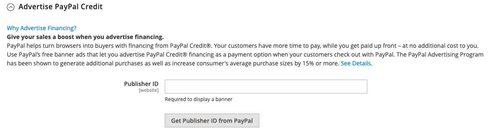

# PayPal Payments Standard

O [PayPal Payments Standard](https://developer.paypal.com/docs/paypal-payments-standard/mobile-paypal-payments-standard/) é a maneira mais fácil de aceitar pagamentos online. Você pode oferecer aos seus clientes a conveniência de pagamento, tanto por cartão de crédito e PayPal simplesmente adicionando um botão de check-out à sua loja.

>[!NOTE]
>
>Para comerciantes fora dos EUA, ele é chamado de _PayPal Site Payments Standard_.

Com PayPal Payments Standard, você pode deslizar os cartões de crédito em dispositivos móveis. Não há taxa mensal e você pode ser pago através do eBay. Os cartões de crédito suportados incluem Visa, MasterCard, Discover e American Express. Além disso, os clientes podem pagar diretamente de suas contas pessoais do PayPal. O PayPal Payments Standard está disponível em todos os países na lista de referência mundial do PayPal.

>[!IMPORTANT]
>
>Requisitos do **PSD2:**  
>A partir de 14 de setembro de 2019, os bancos europeus poderão recusar pagamentos que não atendam aos requisitos do [PSD2](../getting-started/compliance-payment-services-directive.md). Nenhuma ação é necessária para que o PayPal Payments Standard esteja em conformidade com a PSD2, pois todos os requisitos são tratados pelo PayPal.

## Requisitos do comerciante

- [Conta Comercial do PayPal](https://www.paypal.com/webapps/mpp/how-to-sell-online)

## Fluxo de trabalho de check-out

Para os clientes, o PayPal Payments Standard é um processo de uma etapa se as informações de cartão de crédito em suas contas pessoais do PayPal estiverem atualizadas.

1. **Pedido do Customer Places** - O cliente clica/toca no botão _Pagar Agora_ para concluir a compra.

1. **PayPal Processa a Transação** - O cliente é redirecionado para o site do PayPal para concluir a transação.

## Configurar PayPal Payments Standard

>[!NOTE]
>
>PayPal Payments Standard não pode ser usado simultaneamente com qualquer outro método PayPal, incluindo Check-out expresso. Se você alterar as soluções de pagamento, a utilizada anteriormente será desabilitada.

>[!TIP]
>
>Clique em **[!UICONTROL Save Config]** a qualquer momento para salvar seu progresso.

### Etapa 1: iniciar a configuração

Este método de configuração pressupõe que você tenha uma conta existente do PayPal.

1. Na barra lateral _Admin_, vá para **[!UICONTROL Stores]** > _[!UICONTROL Settings]_>**[!UICONTROL Configuration]**.

1. No painel esquerdo, expanda **[!UICONTROL Sales]** e escolha **[!UICONTROL Payment Methods]**.

1. Se a sua instalação do Commerce tiver vários sites, lojas ou modos de exibição, defina **[!UICONTROL Store View]** para o modo de exibição de loja onde deseja aplicar essa configuração.

1. Na seção _[!UICONTROL Merchant Location]_, selecione o **[!UICONTROL Merchant Country]**&#x200B;onde sua empresa está localizada.

   Esta configuração determina a seleção das Soluções do PayPal que aparecem na configuração.

   {width="600" zoomable="yes"}

1. Expanda **[!UICONTROL PayPal All-in-One Payment Solutions]** e clique em **[!UICONTROL Configure]** para **[!UICONTROL Payments Standard]**.

   {width="700" zoomable="yes"}

### Etapa 2: ativar e conectar sua conta do PayPal

{width="600" zoomable="yes"}

1. Conectar sua conta para teste ou produção:

   - Para o modo de teste (desenvolvimento), clique em **[!UICONTROL Sandbox Credentials]** e insira suas credenciais da [sandbox do PayPal](https://developer.paypal.com/docs/api-basics/sandbox/).
   - Para o modo de produção, clique em **[!UICONTROL Connect with PayPal]** e insira suas credenciais de conta de produção.

   Quando a conexão for validada, você poderá continuar.

1. Defina **[!UICONTROL Enable this Solution]** como `Yes`.

1. Se você deseja oferecer o [Crédito do PayPal](paypal.md#paypal-credit-and-pay-later) aos seus clientes, defina o **[!UICONTROL Enable PayPal Credit]** como `Yes`.

### Etapa 3: Concluir as configurações Padrão de Pagamentos

1. Expandir  a seção **[!UICONTROL Payments Standard]**.

   {width="600" zoomable="yes"}

1. Insira o **[!UICONTROL Email Associated with your PayPal Merchant Account]**.

   >[!IMPORTANT]
   >
   >Os endereços de email diferenciam maiúsculas de minúsculas. Para receber o pagamento, o endereço de email inserido deve corresponder ao endereço de email especificado em sua conta de comerciante do PayPal.

   Se você não tiver uma conta do PayPal, clique em **[!UICONTROL Start accepting payments via PayPal]**.

1. Defina **[!UICONTROL API Authentication Methods]** como um dos seguintes:

   - `API Signature` - Este método de autenticação do PayPal é o mais fácil de implementar e baseia-se no seu nome de usuário, senha e uma sequência exclusiva de caracteres e números que identifica a sua conta. As credenciais de assinatura da API não expiram.
   - `API Certificate` - Este método de autenticação do PayPal é mais seguro, baseia-se no seu nome de usuário, senha e um certificado para download. As Credenciais da API expiram após três anos e devem ser renovadas.

   Se necessário, conclua o seguinte:

   - **[!UICONTROL API Username]**
   - **[!UICONTROL API Password]**
   - **[!UICONTROL API Signature]**

1. Se você estiver usando credenciais da sua conta de sandbox, defina **[!UICONTROL Sandbox Mode]** como `Yes`.

   Ao testar a configuração em uma sandbox, use apenas [números de cartão de crédito](https://www.paypalobjects.com/en_AU/vhelp/paypalmanager_help/credit_card_numbers.htm) recomendados pelo PayPal. Quando estiver pronto para entrar na produção, retorne à configuração, defina o Modo de Sandbox como `No` e conecte-se à sua conta de produção do PayPal.

1. Se o sistema usar um servidor proxy para estabelecer a conexão entre o Adobe Commerce ou o Magento Open Source e o sistema de pagamento do PayPal, defina **[!UICONTROL API Uses Proxy]** como `Yes` e conclua o seguinte:

   - **[!UICONTROL Proxy Host]**
   - **[!UICONTROL Proxy Port]**

### Etapa 4: Configurar Crédito do PayPal de Anúncio / Anunciar PayPal PayLater (opcional)

A partir da versão 2.4.3, o PayPal PayLater é compatível com implantações que incluem o PayPal. Esse recurso permite que os compradores paguem um pedido em prestações quinzenais em vez de pagar o valor total no momento da compra. A experiência do PayPal Credit está obsoleta.

Defina **[!UICONTROL Enable PayPal PayLater Experience]** como um dos seguintes:

- `Yes` - Para configurar Anunciar PayPal PayLater
- `No` - Para configurar o Crédito de Anúncio do PayPal

#### Anunciar Crédito do PayPal

1. Expandir  a seção **[!UICONTROL Advertise PayPal Credit]**.

   {width="600" zoomable="yes"}

1. Para obter as informações da sua conta, clique em **[!UICONTROL Get Publisher ID from PayPal]** e siga as instruções.

1. Insira seu **[!UICONTROL Publisher ID]**.

   {width="600" zoomable="yes"}

1. Expandir  a seção **[!UICONTROL Home Page]**.

1. Para colocar um banner na página, defina **[!UICONTROL Display]** como `Yes`.

1. Defina **[!UICONTROL Position]** como um dos seguintes:

   - `Header (center)`
   - `Sidebar (right)`

1. Defina **[!UICONTROL Size]** como um dos seguintes:

   - `190 x 100`
   - `234 x 60`
   - `300 x 50`
   - `468 x 60`
   - `728 x 90`
   - `800 x 66`

1. Expanda  as seções restantes e repita as etapas anteriores:

   - **[!UICONTROL Catalog Category Page]**
   - **[!UICONTROL Catalog Product Page]**
   - **[!UICONTROL Checkout Cart Page]**

#### Anunciar PayPal PayLater

1. Expandir  a seção **[!UICONTROL Advertise PayPal PayLater]**.

1. Defina **[!UICONTROL Enable PayPal PayLater]** como `Yes`.

1. Expandir  a seção **[!UICONTROL Home Page]**.

   {width="600" zoomable="yes"}

1. Para colocar um banner na página, defina **[!UICONTROL Display]** como `Yes`.

1. Defina **[!UICONTROL Position]** como um dos seguintes:

   - `Header (center)`
   - `Sidebar`

1. Defina **[!UICONTROL Style Layout]** como um dos seguintes:

   - `Text`
   - `Flex`

1. Somente para [!UICONTROL Style Layout] **[!UICONTROL Text]**, defina **[!UICONTROL Logo Type]** como um dos seguintes:

   - `Primary`
   - `Alternative`
   - `Inline`
   - `None`

1. Somente para [!UICONTROL Style Layout] **[!UICONTROL Text]**, defina **[!UICONTROL Logo Position]** como um dos seguintes:

   - `Left`
   - `Right`
   - `Top`

1. Somente para [!UICONTROL Style Layout] **[!UICONTROL Text]**, defina **[!UICONTROL Text Color]** como um dos seguintes:

   - `Black`
   - `White`
   - `Monochrome`
   - `Grayscale`

1. Somente para [!UICONTROL Style Layout] **[!UICONTROL Text]**, defina **[!UICONTROL Text Size]** como um dos seguintes:

   - `10px`
   - `11px`
   - `12px`
   - `13px`
   - `14px`
   - `15px`
   - `16px`

1. Somente para [!UICONTROL Style Layout] **[!UICONTROL Flex]**, defina **[!UICONTROL Ratio]** como um dos seguintes:

   - `1x1`
   - `1x4`
   - `8x1`
   - `20x1`

1. Somente para [!UICONTROL Style Layout] **[!UICONTROL Flex]**, defina **[!UICONTROL Color]** como um dos seguintes:

   - `Blue`
   - `Black`
   - `White`
   - `White No Border`
   - `Gray`
   - `Monochrome`
   - `Grayscale`

1. Expanda  as seções restantes e repita as etapas anteriores:

   - **[!UICONTROL Catalog Product Page]**
   - **[!UICONTROL Checkout Cart Page]**
   - **Etapa de pagamento de check-out**
   - **[!UICONTROL Catalog Category Page]**

### Etapa 5: concluir as configurações básicas

1. Expandir  a seção **[!UICONTROL Basic Settings - PayPal Website Payments Standard]**.

   {width="600" zoomable="yes"}

1. Para **[!UICONTROL Title]**, insira um título que identifique este método de pagamento durante o check-out.

   É recomendável usar o título _PayPal_ para todas as exibições de loja.

1. Se você oferecer vários métodos de pagamento, insira um número para **[!UICONTROL Sort Order]** para determinar a sequência em que o PayPal Payments Standard aparece quando listado com os outros métodos de pagamento.

   Esse número é relativo aos outros métodos de pagamento. (`0` = primeiro, `1` = segundo, `2` = terceiro e assim por diante.)

1. Defina **[!UICONTROL Payment Action]** como um dos seguintes:

   - `Authorization` - Aprova a compra e suspende os fundos. O valor não é sacado até que seja capturado pelo comerciante.
   - `Sale` - O valor da compra é autorizado e imediatamente retirado da conta do cliente.

1. Para exibir o botão _[!UICONTROL Check out with PayPal]_&#x200B;na página do produto, defina **[!UICONTROL Display on Product Details Page]**&#x200B;como `Yes`.

### Etapa 6: concluir as configurações avançadas

1. Expandir  a seção **[!UICONTROL Advanced Settings]**.

   {width="600" zoomable="yes"}

1. Para disponibilizar o PayPal Payments Standard do carrinho de compras e do minicarrinho, defina **[!UICONTROL Display on Shopping Cart]** como `Yes`.

1. Defina **[!UICONTROL Payment from Applicable Countries]** como um dos seguintes:

   - `All Allowed Countries` - Clientes de todos os [países](../getting-started/store-details.md#country-options) especificados na sua configuração de loja podem usar esta forma de pagamento.
   - `Specific Countries` - Depois que você escolher essa opção, a lista _[!UICONTROL Payment from Specific Countries]_&#x200B;será exibida. Para selecionar vários países, mantenha pressionada a tecla Ctrl (PC) ou a tecla Command (Mac) e clique em cada opção.

1. Para registrar comunicações com o sistema de pagamento no arquivo de log, defina **[!UICONTROL Debug Mode]** como `Yes`.

   >[!NOTE]
   >
   >O arquivo de log é armazenado no servidor e pode ser acessado apenas por desenvolvedores. De acordo com os padrões de segurança de dados do PCI, as informações de cartão de crédito não são gravadas no arquivo de registro.

1. Para habilitar a verificação SSL, defina **[!UICONTROL Enable SSL Verification]** como `Yes`.

1. Para exibir um resumo de cada item de linha no pedido na página de pagamentos do PayPal, defina **[!UICONTROL Transfer Cart Line Items]** como `Yes`.

   Para incluir até dez opções de envio no resumo, defina **[!UICONTROL Transfer Shipping Options]** como `Yes`. (Essa opção aparecerá somente se os itens de linha estiverem definidos para transferência.)

1. Para determinar o tipo de imagem usado para o botão de aceitação do PayPal, defina **[!UICONTROL Shortcut Buttons Flavor]** como um dos seguintes:

   - `Dynamic` - (Recomendado) Exibe uma imagem que pode ser alterada dinamicamente do servidor PayPal.
   - `Static` - Exibe uma imagem específica que não pode ser alterada dinamicamente.

1. Para permitir que clientes que não têm uma conta do PayPal façam uma compra com este método, defina **[!UICONTROL Enable PayPal Guest Checkout]** como `Yes`.

1. Defina **[!UICONTROL Require Customer's Billing Address]** como um dos seguintes:

   - `Yes` - Requer o endereço de cobrança do cliente para todas as compras.
   - `No` - Não é necessário o endereço de cobrança do cliente para nenhuma compra.
   - `For Virtual Quotes Only` - Requer o endereço de cobrança do cliente somente para cotações virtuais.

1. Para permitir que um cliente entre em um [contrato de cobrança do PayPal](paypal-billing-agreements.md) com sua loja quando não houver contratos de cobrança ativos disponíveis na conta do cliente, defina **[!UICONTROL Billing Agreement Signup]** como um dos seguintes:

   - `Auto` - O cliente pode entrar em um contrato de cobrança durante o fluxo de Finalização Expressa ou usar outro método de pagamento.
   - `Ask Customer` - O cliente pode decidir se quer entrar em um contrato de cobrança durante o fluxo de trabalho de Finalização Expressa.
   - `Never` - O cliente não pode entrar em um contrato de cobrança durante o fluxo de trabalho Check-out Expresso.

   >[!NOTE]
   >
   >Os comerciantes devem solicitar o Suporte Técnico Comerciante do PayPal para habilitar os contratos de faturamento em suas contas. O parâmetro _Assinatura do Contrato de Cobrança_ só poderá ser habilitado depois que o PayPal confirmar que os contratos de cobrança estão habilitados para sua conta de comerciante.

1. Para permitir que o cliente conclua a transação no site do PayPal sem retornar ao seu armazenamento para Revisão do Pedido, defina **[!UICONTROL Skip Order Review Step]** como `Yes`.

### Etapa 7: conclua e salve as definições de configuração

1. Preencha as seguintes seções, conforme necessário para sua loja:

   - [Configurações do Contrato de Cobrança do PayPal](#paypal-billing-agreement-settings)
   - [Configurações do relatório de liquidação](#settlement-report-settings)
   - [Configurações de experiência de front-end](#frontend-experience-settings)

1. Quando terminar, clique em **[!UICONTROL Save Config]**.

#### Configurações do Contrato de Cobrança do PayPal

Um [contrato de cobrança](paypal-billing-agreements.md) é um contrato de venda entre o comerciante e o cliente que foi autorizado pelo PayPal para uso com vários pedidos. Durante o processo de finalização, a opção de pagamento Contrato de faturamento é exibida somente para clientes que já firmaram um contrato de faturamento com sua empresa. Depois que o PayPal autoriza o contrato, o sistema de pagamento emite uma ID de referência exclusiva para identificar cada pedido associado ao contrato. Semelhante a uma ordem de compra, não há limite para o número de contratos de faturamento que um cliente pode configurar com sua empresa.

1. Expandir  a seção **[!UICONTROL PayPal Billing Agreement Settings]**.

   {width="600" zoomable="yes"}

1. Defina **[!UICONTROL Enabled]** como `Yes`.

1. Para **[!UICONTROL Title]**, insira um título que identifique o método de Contrato de Cobrança do PayPal durante o check-out.

1. Se você oferecer vários métodos de pagamento, insira um número no campo **[!UICONTROL Sort Order]** para determinar a sequência em que o Contrato de Cobrança aparece quando listado com outros métodos de pagamento durante o check-out.

1. Defina **[!UICONTROL Payment Action]** como um dos seguintes:

   - `Authorization` - Aprova a compra e suspende os fundos. A quantidade não é retirada até que seja &quot;capturada&quot; pelo comerciante.
   - `Sale` - O valor da compra é autorizado e imediatamente retirado da conta do cliente.

1. Defina **[!UICONTROL Payment Applicable From]** como um dos seguintes:

   - `All Allowed Countries` - Clientes de todos os países especificados na sua configuração de loja podem usar esta forma de pagamento.
   - `Specific Countries` - Depois de escolher esta opção, a lista _[!UICONTROL Payment from Specific Countries]_&#x200B;é exibida. Para selecionar vários países, mantenha pressionada a tecla Ctrl (PC) ou a tecla Command (Mac) e clique em cada um.

1. Para registrar comunicações com o sistema de pagamento no arquivo de log, defina **[!UICONTROL Debug Mode]** como `Yes`.

   >[!NOTE]
   >
   >O arquivo de log é armazenado no servidor e pode ser acessado apenas por desenvolvedores. De acordo com os padrões de segurança de dados do PCI, as informações de cartão de crédito não são gravadas no arquivo de registro.

1. Para habilitar a verificação SSL, defina **[!UICONTROL Enable SSL Verification]** como `Yes`.

1. Para exibir um resumo de cada item de linha no pedido do cliente em sua página de pagamentos do PayPal, defina **[!UICONTROL Transfer Cart Line Items]** como `Yes`.

1. Para permitir que os clientes iniciem um contrato de cobrança a partir do painel da conta do cliente, defina **[!UICONTROL Allow in Billing Agreement Wizard]** como `Yes`.

#### Configurações do relatório de liquidação

1. Expandir  a seção **[!UICONTROL Settlement Report Settings]**.

   {width="600" zoomable="yes"}

1. Para **[!UICONTROL SFTP Credentials]**, faça o seguinte:

   - Se você se inscreveu no servidor FTP seguro do PayPal, insira as seguintes credenciais de logon SFTP:

      - Logon
      - Senha

   - Para executar relatórios de teste antes de entrar em funcionamento com o Check-out expresso no site, defina **[!UICONTROL Sandbox Mode]** como `Yes`.

   - Insira o **[!UICONTROL Custom Endpoint Hostname or IP Address]**.

     O valor padrão é `reports.paypal.com`.

   - Insira o **[!UICONTROL Custom Path]** onde os relatórios são salvos.

     O valor padrão é `/ppreports/outgoing`.

1. Para gerar relatórios de acordo com um agendamento, conclua as configurações de **[!UICONTROL Scheduled Fetching]**:

   - Defina **[!UICONTROL Enable Automatic Fetching]** como `Yes`.

   - Defina **[!UICONTROL Schedule]** como um dos seguintes:

      - `Daily`
      - `Every 3 Days`
      - `Every 7 Days`
      - `Every 10 Days`
      - `Every 14 Days`
      - `Every 30 Days`
      - `Every 40 Days`

     O PayPal retém cada relatório por 45 dias.

   - Defina **[!UICONTROL Time of Day]** como hora, minuto e segundo quando quiser que os relatórios sejam gerados.

#### Configurações de experiência de front-end

Use o _[!UICONTROL Frontend Experience Settings]_&#x200B;para escolher quais logotipos do PayPal aparecem em seu site, e para personalizar a aparência das suas páginas de comerciante do PayPal.

1. Expandir  a seção **[!UICONTROL Frontend Experience Settings]**.

   {width="600" zoomable="yes"}

1. Selecione o **[!UICONTROL PayPal Product Logo]** que você deseja que apareça no bloco PayPal em sua loja.

   Os logotipos PayPal estão disponíveis em quatro estilos e dois tamanhos:

   - `No Logo`
   - `We Prefer PayPal (150 x 60 or 150 x 40)`
   - `Now Accepting PayPal (150 x 60 or 150 x 40)`
   - `Payments by PayPal (150 x 60 or 150 x 40)`
   - `Shop Now Using PayPal (150 x 60 or 150 x 40)`

1. Para personalizar a aparência das páginas do comerciante do PayPal:

   - Digite o nome da **[!UICONTROL Page Style]** que você deseja aplicar às páginas de comerciante do PayPal:

      - `paypal` - Usa o estilo de página do PayPal.
      - `primary` - Usa o estilo de página identificado como _primário_ no perfil da conta.
      - `your_custom_value` - Usa um estilo de página de pagamento personalizado, que é especificado no perfil da conta.

   - Para **[!UICONTROL Header Image URL]**, insira a URL da imagem que você deseja que apareça no canto superior esquerdo da página de pagamento. O tamanho máximo do arquivo é de 750 pixels de largura por 90 pixels de altura.

     >[!NOTE]
     >
     >O PayPal recomenda que a imagem resida em um servidor seguro (https). Caso contrário, um navegador pode avisar que _a página contém itens seguros e não seguros_.

   - Para definir a cor das páginas, insira o código hexadecimal de seis caracteres, sem o símbolo `#`, para cada um dos seguintes itens:

      - **[!UICONTROL Header Background Color]** - Cor de fundo do cabeçalho da página de check-out.
      - **[!UICONTROL Header Border Color]** - Cor da borda de dois pixels ao redor do cabeçalho.
      - **[!UICONTROL Page Background Color]** - Cor de fundo da página de check-out e ao redor do cabeçalho e do formulário de pagamento.
