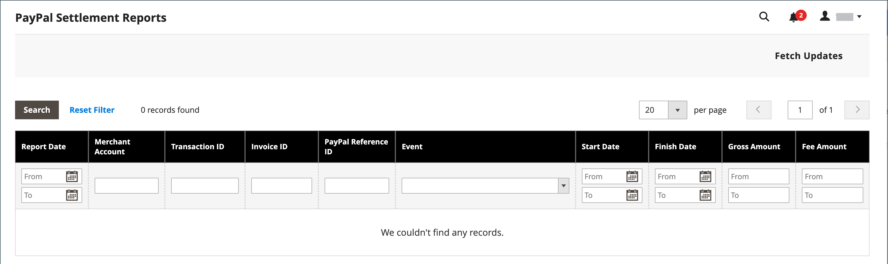

# Relatório de liquidação do PayPal

O relatório Liquidação do PayPal fornece aos comerciantes as informações sobre cada transação que afeta a liquidação de fundos.

>[!NOTE]
>
>Antes de gerar relatórios de liquidação, o administrador da loja deve solicitar que os Serviços Técnicos de Comerciante do PayPal criem uma conta de usuário SFTP, habilitem a geração de relatórios de liquidação e habilitem o SFTP em sua conta comercial do PayPal.

Depois de configurar e ativar os relatórios de liquidação na conta de comerciante do PayPal, o Adobe Commerce e o Magento Open Source começarão a gerar relatórios durante as 24 horas seguintes. A lista de relatórios de liquidação disponíveis pode ser visualizada no Admin.

**_Para exibir relatórios de liquidação:_**

1. Na barra lateral _Admin_, vá para **[!UICONTROL Reports]** > _[!UICONTROL Sales]_>**[!UICONTROL PayPal Settlement]**.

   {width="600" zoomable="yes"}

1. Para obter as atualizações mais recentes, clique em **[!UICONTROL Fetch Updates]** no canto superior direito.

   O sistema se conecta ao servidor SFTP do PayPal para buscar os relatórios. Quando o processo estiver concluído, uma mensagem será exibida com o número de relatórios obtidos. O relatório inclui as seguintes informações para cada transação:

   | Coluna de relatório | Descrição |
   | ------------ | ----------- |
   | [!UICONTROL PayPal Reference ID Type] | Um dos seguintes códigos de referência: - ID da Ordem - ID da Transação - ID da Assinatura |
   | [!UICONTROL Preapproved Payment ID] | **[!UICONTROL Custom]** - O texto inserido pelo comerciante na transação no PayPal. **[!UICONTROL Transaction Debit or Credit]**- A direção da movimentação de dinheiro do valor bruto. **[!UICONTROL Fee Debit or Credit]** - A direção do movimento do dinheiro por taxa. |

   {style="table-layout:auto"}
