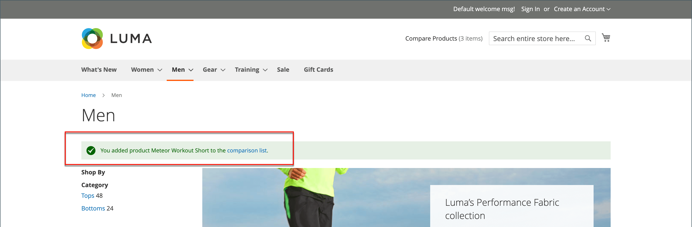
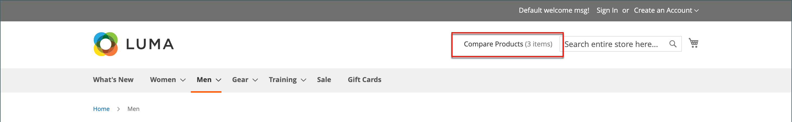

# Comparar produtos

Comparar produtos gera uma comparação detalhada, lado a lado, de dois ou mais produtos. Dependendo do tema, o link Adicionar para Comparar pode ser representado por um ícone ou texto. O bloco _Comparar Produtos_ geralmente aparece na barra lateral esquerda ou direita de uma página de catálogo.

{width="700" zoomable="yes"}

Ao contrário do bloco [Produtos visualizados/comparados recentemente](products-viewed-compared.md), o Administrador não inclui configurações adicionais para Comparar produtos.

## Comparar produtos na loja

Há algumas maneiras de usar a lista de comparação na loja.

### Das páginas do catálogo

1. O cliente encontra os produtos que deseja comparar e clica no link **[!UICONTROL Add to Compare]** para cada um.

1. Navega até uma página de categoria associada.

   Dependendo do tema e do layout da página, pode haver um bloco _Comparar Produtos_ na barra lateral. Em caso afirmativo, os itens na categoria marcados para comparação são listados.

   O cliente pode clicar em _Excluir_ (  ) de qualquer produto para removê-lo do relatório de comparação ou clicar em **[!UICONTROL Clear All]** para remover todos os itens e começar novamente com suas seleções de comparação.

1. Cliques **[!UICONTROL Compare]**.

1. Para imprimir as informações de comparação, clique em **[!UICONTROL Print This Page]**.

1. Para remover um único produto da página de comparação, clique em _Excluir_ (  ).

### De uma mensagem de notificação

1. Depois que um cliente adiciona um produto a uma lista de comparação, a página exibe uma mensagem de notificação.

1. Na notificação da mensagem principal exibida, clique no link _lista de comparação_.

   {width="700" zoomable="yes"}

Essa ação redireciona o cliente para a lista de comparação, onde ele pode acessar ações adicionais.

### No bloco _Comparar Produtos_

1. O cliente encontra os produtos que deseja comparar e clica no link **[!UICONTROL Add to Compare]** para cada um.

1. No cabeçalho próximo ao campo de pesquisa, clique no link _Comparar produtos_.

   {width="700" zoomable="yes"}

### No painel Minha conta

1. O cliente adiciona os produtos necessários à lista de comparação.

1. Navega até **[!UICONTROL My Account]**.

1. No bloco _Comparar Produtos_, clique em **[!UICONTROL Compare]**.

   {width="700" zoomable="yes"}

## Ações adicionais da lista de comparação

| [!UICONTROL Action] | Descrição |
|------|-----------|
|  | Exclui um único item da lista de comparação. |
| **[!UICONTROL Add to Cart]** | Adiciona o produto ao carrinho de compras. Se o produto tiver configurações, a página redirecionará o cliente para a página do produto onde ele seleciona as opções configuráveis e, em seguida, clique em **[!UICONTROL Add to Cart]**. |
| _Ícone da lista de desejos_ | Adiciona o produto à lista de desejos (requer a funcionalidade da lista de desejos ativada na configuração da loja). |
| _Imprimir Esta Página_ | Imprime a página da lista de comparação. |

{style="table-layout:auto"}
