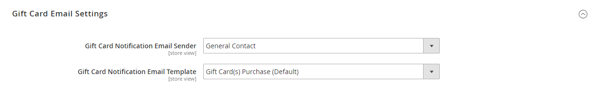

# Contas de cartão-presente

Uma conta de cartão-presente é criada automaticamente para cada cartão-presente comprado. O valor do vale-presente pode então ser aplicado para a compra de um produto em sua loja. Você também pode criar contas de cartão-presente do Administrador como uma promoção ou serviço para clientes. O número da conta do cartão-presente corresponde ao código do cartão-presente.

{width="700" zoomable="yes"}

## Configurar contas de cartão-presente

A configuração de cartão-presente estabelece as configurações padrão para todos os cartões-presente para a exibição de loja e gerencia o conjunto de códigos. O conjunto de códigos é um conjunto de códigos de cartão-presente exclusivos em um formato específico. Os códigos do grupo são usados sempre que uma conta de cartão-presente é criada. É responsabilidade do administrador da loja garantir que haja códigos suficientes disponíveis para vendas de cartão-presente. Certifique-se de gerar um conjunto de códigos antes de oferecer cartões-presente para venda. Por padrão, o Adobe Commerce gera 1.000 códigos. Um novo grupo de códigos não é gerado até que não haja mais códigos disponíveis no grupo atual.

### Etapa 1: configurar notificações por email

1. No _Admin_ barra lateral, vá para **[!UICONTROL Stores]** > _[!UICONTROL Settings]_>**[!UICONTROL Configuration]**.

1. No painel esquerdo, expanda **[!UICONTROL Sales]** e escolha **[!UICONTROL Gift Cards]**.

1. Expandir  o _[!UICONTROL Gift Card Email Settings]_e faça o seguinte:

   - Definir **[!UICONTROL Gift Card Notification Email Sender]** à identidade da loja que aparece como remetente das notificações de cartão-presente.

   - Definir **[!UICONTROL Gift Card Notification Email Template]** ao template usado para a notificação.

   {width="600" zoomable="yes"}

1. Expandir  o _[!UICONTROL Email Sent from Gift Card Account Management]_e faça o seguinte:

   - Definir **[!UICONTROL Gift Card Email Sender]** à identidade da loja para que apareça como o remetente dos cartões-presente.

   - Definir **[!UICONTROL Gift Card Template]** ao modelo que deseja usar para o cartão-presente.

Consulte [Armazenar endereços de email](../configuration-reference/general/store-email-addresses.md) para campos e opções de configuração específicos.

### Etapa 2: concluir as configurações gerais

1. Expandir  o _[!UICONTROL Gift Card General Settings]_seção.

1. Para permitir que o cliente resgate o valor no cartão em troca de dinheiro, defina **[!UICONTROL Redeemable]** para `Yes`.

1. Para **[!UICONTROL Lifetime (days)]**, digite o número de dias antes do cartão expirar.

   Se não houver data de expiração, deixe o campo em branco.

   >[!NOTE]
   >
   >Dependendo da sua localização, pode ser ilegal que cartões-presente expirem. Verifique suas leis locais antes de definir uma vida útil para seus cartões-presente.

1. Para dar aos clientes a opção de inserir uma mensagem para acompanhar o cartão-presente, defina **[!UICONTROL Allow Gift Message]** para `Yes` e insira o número de caracteres disponíveis para a mensagem para **[!UICONTROL Gift Message Maximum Length]**.

1. Definir **[!UICONTROL Generate Gift Card Account when Orders Item is]** a um dos seguintes:

   - `Ordered` - A conta do cartão-presente é criada quando o pedido é feito.
   - `Invoiced` - A conta do cartão-presente é criada depois que o pagamento é capturado e o pedido é faturado.

   {width="600" zoomable="yes"}

### Etapa 3: estabelecer o conjunto de códigos de cartão-presente

1. Expandir  o _[!UICONTROL Gift Card Account General Settings]_e faça o seguinte:

   {width="600" zoomable="yes"}

   - Para personalizar o código, conclua o seguinte de acordo com sua preferência:

      - Comprimento do código
      - Formato do código
      - Prefixo do código
      - Sufixo do código
      - Traço a cada X caracteres

   - Para determinar o número de códigos a serem gerados, informe o **[!UICONTROL New Pool Size]**.

   - Para especificar quando você recebe uma notificação para reabastecer o pool de códigos, insira o **[!UICONTROL Low Code Pool Threshold]**.

1. Antes de gerar o pool de códigos, clique em **[!UICONTROL Save Config]**.

1. Clique em **[!UICONTROL Generate]**.

1. Quando terminar, clique em **[!UICONTROL Save Config]**.

## Revisar uma conta existente de cartão-presente

1. Para localizar o número da conta de cartão-presente de uma ordem atual, faça o seguinte:

   - No _Admin_ barra lateral, vá para **[!UICONTROL Sales]** > _[!UICONTROL Operations]_>**[!UICONTROL Orders]**.

   - Localize a ordem na lista e clique em **[!UICONTROL View]** no _[!UICONTROL Action]_coluna.

   - Role para baixo até _[!UICONTROL Items Ordered]_seção.

   O número está na variável _[!UICONTROL Product]_coluna, abaixo **[!UICONTROL Gift Card Accounts]**.

1. No _Admin_ barra lateral, vá para **[!UICONTROL Marketing]** > _[!UICONTROL Promotions]_>**[!UICONTROL Gift Card Accounts]**.

1. Localize a conta de cartão-presente na grade e abra-a no modo de edição.

   O código do cartão-presente aparece na parte superior do _Informações_ seção.

   {width="600" zoomable="yes"}

## Criar uma conta de cartão-presente

1. No _Admin_ barra lateral, vá para **[!UICONTROL Marketing]** > _[!UICONTROL Promotions]_>**[!UICONTROL Gift Card Accounts]**.

1. No canto superior direito, clique em **[!UICONTROL Add Gift Card Account]**.

1. No _[!UICONTROL Information]_seção, definir **[!UICONTROL Active]**para `Yes` e faça o seguinte:

   - Para tornar o saldo do cartão resgatável no check-out ou transferido para o crédito da loja do cliente, defina **[!UICONTROL Redeemable]** para `Yes`.

   - Escolha o **[!UICONTROL Website]** onde a conta do cartão-presente pode ser usada.

   - Insira o **[!UICONTROL Balance]** no cartão-presente.

   - _(Opcional)_ Para definir um **[!UICONTROL Expiration Date]** para o cartão-presente, selecione a data no calendário .

     Se deixado em branco, a conta do cartão-presente não expirará.

     {width="600" zoomable="yes"}

1. No painel esquerdo, escolha **[!UICONTROL Send Gift Card]** e faça o seguinte:

   - Insira o **[!UICONTROL Recipient Email]** endereço.

   - Insira o **[!UICONTROL Recipient Name]**.

   - Definir **[!UICONTROL Send Email from the Following Store View]** para a exibição de loja que aparece como remetente da notificação de cartão-presente.

   {width="600" zoomable="yes"}

1. Siga um destes procedimentos para salvar a nova conta:

   - Se não estiver pronto para enviar o vale-presente, clique em **[!UICONTROL Save]**.

   - Para salvar as alterações e enviar o cartão-presente por email para o recipient, clique em **Salvar e enviar e-mail**.

## Exibir histórico de conta de cartão-presente

1. Ir para **[!UICONTROL Marketing]** > _[!UICONTROL Promotions]_>**[!UICONTROL Gift Card Accounts]**.

1. Abra o cartão-presente no modo de edição.

1. A variável **[!UICONTROL History]** do cartão-presente é exibido.

   {width="600" zoomable="yes"}

| Coluna | Descrição |
|--- |--- |
| [!UICONTROL ID] | Um número de ação exclusivo com cartão-presente. |
| [!UICONTROL Date] | Data da ação. |
| [!UICONTROL Action] | Determina todas as ações possíveis com um cartão-presente. Opções: `Created` / `Updated` / `Sent` / `Used` / `Redeemed` / `Expired` |
| [!UICONTROL Balance Change] | Exibe o valor pelo qual o saldo do cartão-presente foi alterado. |
| [!UICONTROL Balance] | Indica o saldo disponível. |
| [!UICONTROL More Information] | Exibe informações sobre quem alterou o saldo do cartão-presente. |

{style="table-layout:auto"}

## Excluir uma conta de cartão-presente

1. No _Admin_ barra lateral, vá para **[!UICONTROL Marketing]** > _[!UICONTROL Promotions]_>**[!UICONTROL Gift Card Accounts]**.

1. Selecione a conta de cartão-presente a ser excluída e abra-a no modo de edição.

1. Na barra de menus, clique em **[!UICONTROL Delete]**.

1. Para confirmar a ação, clique em **[!UICONTROL OK]**.

## Descrições da coluna

| Coluna | Descrição |
|--- |--- |
| [!UICONTROL ID] | Um identificador numérico exclusivo que é atribuído à conta de cartão-presente. |
| [!UICONTROL Code] | O código que deve ser inserido para aplicar um cartão-presente. |
| [!UICONTROL Website] | Indica os sites nos quais a conta de cartão-presente está disponível. |
| [!UICONTROL Created] | Data de criação. |
| [!UICONTROL End] | Data de expiração do cartão-presente, se programada. |
| [!UICONTROL Active] | Determina se o cartão-presente está ativo. |
| [!UICONTROL Status] | Determina se o cartão-presente é resgatado na conta do cliente ou se está disponível. Opções: `Used` / `Redeemed` / `Expired` |
| [!UICONTROL Balance] | Indica o saldo disponível. |

{style="table-layout:auto"}
