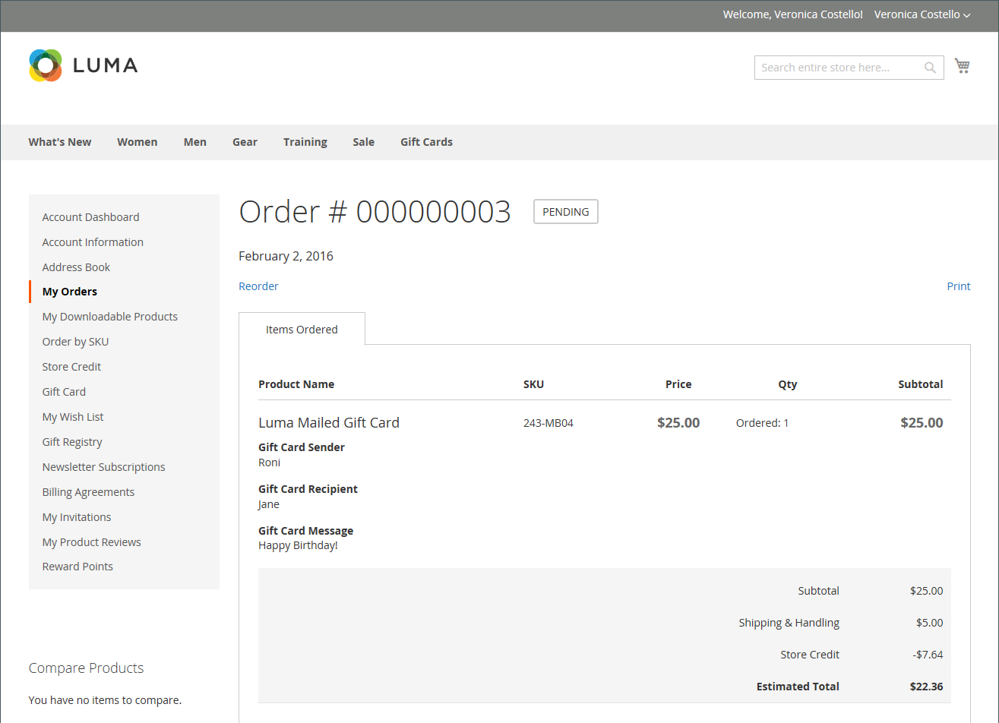
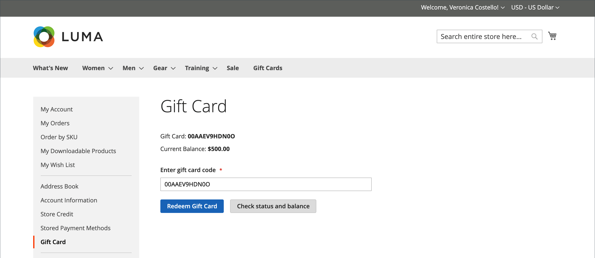

# Compra e resgate de cartão-presente

{{ee-feature}}

Os cartões-presente são resgatados no carrinho de compras de forma semelhante à forma como um cupom é aplicado a um pedido. Durante o check-out, o comprador insere o código do vale-presente para aplicar um valor do vale-presente à compra. Os portadores de cartões-presente que têm contas de clientes podem verificar o status e o saldo restante no painel de contas. Cartões-presente únicos e múltiplos podem ser usados para pagar toda ou parte de um pedido.

O código de cartão-presente aplicado pode ser visualizado ao abrir o pedido no _Administrador_, o que permite recuperar o código para colocá-lo em um cartão-presente físico, se necessário. Se uma ordem de cartão-presente for cancelada ou reembolsada, você deverá cancelar manualmente a conta de cartão-presente associada. Você pode excluir a conta totalmente ou desativá-la.

{width="700" zoomable="yes"}

Por exemplo, um cliente que compra na loja de demonstração da Luma pode comprar um cartão-presente virtual ou físico.

**Cartão-presente virtual** - Um cartão-presente virtual Luma é enviado por email com uma mensagem opcional para o destinatário. Ele pode ser resgatado em qualquer um dos sites da família Luma e nunca expira.

**Cartão-presente físico** - Um cartão-presente Luma é empacotado em um mensageiro artístico personalizado e enviado sem custo para o destinatário. Ele pode ser produzido com antecedência, rotulado com códigos únicos e resgatado na loja, por telefone ou em qualquer família de sites da Luma. Ele nunca expira.

**Cartão-presente combinado** - Um cartão-presente combinado tem as características de um cartão-presente virtual e físico. Um vale-presente combinado da Luma é enviado e enviado por email para o recipient. O email e o endereço de envio são necessários durante a compra do cartão-presente. Ele nunca expira.

## Ciclo de vida do cartão-presente

1. **O cliente determina o valor do vale-presente**.

   O cliente determina o valor do cartão-presente a partir da página do produto. Dependendo da configuração, há um campo de preço fixo, uma lista de opções de preço ou ambos. Todos os valores aparecem na moeda usada no armazenamento.

1. **O cliente conclui as informações sobre o cartão-presente**.

   Para um cartão-presente físico, o cliente insere o **Nome do Remetente** e o **Nome do Destinatário**. Para cartões-presente virtuais ou combinados, o cliente também insere o **Email do remetente** e o **Email do destinatário**. Se o cliente estiver conectado, o Nome do remetente (e Email do remetente, se aplicável) será inserido automaticamente na conta dele. Dependendo da configuração, o cliente também poderá inserir uma mensagem para o recipient.

1. **O cliente conclui o check-out**.

   O cartão-presente é exibido como um item de linha no carrinho com detalhes que mostram o nome do remetente, destinatário e mensagem, se aplicável. O valor associado ao vale-presente é convertido na moeda base da loja quando adicionado ao carrinho.

1. **O cliente recebe a confirmação do pedido**.

   O comprador do vale-presente pode clicar no link na confirmação para rastrear o pedido no painel da conta.

1. **O destinatário recebe o cartão-presente**.

   Para cartões-presente virtuais ou combinados, o recipient recebe um email com o código do cartão-presente, nome do remetente e mensagem, se aplicável. Se vários cartões-presente forem comprados em um único pedido e o tipo for virtual ou combinado, todos os códigos de cartão-presente correspondentes serão enviados ao destinatário em um único email. Os cartões-presente físicos podem ser enviados diretamente ao destinatário ou ao cliente, que pode então entregar pessoalmente o cartão-presente ao destinatário.

1. **O destinatário aplica o cartão-presente à compra**.

   O recipient compra um item em sua loja e aplica o código do cartão-presente durante o check-out. Cada vez que um cartão-presente é aplicado durante o check-out, o valor é exibido no bloco de totais do pedido e é subtraído do total geral. O saldo total de cada cartão-presente é subtraído do total do carrinho de compras. Se vários cartões-presente forem usados para uma compra, eles serão aplicados em ordem crescente, começando pelo cartão com o menor saldo restante, até que todos sejam aplicados ou o total geral seja zero. Quando o total geral chega a zero, a última conta de cartão-presente aplicada ao carrinho recebe uma dedução parcial. Quaisquer cartões que não foram aplicados ao carrinho não recebem uma dedução de saldo. Os valores são deduzidos das contas de cartão-presente somente após a realização do pedido.

## Experiência da vitrine

Como os cartões-presente funcionam na loja:

- O código do cartão-presente pode ser aplicado no carrinho ou no check-out para cobrir o valor total do pedido.

- No catálogo, um vale-presente é apresentado como um tipo de produto separado.

- O código do cartão-presente é ativado depois que o pedido é faturado. Se a ordem não for paga, o cliente destinatário não poderá usar o cartão-presente.

- Contas para códigos de presente são criadas para rastrear o saldo de um voucher específico. Um administrador de armazenamento pode ajustar manualmente o saldo.

O cliente destinatário pode usar a seção _[!UICONTROL Gift Card]_do painel da conta para verificar o saldo da [conta de vale-presente](product-gift-card-accounts.md) e resgatar vale-presente para [armazenar crédito](../customers/store-credit-using.md).

{width="700" zoomable="yes"}

### Verificar status e saldo do cartão-presente

1. Na loja, o cliente faz logon e abre a página da conta do cliente.

1. O cliente abre a página **[!UICONTROL Gift Card]** e insere o código do cartão-presente.

1. O cliente clica em **[!UICONTROL Check status and balance]**.

{width="700" zoomable="yes"}

O saldo do cartão-presente é exibido.

### Ativação de cartão-presente

1. Na página _[!UICONTROL Gift Card]_, o cliente insere o código do vale-presente.

1. O cliente clica em **[!UICONTROL Redeem Gift Card]**.

{width="700" zoomable="yes"}

O valor do cartão-presente é ativado e adicionado ao saldo de crédito da loja total.

{width="700" zoomable="yes"}

Todas as operações para o saldo de cartão-presente estão disponíveis na página _[!UICONTROL Store Credit]_.

### Aplicar um cartão-presente durante o check-out

Se o vale-presente não for resgatável, o cliente poderá aplicar o código do vale-presente durante o checkout.

1. Durante a etapa _Verificação e Pagamentos_, o cliente clica em **[!UICONTROL Apply Gift Card]**.

1. Insira o código do cartão-presente e clique em **[!UICONTROL Apply]**.

   O desconto deve ser refletido no _[!UICONTROL Order Summary]_.

1. Clica em **[!UICONTROL Place Order]** para finalizar o pedido.
