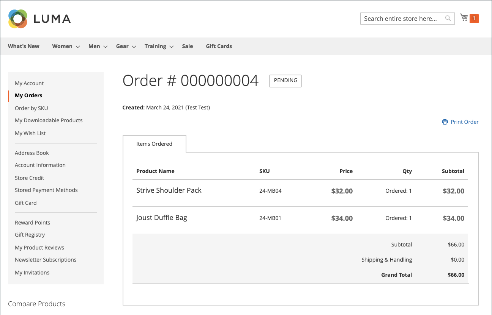

# Permitir reordenações

Quando habilitados, os reordenamentos podem ser feitos diretamente da conta do cliente ou do pedido original no _Administrador_. As reordenações são ativadas por padrão.

{width="700" zoomable="yes"}

## Critérios para a reordenação ser ativada para um pedido

- A opção de configuração _Permitir Reordenação_ deve estar habilitada.

- Se a ordem estiver no status `Hold` ou `Payment Review`, a opção de reordenação estará desabilitada.

- Se qualquer um dos itens no pedido estiver indisponível, esgotado ou desativado, a opção de reordenação está desativada na loja.

- Um _Administrador_ pode reordenar mesmo se algum dos itens estiver indisponível ou desabilitado.

## Configurar para permitir reordenações do cliente

1. Na barra lateral _Admin_, vá para **[!UICONTROL Stores]** > _[!UICONTROL Settings]_>**[!UICONTROL Configuration]**.

1. No painel esquerdo, expanda **[!UICONTROL Sales]** e escolha **[!UICONTROL Sales]** abaixo de.

1. Expandir  a seção **[!UICONTROL Reorder]**.

   {width="600" zoomable="yes"}

1. Defina **[!UICONTROL Allow Reorder]** como `Yes`.

   Essa configuração habilita a funcionalidade de reordenação da conta do cliente na vitrine ou na lista de pedidos do Administrador.

1. Clique em **[!UICONTROL Save Config]**.

## Reordenar da loja

Um cliente pode iniciar a funcionalidade de reordenação para um pedido específico a partir de duas páginas:

- Página _Meus Pedidos_

- Página _Exibição do pedido_

### Meus Pedidos

O botão _Reordenar_ é sempre exibido na lista com Pedidos (mesmo se todos os produtos do pedido não estiverem disponíveis para reordenação).

{width="700" zoomable="yes"}

**Caso 1.** Todos os produtos do pedido estão **disponíveis** para reordenação

O usuário é redirecionado para o carrinho e todos os produtos são adicionados a ele

{width="700" zoomable="yes"}

**Caso 2.** Alguns/todos os produtos do pedido **não estão disponíveis** para reordenação

>[!NOTE]
>
>É possível reordenar `Not Visible Individually` produtos.

O botão _Reordenar_ não aparece nas páginas _Meus Pedidos_ e _Exibir Pedido_.

{width="700" zoomable="yes"}

### Página de exibição de pedidos

**Caso 1.** Todos os produtos do pedido estão disponíveis para reordenação

O usuário é redirecionado para o carrinho e todos os produtos são adicionados a ele

**Caso 2.** Alguns/todos os produtos do pedido **não estão disponíveis** para reordenação

>[!NOTE]
>
>É possível reordenar `Not Visible Individually` produtos.

O botão _Reordenar_ não aparece nas páginas _Meus Pedidos_ e _Exibir Pedido_.

{width="700" zoomable="yes"}

### O carrinho não está vazio

Se o carrinho não estiver vazio e o usuário clicar em **[!UICONTROL Reorder]** (na página _Meus pedidos_ ou _Visualização do pedido_), os produtos existentes permanecerão no carrinho com os produtos de reordenação adicionados.

{width="700" zoomable="yes"}

## Reordenar do administrador

1. Na barra lateral _Admin_, vá para **[!UICONTROL Sales]** > **[!UICONTROL Orders]**.

1. Localize a ordem e abra no modo **[!UICONTROL View]**.

1. Clique em **[!UICONTROL Reorder]**, que é exibido na barra de botões superior.

   {width="600" zoomable="yes"}

   Depois de clicar em **[!UICONTROL Reorder]**, a página _Criar novo pedido_ será aberta com a reorganização de produtos.

   {width="600" zoomable="yes"}

1. Preencha todos os campos obrigatórios conforme necessário.

1. Para enviar o pedido, clique em **[!UICONTROL Submit Order]**.
