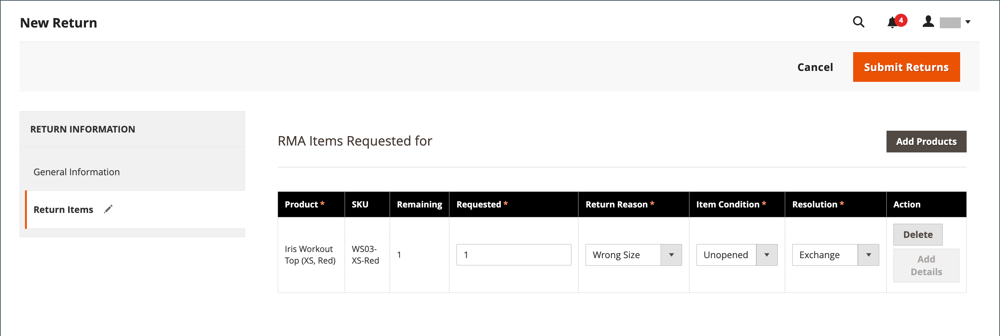

# Devoluções

A _autorização de mercadoria devolvida_ (RMA) pode ser concedido a clientes que solicitarem a devolução de um item para substituição ou reembolso. Normalmente, o cliente entra em contato com o comerciante para solicitar um reembolso. Se aprovado, um número de RMA exclusivo é atribuído para identificar o produto devolvido. Na configuração, você pode ativar a RMA para todos os produtos ou permitir a RMA apenas para determinados produtos. A variável _[!UICONTROL Returns]_A grade lista as solicitações de merchandise (RMAs) retornadas atuais e é usada para inserir novas solicitações de devolução.

{width="600" zoomable="yes"}

As RMAs podem ser emitidas para tipos de produtos simples, agrupados, configuráveis e agrupados. No entanto, os RMAs não estão disponíveis para produtos virtuais, produtos para download e cartões-presente.

## Descrições da coluna

| Coluna | Descrição |
|--- |--- |
| [!UICONTROL Select] | Marque as caixas de seleção para que os retornos sejam sujeitos a uma ação ou use o controle de seleção no cabeçalho da coluna. Opções: `Select All` / `Deselect All` / `Select Visible` / `Unselect Visible` |
| [!UICONTROL RMA] | Um identificador numérico exclusivo que é atribuído a cada retorno |
| [!UICONTROL Requested] | Data e hora em que a devolução foi feita |
| [!UICONTROL Order] | Um número exclusivo do pedido original |
| [!UICONTROL Ordered] | A data e a hora em que o pedido foi feito |
| [!UICONTROL Customer] | O nome do cliente ou comprador que colocou a ordem |
| [!UICONTROL Status] | Status de retorno. Opções: `Pending` / `Authorized` / `Partially Authorized` / `Approved` / `Rejected` / `Processed and Closed` / `Closed` |
| [!UICONTROL Action] | **[!UICONTROL View]** abre a devolução no modo de edição. |

{style="table-layout:auto"}

## RMA e workflow de devolução

1. **Receber solicitação** - Se [habilitado](rma-configure.md#enable-rmas-for-your-store) para a loja, os clientes registrados e os convidados podem solicitar uma RMA. Também é possível [enviar uma solicitação de RMA no Administrador](#create-a-return-request-in-the-admin).

2. **RMA emitida** - Depois de considerar a solicitação, você pode autorizá-la parcial ou completamente ou cancelar a solicitação. Se você autorizar a devolução e concordar em pagar pela remessa de devolução, poderá criar uma ordem de remessa do Administrador com uma transportadora suportada.

3. **Merchandise recebida e devolução do produto processada** - O fluxograma a seguir descreve a ordem operacional para concluir o processo de devolução:

   {width="500"}

## Status de RMA

Durante seu ciclo de vida, uma autorização de mercadoria retornada (RMA) pode ter muitos status atribuídos (como Pendente ou Autorizado). O status da RMA indica o andamento de uma solicitação de RMA emitida pelo usuário ou comerciante.

| Status | Descrição |
|--- |--- |
| [!UICONTROL Pending] | O status inicial atribuído a uma solicitação de RMA quando ela é gerada por um usuário na loja ou pelo comerciante no Administrador. |
| [!UICONTROL Authorized] | Esse status é atribuído à RMA quando todos os itens solicitados são autorizados pelo comerciante no Administrador para as devoluções. |
| [!UICONTROL Partially Authorized] | Esse status é atribuído à RMA se algum dos itens solicitados tiver sido negado e outros produtos estiverem autorizados. |
| [!UICONTROL Denied] | Esse status é atribuído à RMA se todos os itens solicitados forem rejeitados pelo comerciante no Administrador para as devoluções. |
| [!UICONTROL Return Received] | Esse status é atribuído pelo comerciante à RMA quando os itens solicitados são recebidos do usuário. |
| [!UICONTROL Return Partially Received] | Esse status é atribuído pelo comerciante à RMA quando os itens solicitados são parcialmente devolvidos e alguns dos itens são negados para processamento. |
| [!UICONTROL Approved] | Esse status é atribuído pelo comerciante à RMA quando os itens solicitados são aprovados para processamento adicional. |
| [!UICONTROL Rejected] | Esse status é atribuído pelo comerciante à RMA quando os itens solicitados são rejeitados para processamento adicional. |
| [!UICONTROL Processed and Closed] | Esse status é atribuído pelo comerciante à RMA quando todos os itens solicitados são aprovados para processamento adicional. |
| [!UICONTROL Closed] | Esse status é atribuído pelo comerciante à RMA quando os itens solicitados são negados para processamento para devolução. |

{style="table-layout:auto"}

## Criar uma solicitação de retorno no Administrador

Um comerciante pode criar uma solicitação de devolução em nome do cliente do Administrador. Os clientes podem [criar uma solicitação de devolução](rma-customer-experience.md) na loja de uma loja da Adobe Commerce.

1. No _Admin_ barra lateral, vá para **[!UICONTROL Sales]** > **[!UICONTROL Returns]**.

1. Clique em **[!UICONTROL New Return Request]**.

1. Para criar uma solicitação de devolução, clique em um pedido com uma `Complete` status.

1. No _[!UICONTROL Return Information]_, selecione a **[!UICONTROL Return Items]**guia.

1. Para adicionar itens para retornar, clique em **[!UICONTROL Add Items]**.

1. Marque a caixa de seleção do produto desejado e clique em **[!UICONTROL Add Selected Product to returns]**.

1. Para **[!UICONTROL Requested]**, insira o número de itens a serem retornados.

1. Definir **[!UICONTROL Return Reason]** a um dos seguintes:

   - `Wrong Color`
   - `Wrong Size`
   - `Out of Service`
   - `Other`

   Se o motivo da devolução for diferente das opções listadas, você poderá informar suas próprias opções se selecionar a opção `Other` opção.

1. Definir **[!UICONTROL Item Condition]** a um dos seguintes:

   - `Unopened`
   - `Opened`
   - `Damaged`

1. Definir **[!UICONTROL Resolution]** a um dos seguintes:

   - `Exchange`
   - `Refund`
   - `Store Credit`

1. Para criar um retorno, clique em **[!UICONTROL Submit Returns]**.

   {width="600" zoomable="yes"}

   A solicitação RMA recém-enviada aparece na **[!UICONTROL Returns]** página com um `Pending` status.
