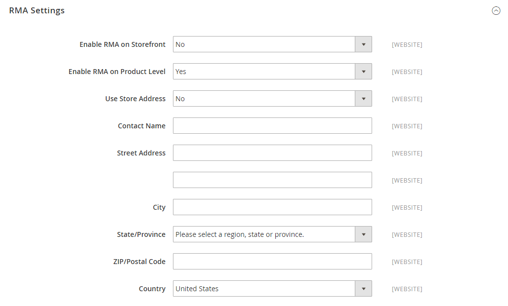

# Configurar devoluções

{{ee-feature}}

Quando ativadas, as solicitações de RMA podem ser enviadas pelos clientes da loja. Uma RMA só poderá ser gerada se houver um item na ordem que esteja disponível para devolução. As solicitações de retorno de itens individuais são gerenciadas pelo atributo _Habilitar RMA_ em cada registro de produto. Por padrão, as configurações são aplicadas ao produto (_[!UICONTROL Use Config Settings]_&#x200B;está selecionado). Se&#x200B;_[!UICONTROL Enable RMA]_ estiver definido como `No`, o produto não aparecerá na lista de itens disponíveis para devolução. Se você alterar a configuração _Habilitar RMA_, ela se aplicará a pedidos novos e existentes.

## Habilitar RMAs para sua loja

1. Na barra lateral _Admin_, vá para **[!UICONTROL Stores]** > _[!UICONTROL Settings]_>**[!UICONTROL Configuration]**.

1. No painel esquerdo, expanda **[!UICONTROL Sales]** e escolha **[!UICONTROL Sales]** abaixo de.

1. Expandir  a seção **[!UICONTROL RMA Settings]**.

   {width="600" zoomable="yes"}

1. Defina **[!UICONTROL Enable RMA on Storefront]** como `Yes`.

   Esta configuração determina se os clientes podem criar e visualizar solicitações de RMA na loja. As RMAs podem ser aplicadas a ordens novas e existentes.

1. Defina **[!UICONTROL Enable RMA on Product Level]** como `Yes`.

   Esta configuração determina o comportamento do atributo _Habilitar RMA_ para produtos individuais na loja:

   - Quando [!UICONTROL Enable RMA on Product Level] estiver definido como `Yes`, os clientes da loja poderão retornar todos os produtos individuais. Inclui _[!UICONTROL Enable RMA]_= `Yes` e&#x200B;_[!UICONTROL Enable RMA]_ = `No` valores de atributos de produto.
   - Quando [!UICONTROL Enable RMA on Product Level] está definido como `No`, os clientes da loja podem retornar somente os produtos com um _[!UICONTROL Enable RMA]_= `Yes` valor de atributo de produto.

1. Defina **[!UICONTROL Use Store Address]** com um dos seguintes valores:

   - `Yes` - Enviar produtos devolvidos ao endereço da loja.
   - `No` - Digite um endereço alternativo para devoluções de produtos.

   {width="600" zoomable="yes"}

1. Clique em **[!UICONTROL Save Config]**.

## Configurar métodos de envio para devoluções

1. Na barra lateral _Admin_, vá para **[!UICONTROL Stores]** > _[!UICONTROL Settings]_>**[!UICONTROL Configuration]**.

1. No painel esquerdo, expanda **[!UICONTROL Sales]** e escolha **[!UICONTROL Delivery Methods]**.

1. Expanda a seção da transportadora que você deseja usar para o serviço de retorno, como **[!UICONTROL UPS]**.

   {width="600" zoomable="yes"}

1. Defina **[!UICONTROL Enabled for RMA]** como `Yes`.

1. Clique em **[!UICONTROL Save Config]**.

## Alterar RMAs permitidas no nível do produto

Se você habilitar as RMAs para sua loja e seu catálogo contiver alguns produtos que não devem ter permissão para devolução, será possível modificar a configuração no nível do produto,

1. Abra o produto no modo de edição.

1. Role para baixo e expanda  na seção **[!UICONTROL Autosettings]**.

1. Desmarque a caixa de seleção **[!UICONTROL Use Config Setting]**, se necessário.

1. Alterne a configuração **[!UICONTROL Enable RMA]** para `No`.

   {width="600" zoomable="yes"}

1. Clique em **[!UICONTROL Save]**.
