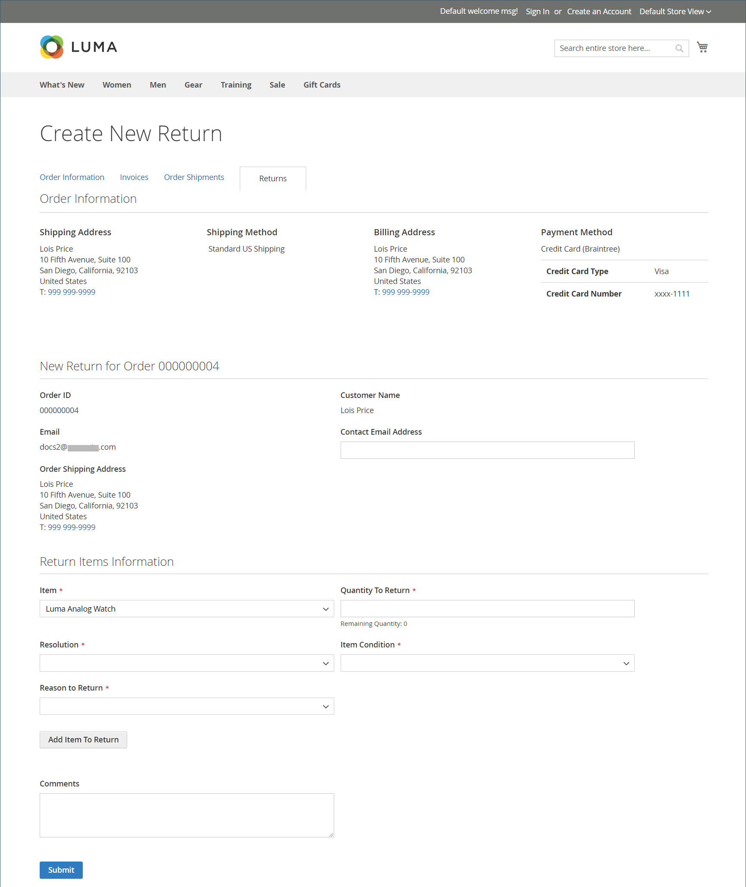

# Retorna a experiência da vitrine

{{ee-feature}}

Os clientes podem usar qualquer um dos itens a seguir para solicitar uma RMA da loja:

- [Widget de Pedidos e Devoluções](../content-design/widget-orders-returns.md) na barra lateral
- _Pedidos e Devoluções_ link no rodapé

Como prática recomendada, inclua uma descrição dos requisitos e do processo de RMA na política de Atendimento ao cliente.

>[!NOTE]
>
>Se quiser coletar informações adicionais relacionadas a devoluções, você poderá adicionar seus próprios [atributos de devoluções](attributes-returns.md) personalizados.

Todas as informações de RMA do cliente são exibidas na página **[!UICONTROL My Returns]** no painel de conta do cliente.

{width="700" zoomable="yes"}

## Solicitar uma RMA

O cliente conclui as seguintes etapas na loja para enviar uma RMA:

1. No rodapé, clique em **[!UICONTROL Orders and Returns]**.

1. Insere as informações do pedido:

   - ID do pedido
   - Sobrenome de cobrança
   - Email

1. Cliques **[!UICONTROL Continue]**.

   {width="700" zoomable="yes"}

1. Abaixo da data do pedido, cliques em **[!UICONTROL Return]**.

   {width="700" zoomable="yes"}

1. Escolhe o item a ser retornado e insere o **[!UICONTROL Quantity to Return]**.

1. Define **[!UICONTROL Resolution]** para um dos seguintes:

   - Exchange
   - [Reembolso](../customers/refunds-customer-account.md)
   - [Crédito da loja](../customers/store-credit-using.md)

1. Define **[!UICONTROL Item Condition]** para um dos seguintes:

   - `Unopened`
   - `Opened`
   - `Damaged`

1. Define **[!UICONTROL Reason to Return]** para um dos seguintes:

   - `Wrong Color`
   - `Wrong Size`
   - `Out of Service`
   - `Other`

   {width="700" zoomable="yes"}

1. Se necessário, define **[!UICONTROL Contact Email Address]** e **[!UICONTROL Comments]**.

   >[!NOTE]
   >
   >Se o pedido contiver vários itens e o cliente quiser retornar outro, poderá clicar em **[!UICONTROL Add Item To Return]**, selecionar o item e definir todas as opções mencionadas.

1. Cliques **[!UICONTROL Submit]**.
