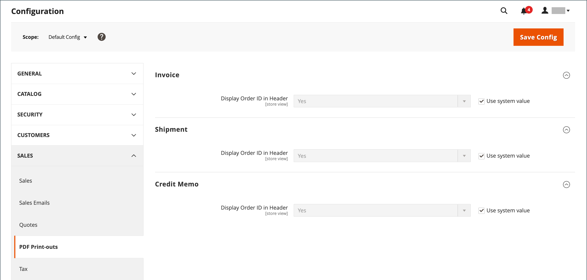

# Documentos de vendas

Para suportar o workflow do pedido e fornecer documentação aos clientes sobre os pedidos enviados, configure os documentos de vendas relacionados para refletir a marca da loja e incluir informações de referência.

## Configurar faturas e guias de remessa

Ao contrário das imagens de logotipo usadas nas páginas de frente de loja, o logotipo de faturas de PDF e outros documentos de vendas pode ser uma imagem de 300 dpi de alta resolução. Tenha cuidado para preservar a proporção ao redimensionar o logotipo. Redimensione o logotipo para que ele se ajuste à altura e não se preocupe com nenhum espaço não utilizado à direita.

{width="200"}

Uma maneira de redimensionar seu logotipo para ajustá-lo ao tamanho necessário é criar uma imagem nova e em branco com as dimensões corretas. Em seguida, cole a imagem do logotipo e redimensione-a para ajustá-la à altura. Com a maioria dos programas de edição de imagens, é possível dimensioná-la em uma porcentagem para preservar a proporção ou manter pressionada a tecla Shift e redimensionar manualmente a imagem.

**_Para atualizar o logotipo:_**

1. No _Admin_ barra lateral, vá para **[!UICONTROL Stores]** > _[!UICONTROL Settings]_>**[!UICONTROL Configuration]**.

1. No painel esquerdo, expanda **[!UICONTROL Sales]** e escolha **[!UICONTROL Sales]** por baixo.

1. Expandir  o **[!UICONTROL Invoice and Packing Slip Design]** e faça o seguinte:

   {width="600" zoomable="yes"}

   - Para fazer upload da **[!UICONTROL Logo for PDF Print-outs]**, clique em **[!UICONTROL Choose File]**, localize o logotipo preparado e clique em **[!UICONTROL Open]**.

   - Para fazer upload da **[!UICONTROL Logo for HTML Print View]**, clique em **[!UICONTROL Choose File]**, localize o logotipo preparado e clique em **[!UICONTROL Open]**.

   - Digite o endereço como deseja que ele apareça nas faturas e nas guias de remessa.

1. Quando terminar, clique em **[!UICONTROL Save Config]**.

   Para referência, uma miniatura da imagem carregada é exibida antes de cada campo. Não se preocupe se a miniatura parecer distorcida. A proporção do logotipo está correta na fatura.

### Substituir uma imagem

1. Clique em **[!UICONTROL Choose File]** e escolha um arquivo de logotipo diferente.

1. Selecione o **[!UICONTROL Delete Image]** para a imagem que você deseja substituir.

1. Clique em **[!UICONTROL Save Config]**.

### Formatos de imagem

| Formato | Requisitos |
|--- |------------------------------------------|
| **_PDF_** |  |
| Formato de arquivo | JPG (JPEG), PNG, TIF (TIFF) |
| Tamanho da imagem | Até 1080 pixels de largura x 270 pixels de altura |
| Resolução | 300 DPI recomendado |
| **_HTML_** |  |
| Formato de arquivo | JPG (JPEG), PNG, GIF |
| Tamanho da imagem | Determinado pelo tema. |
| Resolução | 72 ou 96 PPP |

{style="table-layout:auto"}

## Adicionar IDs de referência

A ID do pedido e o endereço IP do cliente podem ser incluídos no cabeçalho dos documentos de venda que acompanham um pedido. Por padrão, o ID da ordem e o endereço IP do cliente aparecem no cabeçalho de faturas, guias de remessa de remessa e avisos de crédito.

{width="600" zoomable="yes"}

**_Para alterar a configuração de ID do pedido:_**

1. No _Admin_ barra lateral, vá para **[!UICONTROL Stores]** > _[!UICONTROL Settings]_>**[!UICONTROL Configuration]**.

1. No painel esquerdo, expanda **[!UICONTROL Sales]** e escolha **[!UICONTROL PDF Print-outs]**.

1. Expandir  o **Fatura** seção.

1. Definir **[!UICONTROL Display Order ID in Header]** de acordo com sua preferência.

1. Repita o procedimento para o **[!UICONTROL Shipment]** e **[!UICONTROL Credit Memo]** seções.

1. Quando terminar, clique em **[!UICONTROL Save Config]**.

**_Para alterar a configuração do endereço IP do cliente:_**

1. No _Admin_ barra lateral, vá para **[!UICONTROL Stores]** > _[!UICONTROL Settings]_>**[!UICONTROL Configuration]**.

1. No painel esquerdo, expanda **[!UICONTROL Sales]** e escolha **[!UICONTROL Sales]** por baixo.

1. Expandir  o **[!UICONTROL General]** seção.

   {width="600" zoomable="yes"}

1. Definir **[!UICONTROL Hide Customer IP]** de acordo com sua preferência.

1. Quando terminar, clique em **[!UICONTROL Save Config]**.
