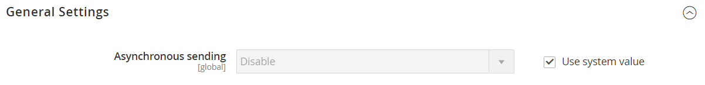
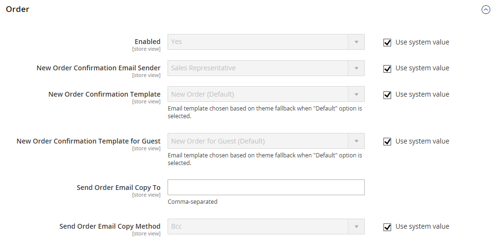

# Emails de vendas

Várias mensagens de email são acionadas pelos eventos relacionados a um pedido e a configuração é semelhante. Identifique o contato da loja que aparece como remetente da mensagem, o modelo de email a ser usado e qualquer outra pessoa que deva receber uma cópia da mensagem. Emails de vendas podem ser enviados quando acionados por um evento ou por um intervalo predeterminado.

{width="600" zoomable="yes"}

## Etapa 1. Atualizar os modelos de email

Atualize o modelo [cabeçalho de email](../systems/email-template-custom.md#header-template) para que ele reflita sua marca e os outros modelos de email conforme necessário. Para obter uma lista completa de modelos, consulte [Modelos de email](../systems/email-templates.md).

## Etapa 2. Escolha o tipo de transmissão

1. Na barra lateral _Admin_, vá para **[!UICONTROL Stores]** > _[!UICONTROL Settings]_>**[!UICONTROL Configuration]**.

1. No painel esquerdo, expanda **[!UICONTROL Sales]** e escolha **[!UICONTROL Sales Emails]**.

1. Se necessário, expanda  a seção **[!UICONTROL General Settings]**.

   {width="600" zoomable="yes"}

   Por padrão, o Envio assíncrono está configurado para `Disable`. Para alterar a configuração do sistema, desmarque a caixa de seleção **[!UICONTROL Use system value]** e defina **[!UICONTROL Asynchronous sending]** como uma das seguintes opções:

   - `Disable` - Envia email de vendas quando acionado por um evento.
   - `Enable` - Envia emails de vendas em intervalos regulares predeterminados.

   O Suporte da Adobe Commerce recomenda ativar o envio assíncrono para melhorar o desempenho do posicionamento de pedidos. Consulte [Práticas recomendadas de configuração para processamento de pedidos](https://experienceleague.adobe.com/docs/commerce-operations/implementation-playbook/best-practices/maintenance/order-processing-configuration.html) na Base de Dados de Conhecimento de Suporte da Adobe Commerce.

## Etapa 3. Preencha os detalhes de cada mensagem de email de vendas

1. Se necessário, expanda  a seção **[!UICONTROL Order]**.

   {width="600" zoomable="yes"}

1. Verifique se **[!UICONTROL Enabled]** está definido como `Yes` (padrão).

1. Defina **[!UICONTROL New Order Confirmation Email]** para o contato de armazenamento que aparece como remetente da mensagem.

1. Defina **[!UICONTROL New Order Confirmation Template]** com o modelo que é usado para o email enviado a clientes registrados.

1. Defina **[!UICONTROL New Order Confirmation Template for Guest]** com o modelo usado para o email enviado aos convidados que não têm uma conta na sua loja.

1. Para **[!UICONTROL Send Order Email Copy To]**, insira o endereço de email de qualquer pessoa que receberá uma cópia do novo email do pedido.

   Se estiver enviando uma cópia para vários destinatários, separe cada endereço com uma vírgula.

1. Defina **[!UICONTROL Send Order Email Copy Method]** como um dos seguintes:

   - `Bcc` - Envia uma _cópia de cortesia oculta_ ao incluir o destinatário no cabeçalho do mesmo email enviado ao cliente. O destinatário CCO não está visível para o cliente.
   - `Separate Email` - Envia a cópia como um email separado.

1. Expanda  a seção **[!UICONTROL Order Comments]** e repita essas etapas.

   {width="600" zoomable="yes"}

1. Conclua a configuração dos tipos de email de vendas restantes:

   - **[!UICONTROL Invoice]** / **[!UICONTROL Invoice Comments]**
   - **[!UICONTROL Shipment]** / **[!UICONTROL Shipment Comments]**
   - **[!UICONTROL Credit Memo]** / **[!UICONTROL Credit Memo Comments]**

1. Quando terminar, clique em **[!UICONTROL Save Config]**.

   Quando solicitado, clique no link [Gerenciamento de Cache](../systems/cache-management.md) na mensagem na parte superior do espaço de trabalho e limpe todos os caches inválidos.
