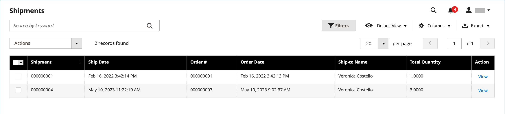

# Entregas

A variável _[!UICONTROL Shipments]_grade lista o registro de entrega de todas as NFFs que foram preparadas para entrega. Um registro de remessa pode ser gerado quando um pedido é [faturado](invoices.md) ou posteriormente.

A Adobe Commerce e o Magento Open Source dão suporte à entrega parcial e completa do pedido, com opções adicionais disponíveis no [Inventory management](../inventory-management/introduction.md) e extensões de terceiros.

{width="600" zoomable="yes"}

## Descrições da coluna

| Coluna ou controle | Descrição |
|--- |--- |
| [!UICONTROL Select] | Marque a caixa de seleção para que cada cotação esteja sujeita a uma ação ou use o controle de seleção no cabeçalho da coluna. Opções: `Select All` / `Deselect All` |
| [!UICONTROL Shipment] | Um número sequencial exclusivo que é atribuído quando uma nova entrega é salva pela primeira vez |
| [!UICONTROL Ship Date] | Data de remessa |
| [!UICONTROL Order] | Número exclusivo do pedido |
| [!UICONTROL Order Date] | A data e a hora em que o pedido foi feito |
| [!UICONTROL Ship-to Name] | O nome da pessoa para quem a ordem é remetida |
| [!UICONTROL Total Quantity] | Quantidade total de itens a serem remetidos |
| [!UICONTROL Action] | Exibir abre a remessa no modo de edição |

{style="table-layout:auto"}

Colunas adicionais:

| Coluna | Descrição |
|--- |--- |
| [!UICONTROL Order Status] | Indica o status do pedido |
| [!UICONTROL Purchased From] | Indica o site, loja e exibição de loja onde o pedido foi feito |
| [!UICONTROL Customer Name] | O nome do cliente ou comprador que colocou a ordem |
| [!UICONTROL Email] | O endereço de email de um cliente registrado |
| [!UICONTROL Customer Group] | O nome do grupo de clientes ou catálogo compartilhado ao qual o cliente está atribuído |
| [!UICONTROL Billing Address] | O nome do cliente ou comprador que colocou a ordem |
| [!UICONTROL Shipping Address] | O nome da pessoa para quem a ordem é remetida |
| [!UICONTROL Payment Method] | O método de pagamento a ser usado para a ordem |
| [!UICONTROL Shipping Information] | O método a ser usado para enviar a ordem |

{style="table-layout:auto"}

## Criar uma remessa

As instruções a seguir orientam você no processo de criação de uma remessa no Adobe Commerce ou no Magento Open Source. Se o Inventory management estiver habilitado, talvez você queira revisar [Criar Entregas de Várias Origens](../inventory-management/shipments-create.md) e selecione uma origem (ou local) e uma quantidade para enviar por item de linha.

1. No _Admin_ barra lateral, vá para **[!UICONTROL Sales]** > **[!UICONTROL Orders]**.

1. Localize a ordem na grade e abra-a.

1. Se a ordem for paga, faturada e pronta para ser enviada, clique em **[!UICONTROL Ship]**.

   As seções na parte superior da entrega contêm o nome, o endereço e as informações de pagamento da ordem de venda.

1. Preencha cada seção do formulário de entrega usando as instruções nas seções a seguir.

### [!UICONTROL Items to Ship]

Para cada item de linha na ordem, modifique o **[!UICONTROL Qty to Ship]** conforme necessário.

### [!UICONTROL Shipping Information]

**Método 1:** Uso da página de pedido

1. No _Admin_ barra lateral, vá para **[!UICONTROL Sales]** > **[!UICONTROL Orders]**.

1. No **[!UICONTROL Action]** para a ordem selecionada, clique em **[!UICONTROL View]**.

1. Clique em **[!UICONTROL Ship]**.

1. Role para baixo até _[!UICONTROL Payment & Shipping Method]_bloquear e clicar **[!UICONTROL Add Tracking Number]**.

1. Definir **[!UICONTROL Carrier]**:

   - `Custom Value`
   - `DHL`
   - `Federal Express`
   - `United Parcel Service`
   - `United States Postal Service`

1. Para rastrear a entrega, informe o **[!UICONTROL Title]** e **[!UICONTROL Number]** .

**Método 2:** Uso da página de remessa

Esse método só será permitido se a remessa do pedido já tiver sido criada na página do pedido.
Você pode modificar as informações de remessa e rastreamento conforme necessário usando a página de remessa direta:

1. No _Admin_ barra lateral, vá para **[!UICONTROL Sales]** > **[!UICONTROL Shipments]**.

1. Localizar e abrir a remessa no modo de edição.

1. Role para baixo até _[!UICONTROL Payment & Shipping Method]_bloco.

1. Selecione o **[!UICONTROL Carrier]**.

1. Insira um **[!UICONTROL Title]** para o pacote.

1. Insira o rastreamento **[!UICONTROL Number]**.

1. Clique em **[!UICONTROL Add]**.

1. Para enviar um email com informações de rastreamento ao cliente, clique em **[!UICONTROL Send Tracking Information]** e confirme a ação.

   Para rastrear a localização de qualquer entrega, abra a entrega necessária no modo de edição e clique em **[!UICONTROL Track this shipment]**.

   {width="600" zoomable="yes"}

### Botões

| Botão | Descrição |
|--- |--- |
| **[!UICONTROL Back]** | Fecha o formulário Nova Remessa e retorna à ordem |
| **[!UICONTROL Submit Shipment]** | Adiciona a remessa do pedido. |
| **[!UICONTROL Reset]** | Restaura todos os campos aos valores originais. |

{style="table-layout:auto"}

### Comentários da remessa

1. Enter **Comentários** para a transferência, se necessário.

1. Quando a remessa estiver pronta, clique em **Enviar Remessa**.

## Configurar comentários para remessas

1. No _Admin_ barra lateral, vá para **[!UICONTROL Stores]** > _[!UICONTROL Settings]_>**[!UICONTROL Configuration]**.

1. Em _[!UICONTROL Sales]_, selecione **[!UICONTROL Sales Email]**.

1. Expanda a **Comentários da Remessa** e modifique as configurações conforme necessário:

   {width="600" zoomable="yes"}

   - A variável **[!UICONTROL Enabled]** está definida como `Yes` por padrão, o que significa que o email é enviado a um cliente quando um comentário de remessa é inserido.

   - Para **[!UICONTROL Shipment Comment Email Sender]**, selecione a pessoa da qual o email de comentário de entrega é enviado. O padrão oferece cinco endereços de email.

   - Para **[!UICONTROL Shipment Comment Email Template]**, selecione o template com base no seu requisito ou selecione a opção padrão.

   - Para **[!UICONTROL Shipment Comment Email Template for Guests]**, escolha o modelo usado para clientes que não têm uma conta na loja.

   - Para **[!UICONTROL Shipment Comment Email Copy To]**, insira os endereços de email para enviar uma cópia do email de comentário de remessa. Separe vários endereços de email com vírgula.

   - Para **[!UICONTROL Shipment Comment Email Copy Method]**, selecione `bcc` (cópia oculta) ou `separate email copy` com base em sua preferência.

1. Clique em **[!UICONTROL Save Config]**.

## Cancelar uma remessa

Antes de uma remessa ser despachada para uma transportadora, ela pode ser cancelada abrindo a ordem e navegando até a remessa, desde que a transportadora suporte cancelamentos. Algumas operadoras restringem ou limitam cancelamentos após uma reserva. Por exemplo, a UPS permite cancelamentos, mas exige que você aguarde 24 horas após a remessa ser registrada. Se uma entrega for cancelada, o cancelamento não poderá ser revertido. O único recurso é recriar a ordem.

1. No _Admin_ barra lateral, vá para **[!UICONTROL Sales]** > **[!UICONTROL Orders]**.

1. Localize a ordem na grade.

1. No _Ação_ coluna, escolha **[!UICONTROL View]**.

1. No painel esquerdo, escolha **[!UICONTROL Shipments]**.

   Se a remessa puder ser cancelada, _[!UICONTROL Cancel Shipment]_é exibido como uma opção na barra de botões superior.

1. Clique em **[!UICONTROL Cancel Shipment]**.

1. Quando for solicitada a confirmação, clique em **[!UICONTROL OK]**.

O status da remessa muda para `Canceled`. Se a transportadora não suportar cancelamentos, uma mensagem de erro será exibida e explicará por que a entrega não pôde ser cancelada.

## Descrições do campo de remessa

### [!UICONTROL Shipping Information]

| Campo | Descrição |
|-----|-----------|
| [!UICONTROL Carrier] | O nome da transportadora selecionada |
| [!UICONTROL Title] | Um nome descritivo atribuído ao pacote pela operadora. |
| [!UICONTROL Number] | O número de rastreamento vinculado atribuído ao pacote. |
| [!UICONTROL Action] |  - Exclui as informações do pacote do registro de remessa. |
| [!UICONTROL Add] | Adicionar outro pacote à remessa. |

{style="table-layout:auto"}

### [!UICONTROL Route Information]

| Campo | Descrição |
|-----|-----------|
| [!UICONTROL Origin Location] | Exibe uma lista de locais disponíveis. |
| [!UICONTROL International] | Se estiver marcada, identifica a entrega como uma entrega internacional. |

{style="table-layout:auto"}

### [!UICONTROL Items Ordered]

| Campo | Descrição |
|-----|-----------|
| [!UICONTROL Description] | A descrição do item. |
| [!UICONTROL SKU] | A Unidade de Manutenção de Estoque do item. |
| [!UICONTROL Weight] | O peso do item. |
| [!UICONTROL Qty Ordered] | A quantidade do item que foi solicitada. |
| [!UICONTROL Qty Shipped] | A quantidade de itens que foram remetidos. |
| [!UICONTROL Qty Packed] | O número de itens incluídos neste pacote. |

{style="table-layout:auto"}

### [!UICONTROL Shipment Comments]

| Campo | Descrição |
|-----|-----------|
| [!UICONTROL Comments] | Os comentários sobre a entrega são para uso interno. |

{style="table-layout:auto"}

### [!UICONTROL Documentation]

| Campo | Descrição |
|-----|-----------|
| [!UICONTROL Package Label] | **PNG** - Baixar a etiqueta do pacote da remessa. Tamanho: A6 (105 x 148mm; 4,1 x 5,6 pol) |

{style="table-layout:auto"}
