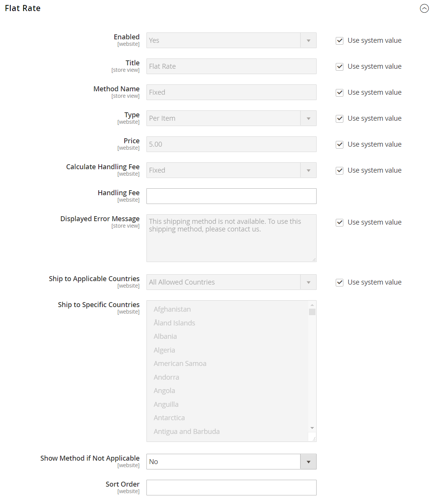

# Taxa única de envio

_Taxa única_ é um encargo fixo predefinido que pode ser aplicado por item ou por remessa. A taxa única é uma solução de envio simples, especialmente quando usada com a embalagem de taxa única disponível em algumas operadoras. Quando habilitada, a _Taxa Uniforme_ aparece como uma opção durante o check-out. Como nenhuma operadora específica é especificada, você pode usar uma operadora de sua escolha.

## Configurar remessa com taxa uniforme

1. Na barra lateral _Admin_, vá para **[!UICONTROL Stores]** > _[!UICONTROL Settings]_>**[!UICONTROL Configuration]**.

1. No painel esquerdo, expanda **[!UICONTROL Sales]** e escolha **[!UICONTROL Delivery Methods]**.

1. Expanda  a seção **Taxa Uniforme**.

   {width="600" zoomable="yes"}

   Para obter uma descrição detalhada de cada uma dessas configurações, consulte [Taxa Uniforme](../configuration-reference/sales/delivery-methods.md#flat-rate) no _Guia de Referência de Configuração_.

1. Defina **[!UICONTROL Enabled]** como `Yes`.

   Taxa única aparece como uma opção na seção Estimar envio e imposto do carrinho de compras e também na seção envio durante o check-out.

1. Insira um **[!UICONTROL Title]** descritivo para o método de taxa única.

1. Digite um **Nome do Método** para aparecer ao lado da taxa calculada no carrinho de compras.

   O nome do método padrão é `Fixed`. Se você cobrar uma taxa de tratamento, poderá alterar esse texto para `Plus Handling` ou algo mais adequado.

1. Para descrever como o frete de taxa uniforme pode ser usado, defina **Type** como um dos seguintes:

   - `None` - Desabilita o tipo de pagamento. A opção Taxa única está listada no carrinho, mas com uma taxa igual a zero, que é a mesma do frete gratuito.
   - `Per Order` - Cobra uma única taxa uniforme para o pedido inteiro.
   - `Per Item` - Cobra uma única taxa uniforme para cada item. A taxa é multiplicada pelo número de itens no carrinho, independentemente de haver várias quantidades dos mesmos itens ou de itens diferentes.

1. Insira o **Preço** que você deseja cobrar pela remessa com taxa uniforme.

1. Configure as opções de taxa de manuseio de acordo com suas necessidades.

   A taxa de manuseio é opcional e aparece como um custo extra que é adicionado ao custo de envio. Se quiser incluir uma taxa de manuseio, faça o seguinte:

   - Para **Calcular Taxa de Manuseio**, selecione o método que deseja usar para calcular as taxas de manuseio:

      - `Fixed`
      - `Percent`

   - Para a **Taxa de Manuseio**, insira o valor a ser cobrado, com base no método escolhido para calcular o valor.

     Por exemplo, se o encargo for baseado em uma taxa fixa, insira o valor como um valor decimal, como `4.90`. No entanto, se a taxa de manuseio for baseada em uma porcentagem do custo de envio, insira o valor como uma porcentagem. Por exemplo, se você estiver cobrando seis por cento do custo de envio, insira o valor como `6`.

1. Se necessário, altere a **Mensagem de Erro Exibida**.

   Essa caixa de texto é predefinida com uma mensagem-padrão, mas você pode informar uma mensagem diferente que deseja exibir se a Entrega de Taxa Uniforme se tornar indisponível.

1. Definir **Remeter para os Países Aplicáveis**:

   - `All Allowed Countries` - Clientes de todos os [países](../getting-started/store-details.md#country-options) especificados na sua configuração de loja podem usar este método de entrega.
   - `Specific Countries` - Ao escolher essa opção, a lista _Remeter para Países Específicos_ é exibida. Selecione cada país na lista onde esse método de entrega pode ser usado.

1. Definir **Mostrar Método se Não Aplicável**:

   - `Yes` - Sempre mostra o método de Taxa Uniforme, mesmo quando não aplicável.
   - `No` - Mostra o método de Taxa Uniforme apenas quando aplicável.

1. Para **[!UICONTROL Sort Order]**, insira um número para determinar a sequência em que a Remessa de Taxa Uniforme aparece quando listada com outros métodos de entrega durante o check-out.

   `0` = primeiro, `1` = segundo, `2` = terceiro e assim por diante.

1. Clique em **[!UICONTROL Save Config]**.
