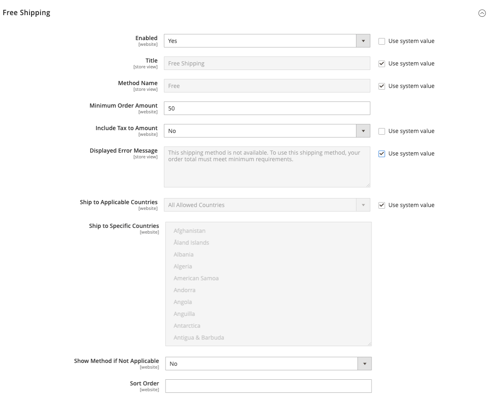

# Frete gratuito

_Remessa gratuita_ é uma das promoções mais eficazes que você pode oferecer. Ela pode ser baseada em uma compra mínima ou configurada como uma [regra de preço do carrinho](../merchandising-promotions/price-rules-cart.md) que é aplicada quando um conjunto de condições é atendido. Se ambos se aplicarem à mesma ordem, a definição de configuração terá prioridade sobre a regra do carrinho.

>[!NOTE]
>
>Verifique a configuração da sua transportadora para quaisquer configurações adicionais que possam ser necessárias para frete gratuito.

## Etapa 1: configurar frete grátis

1. Na barra lateral _Admin_, vá para **[!UICONTROL Stores]** > _[!UICONTROL Settings]_>**[!UICONTROL Configuration]**.

1. No painel esquerdo, expanda **[!UICONTROL Sales]** e escolha **[!UICONTROL Delivery Methods]**.

1. Expandir  a seção **[!UICONTROL Free Shipping]**.

   >[!NOTE]
   >
   >Se necessário, primeiro desmarque a caixa de seleção **[!UICONTROL Use system value]** para alterar as configurações a seguir, conforme descrito.

1. Defina **[!UICONTROL Enabled]** como `Yes`.

1. Para **[!UICONTROL Title]**, insira um título que identifique o método de envio gratuito durante o check-out e um **[!UICONTROL Method Name]** para descrevê-lo.

1. Para **[!UICONTROL Minimum Order Amount]**, insira o valor total mínimo que se qualifica para remessa gratuita.

   >[!TIP]
   >
   >Para usar frete grátis com [taxas de tabela](shipping-table-rate.md), torne o _[!UICONTROL Minimum Order Amount]_&#x200B;tão alto que nunca será atendido. O uso desse valor alto impede que o frete grátis entre em vigor, a menos que seja acionado por uma regra de preço.

1. Conjunto **[!UICONTROL Include Tax to Amount]**:

   - `Yes` - Inclui imposto ao calcular o valor Mínimo do Pedido (Subtotal + Imposto - Desconto).
   - `No` - Não inclui o imposto ao calcular o Valor mínimo do pedido (Subtotal - Desconto).

   {width="600" zoomable="yes"}

1. Para **[!UICONTROL Displayed Error Message]**, insira a mensagem a ser exibida se o frete gratuito ficar indisponível.

1. Conjunto **[!UICONTROL Ship to Applicable Countries]**:

   - `All Allowed Countries` - Clientes de todos os [países](../getting-started/store-details.md#country-options) especificados na sua configuração de loja podem usar frete grátis.

   - `Specific Countries` - Depois de escolher este valor, a lista _[!UICONTROL Ship to Specific Countries]_&#x200B;é exibida. Selecione cada país na lista onde a remessa gratuita pode ser usada.

1. Conjunto **[!UICONTROL Show Method if Not Applicable]**:

   - `Yes` - Sempre mostra o método de envio gratuito, mesmo quando não aplicável.
   - `No` - Mostra o método de envio gratuito apenas quando aplicável.

1. Para **[!UICONTROL Sort Order]**, insira o número que determina a posição da remessa gratuita na lista de métodos de entrega durante o check-out.

   `0` = primeiro, `1` = segundo, `2` = terceiro e assim por diante.

1. Clique em **[!UICONTROL Save Config]**.

## Etapa 2: Ativar frete grátis na configuração da operadora

Conclua qualquer configuração necessária para cada transportadora que você planeja usar para o frete gratuito. Por exemplo, se a sua [configuração de UPS](ups.md) estiver concluída, atualize as seguintes configurações para habilitar e configurar o frete gratuito.

1. Na configuração _[!UICONTROL Delivery Methods]_, expanda  na seção **[!UICONTROL UPS]**.

1. Defina **[!UICONTROL Free Method]** como `UPS Ground` ou outro tipo que você deseja designar para envio gratuito.

1. Para solicitar um pedido mínimo de frete grátis, defina **[!UICONTROL Enable Free Shipping Threshold]** como `Enable`.

   Se você optar por usar um pedido mínimo, insira o valor necessário para **[!UICONTROL Free Shipping Amount Threshold]**.

1. Clique em **[!UICONTROL Save Config]**.
