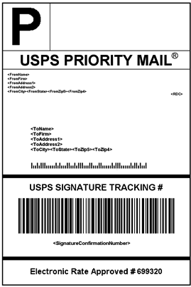

# Etiquetas de remessa

O Commerce inclui um alto nível de integração com as principais transportadoras, o que dá acesso aos sistemas de remessa de transportadoras para rastrear pedidos, criar etiquetas de remessa e muito mais. As etiquetas de remessa podem ser criadas para remessas regulares e produtos com autorização para devolução de mercadoria. Além das informações fornecidas pela transportadora, a etiqueta também inclui o número do pedido do Commerce, o número do pacote e a quantidade total de pacotes para a remessa.

{width="300"}

- [Configurar etiquetas de remessa](shipping-label-configure.md)
- [Criar etiquetas e pacotes de remessa](shipping-label-create.md)

## Fluxo de trabalho de etiqueta de remessa

As etiquetas de remessa podem ser produzidas no momento em que a remessa é criada ou posteriormente. As etiquetas de remessa são armazenadas no formato PDF e são baixadas no computador.

### Etapa 1: o comerciante envia a solicitação de etiqueta de remessa

O comerciante/gerente da loja conclui as informações necessárias para gerar as etiquetas e envia a solicitação.

### Etapa 2: Solicitação enviada à transportadora

O Commerce entra em contato com a transportadora e cria um pedido no sistema da transportadora. Uma ordem separada é criada para cada pacote enviado.

### Etapa 3: a operadora envia o rótulo e o número de rastreamento

A transportadora envia o rótulo da remessa e o número de rastreamento da remessa.

- Uma única entrega com vários pacotes recebe várias etiquetas de entrega.

- Se você gerar os mesmos rótulos de remessa várias vezes, os números de rastreamento originais serão preservados.

- Para produtos devolvidos com números RMA, os números de rastreamento antigos são substituídos por novos.

### Etapa 4: o comerciante baixa e imprime a etiqueta

Depois que a etiqueta de remessa é gerada, a nova remessa é salva e a etiqueta pode ser impressa. Se a etiqueta da entrega não puder ser criada devido a problemas com a conexão ou por qualquer outro motivo, a entrega não será criada. Dependendo das configurações do navegador, o arquivo PDF pode ser aberto e impresso. Cada rótulo aparece em uma página separada no PDF.
