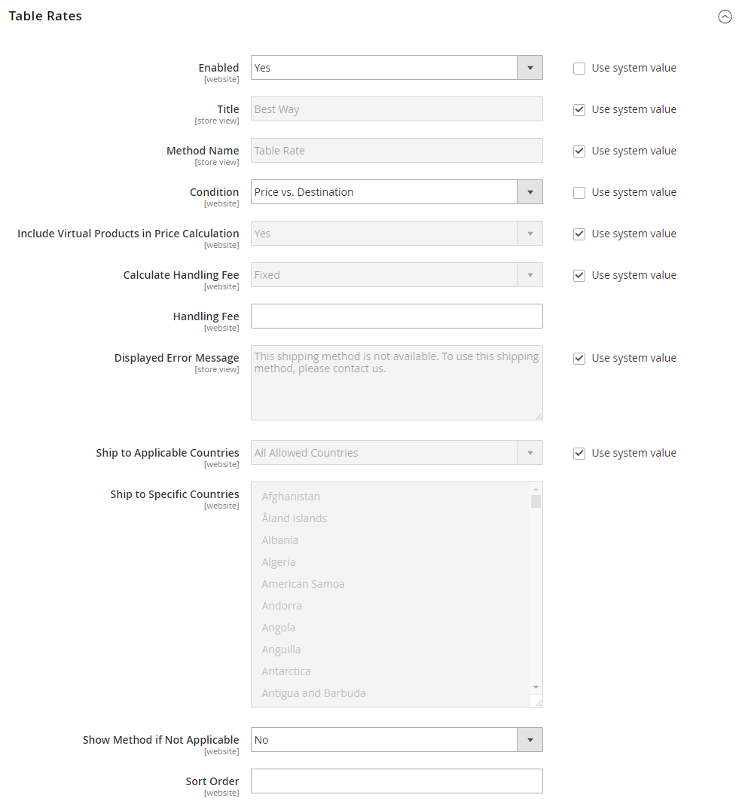

# Taxa de tabela de remessa

A variável _taxa de tabela_ o método de entrega faz referência a uma tabela de dados para calcular taxas de entrega com base em uma combinação de condições, incluindo:

- Peso v. Destino
- Preço v. Destino
- Número de itens v. destino

Por exemplo, se seu armazém está em Los Angeles, custa menos para enviar para San Diego do que para Vermont. Você pode usar a taxa de tabela de envio para repassar a economia para seus clientes.

Os dados usados para calcular taxas de tabelas são preparados em uma planilha e importados para sua loja. Quando o cliente solicita uma cotação, os resultados são exibidos na seção de estimativa de envio do carrinho de compras.

>[!NOTE]
>
>Somente um conjunto de dados de taxa de tabela pode estar ativo por vez.

{width="700" zoomable="yes"}

## Etapa 1: completar as configurações padrão

A primeira etapa é concluir as configurações padrão para taxas de tabela. Você pode concluir esta etapa sem alterar o escopo da configuração.

1. No _Admin_ barra lateral, vá para **[!UICONTROL Stores]** > _[!UICONTROL Settings]_>**[!UICONTROL Configuration]**.

1. No _[!UICONTROL Sales]_do painel esquerdo, escolha **[!UICONTROL Delivery Methods]**.

1. Expandir  o **[!UICONTROL Table Rates]** seção.

   >[!NOTE]
   >
   >Se necessário, primeiro limpe o **[!UICONTROL Use system value]** para alterar as configurações a seguir, conforme descrito.

   {width="600" zoomable="yes"}

1. Definir **[!UICONTROL Enabled]** para `Yes`.

1. Insira o **[!UICONTROL Title]** que você deseja que apareça na seção taxas de tabela durante a finalização da compra.

   O título padrão é `Best Way`.

1. Insira o **[!UICONTROL Method Name]** que você deseja que apareça como um rótulo ao lado da taxa calculada no carrinho de compras.

1. Definir **[!UICONTROL Condition]** a um dos seguintes métodos de cálculo:

   - `Weight v. Destination`
   - `Price v. Destination`
   - `Number of Items v. Destination`

1. Para pedidos que incluem produtos virtuais, defina **[!UICONTROL Include Virtual Products in Price Calculation]** para `Yes` se quiser incluir os produtos virtuais no cálculo.

   >[!NOTE]
   >
   >Como os produtos virtuais — como serviços — não têm peso, eles não podem alterar o resultado de um cálculo que é baseado no Peso v. Condição de destino. No entanto, os produtos virtuais podem alterar o resultado de um cálculo baseado no Preço v. Destino ou no Número de itens vs. Destino.

1. Configure as opções de taxa de manuseio de acordo com suas necessidades.

   A taxa de manuseio é opcional e aparece como um custo extra que é adicionado ao custo de envio. Se quiser incluir uma taxa de manuseio, faça o seguinte:

   - Definir **[!UICONTROL Calculate Handling Fee]**:

      - `Fixed`
      - `Percent`

   - Insira o **[!UICONTROL Handling Fee]** taxa de acordo com o método utilizado para calcular a taxa.

     Por exemplo, se o encargo for baseado em uma taxa fixa, insira o valor como um valor decimal, como `4.90`. No entanto, se a taxa de manuseio se basear em uma porcentagem do pedido, insira o valor como uma porcentagem. Por exemplo, se você estiver cobrando seis por cento da ordem, insira o valor como `.06`.

1. Se necessário, altere o **[!UICONTROL Displayed Error Message]**.

   Essa caixa de texto é predefinida com uma mensagem padrão, mas você pode inserir uma mensagem diferente que deseja exibir se esse método de delivery se tornar indisponível.

1. Definir **[!UICONTROL Ship to Applicable Countries]**:

   - `All Allowed Countries` - Clientes de todos os [países](../getting-started/store-details.md#country-options) especificado na configuração da loja pode usar esse método de entrega.
   - `Specific Countries` - Ao escolher essa opção, a variável _[!UICONTROL Ship to Specific Countries]_é exibida. Selecione cada país na lista onde esse método de entrega pode ser usado.

1. Definir **[!UICONTROL Show Method if Not Applicable]** para `Yes` se você deseja mostrar as Taxas de tabela o tempo todo

1. Para **[!UICONTROL Sort Order]**, informe um número para determinar a sequência em que a Entrega de Taxa de Tabela aparece quando listada com outros métodos de distribuição durante a finalização da compra.

   `0` = primeiro, `1` = segundo, `2` = terceiro e assim por diante.

1. Clique em **[!UICONTROL Save Config]**.

## Etapa 2: Preparar os dados da taxa de tabela

1. No canto superior esquerdo, defina **[!UICONTROL Store View]** para `Main Website`, ou para qualquer outro site onde a configuração se aplique.

   >[!NOTE]
   >
   >Se necessário, primeiro desmarque a opção **[!UICONTROL Use system value]** para alterar as configurações a seguir, conforme descrito.

1. Altere o **[!UICONTROL Condition]** conforme necessário.

1. Clique em **[!UICONTROL Export CSV]**.

   {width="700" zoomable="yes"}

1. Salve o `tablerates.csv` para o seu sistema.

1. Abra o arquivo em um aplicativo de planilha.

1. Preencha a tabela com os valores apropriados para a condição de cálculo de entrega.

   - Use um asterisco (*) como um curinga que representa todos os valores possíveis em qualquer categoria.
   - A variável _[!UICONTROL Country]_a coluna deve conter um [código válido de três caracteres][1] para cada linha.
   - Classificar os dados por _[!UICONTROL Region/State]_portanto, os locais específicos estão no topo da lista e os locais curingas na parte inferior. O uso desse método processa as regras com os valores absolutos primeiro e depois os valores curingas.
   - Valores no _[!UICONTROL Weight (and above)]_pode ter no máximo quatro casas decimais (como `2.5075`). Usar mais casas decimais nos dados faz com que a importação falhe.

   {width="500"}

1. Salve o `tablerates.csv` arquivo.

## Etapa 3: Importar os dados da taxa de tabela

1. Retorne para a **[!UICONTROL Table Rates]** seção da configuração da loja.

1. No canto superior esquerdo, defina **[!UICONTROL Store View]** para o site onde esse método é usado.

1. Para **[!UICONTROL Import]**, clique em **[!UICONTROL Choose File]** e selecione o `tablerates.csv` arquivo para importar as taxas.

   {width="600" zoomable="yes"}

1. Clique em **[!UICONTROL Save Config]**.

## Etapa 4: verificar as taxas

Para garantir que os dados da taxa de tabela estejam corretos, passe pelo processo de pagamento com vários endereços diferentes para garantir que as taxas de remessa e manuseio sejam calculadas corretamente.

### Exemplo 1: Preço e destino

Esse exemplo usa a condição Preço v. Destino para criar um conjunto de três taxas de entrega diferentes com base na quantia do subtotal da ordem para os Estados Unidos continentais, Alasca e Havaí. O asterisco (*) é um curinga que representa todos os valores.

| PAÍS | REGIÃO / ESTADO | CEP | SUBTOTAL DO PEDIDO (e acima) | PREÇO DE ENVIO |
|--- |--- |--- |--- |--- |
| EUA | OI | * | 100 | 10 |
| EUA | OI | * | 50 | 15 |
| EUA | OI | * | 0 | 20 |
| EUA | AK | * | 100 | 10 |
| EUA | AK | * | 50 | 15 |
| EUA | AK | * | 0 | 20 |
| EUA | * | * | 100 | 5 |
| EUA | * | * | 50 | 10 |
| EUA | * | * | 0 | 15 |

{style="table-layout:auto"}

### Exemplo 2: peso e destino

Este exemplo usa a condição Peso v. Destino para criar diferentes taxas de entrega com base no peso da ordem.

| PAÍS | REGIÃO / ESTADO | CEP | PESO (e acima) | PREÇO DE ENVIO |
|--- |--- |--- |--- |--- |
| AUS | NT | * | 9 | 39.95 |
| AUS | NT | * | 0 | 19.95 |
| AUS | VIC | * | 9 | 19.95 |
| AUS | VIC | * | 0 | 5.95 |
| AUS | WA | * | 9 | 39.95 |
| AUS | WA | * | 0 | 19.95 |
| AUS | * | * | 9 | 29.95 |
| AUS | * | * | 0 | 9.95 |

{style="table-layout:auto"}

### Exemplo 3: Restringir frete grátis para o território continental dos Estados Unidos

1. Criar um `tablerates.csv` arquivo que inclui todos os destinos de estado para os quais você está disposto a fornecer frete grátis.

1. Conclua a configuração da taxa de tabela com as seguintes configurações:

   | Configuração | Valor |
   |----------|-------|
   | [!UICONTROL Condition] | `Price v. Destination` |
   | [!UICONTROL Method Name] | `Free Shipping` |
   | [!UICONTROL Ship to Applicable Countries] | `Specific Countries` |
   | [!UICONTROL Ship to Specific Countries] | `Select only United States` |
   | [!UICONTROL Show method if not applicable] | `No` |

   {style="table-layout:auto"}

1. No canto superior esquerdo, defina **[!UICONTROL Store View]** para `Main Website`, ou para qualquer outro site onde a configuração se aplique.

1. Para **[!UICONTROL Import]**, clique em **[!UICONTROL Choose File]** e selecione o `tablerates.csv` arquivo para importar as taxas.

[1]: https://en.wikipedia.org/wiki/ISO_3166-1_alpha-3
