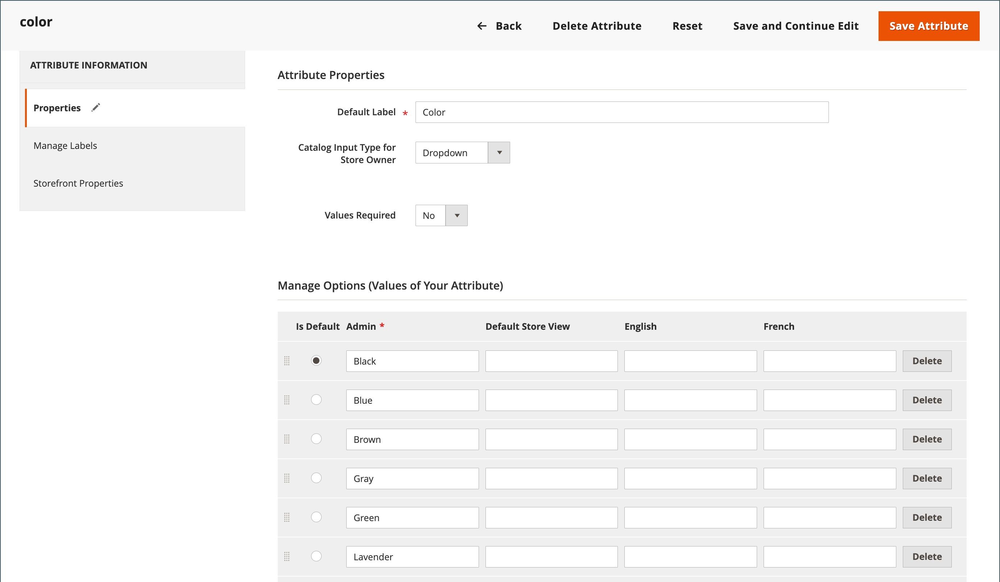

# Localização da loja

A maioria do texto que parece ser codificado nas páginas em toda a loja pode ser alterada instantaneamente para um idioma diferente, alterando o local da exibição. Alterar o local não traduz realmente o texto palavra por palavra, mas simplesmente faz referência a uma tabela de tradução diferente que fornece o texto da interface usado em toda a loja. O texto que pode ser alterado inclui títulos de navegação, rótulos, botões e links como _Meu Carrinho_ e _Minha Conta_. Você também pode usar a ferramenta [Tradução sequencial](../configuration-reference/advanced/developer.md) para retocar o texto na interface.

Os pacotes de idiomas podem ser encontrados em [Traduções e localização][1]{:target="_blank"} no Commerce Marketplace. Novas extensões são adicionadas continuamente ao Marketplace, portanto, verifique com frequência.

## Etapa 1: instalar um pacote de idiomas

Siga as instruções padrão para instalar a extensão de pacote de idiomas. Para obter informações detalhadas sobre a instalação de uma extensão, consulte [Instalação geral da CLI][2] no _Guia de Extensões_.

## Etapa 2: criar uma exibição de loja para o idioma

1. Na barra lateral _Admin_, vá para **[!UICONTROL Stores]** > _[!UICONTROL Settings]_>**[!UICONTROL All Stores]**.

1. Clique em **[!UICONTROL Create Store View]**.

1. Defina as opções para a nova exibição de loja:

   - **[!UICONTROL Store]** — Escolha o armazenamento que é o pai da exibição.

   - **[!UICONTROL Name]** — Digite um nome para a exibição de armazenamento. Por exemplo: Português.

     No cabeçalho do armazenamento, o nome aparece no _seletor de idioma_.

   - **[!UICONTROL Code]** — Digite um código em caracteres minúsculos para identificar o modo de exibição. Por exemplo: `portuguese`.

   - **[!UICONTROL Status]** — Para ativar a exibição, defina como `Enabled`.

   - **[!UICONTROL Sort Order]** — (Opcional) Insira um número para determinar a sequência na qual esta exibição está listada com outras exibições.

1. Quando terminar, clique em **[!UICONTROL Save Store View]**.

## Etapa 3: alterar o local da exibição de loja

1. Na barra lateral _Admin_, vá para **[!UICONTROL Stores]** > _[!UICONTROL Settings]_>**[!UICONTROL Configuration]**.

1. Na lista suspensa **[!UICONTROL Scope]**, selecione o modo de exibição de armazenamento a ser configurado e clique em **[!UICONTROL OK]** quando solicitado.

1. Na página de configuração *[!UICONTROL General]*, expanda  na seção **[!UICONTROL Locale Options]**.

1. Desmarque a caixa de seleção **[!UICONTROL Use Website]** e defina **[!UICONTROL Locale]** como o idioma que você deseja atribuir ao modo de exibição.

   Se houver várias variações do idioma disponível, escolha uma para a região ou dialeto específico.

1. Quando terminar, clique em **[!UICONTROL Save Config]**.

   Depois de alterar o idioma da localidade, o conteúdo restante que você criou, incluindo nomes de produtos e descrições, categorias, páginas do [CMS](../content-design/page-translate.md) e blocos, deve ser traduzido separadamente para cada exibição da loja.

## Localizar produtos

Se sua loja tiver várias visualizações em diferentes idiomas, os mesmos produtos estarão disponíveis em cada visualização de loja. Você pode usar as mesmas informações básicas do produto, como SKU, preço e nível de inventário, independentemente do idioma. Em seguida, traduza somente o nome do produto, os campos de descrição e os metadados, conforme necessário, para cada idioma.

### Etapa 1: Traduzir campos de produto

1. Na barra lateral _Admin_, vá para **[!UICONTROL Catalog]** > **[!UICONTROL Products]**.

1. Na grade, localize o produto a ser traduzido e abra-o no modo de edição.

1. No canto superior esquerdo, defina **[!UICONTROL Store View]** para o modo de exibição da tradução e clique em **[!UICONTROL OK]** quando for solicitada a confirmação.

1. Para cada campo a ser editado, faça o seguinte:

   - Desmarque a caixa de seleção **[!UICONTROL Use Default Value]** à direita do campo.

   - Cole ou digite o texto traduzido no campo.

   Certifique-se de traduzir todos os campos de texto, incluindo rótulos de [imagem](../catalog/catalog-images-video.md) e texto alternativo, campos de [Otimização do Mecanismo de Pesquisa](../catalog/product-search-engine-optimization.md) e qualquer informação de [Opções Personalizadas](../catalog/settings-advanced-custom-options.md).

1. Quando terminar, clique em **[!UICONTROL Save]**.

### Etapa 2: Traduzir rótulos de campo

1. Na barra lateral _Admin_, vá para **[!UICONTROL Stores]** > _[!UICONTROL Attributes]_>**[!UICONTROL Product]**.

1. Na lista, localize o atributo a ser traduzido e aberto no modo de edição.

1. No painel esquerdo, escolha **[!UICONTROL Manage Labels]**.

1. Na seção _[!UICONTROL Manage Titles]_, insira um rótulo traduzido para cada exibição de loja.

   {width="600" zoomable="yes"}

1. Quando terminar, clique em **[!UICONTROL Save Attribute]**.

### Etapa 3: Traduzir todas as categorias

1. Na barra lateral _Admin_, vá para **[!UICONTROL Catalog]** > **Categorias**.

1. No canto superior esquerdo, defina **[!UICONTROL Store View]** para o modo de exibição da tradução e clique em **[!UICONTROL OK]** quando for solicitada a confirmação.

1. Na árvore, localize a categoria a ser traduzida e abra-a no modo de edição.

1. Para _Informações Básicas_, traduza **[!UICONTROL Category Name]**.

1. Expandir  a seção _[!UICONTROL Content]_&#x200B;e traduzir **[!UICONTROL Description]**.

1. Expanda  a seção **[!UICONTROL Search Engine Optimization Settings]** e traduza os seguintes campos:

   - **[!UICONTROL Meta Title]**
   - **[!UICONTROL Meta Keywords]**
   - **[!UICONTROL Meta Description]**

1. Na seção _[!UICONTROL Search Engine Optimization Settings]_, faça o seguinte para traduzir a **[!UICONTROL URL Key]**:

   - Desmarque a caixa de seleção **[!UICONTROL Use Default Value]** à direita do campo.

   - Insira o texto traduzido.

   - Verifique se a caixa de seleção **[!UICONTROL Create Permanent Redirect for old URL]** está marcada.

   

1. Quando terminar, clique em **[!UICONTROL Save Category]**.

1. Repita o processo para todas as categorias usadas no armazenamento.

### Etapa 4: Traduzir atributos do produto e opções de atributos

1. Na barra lateral _Admin_, vá para **[!UICONTROL Stores]** > _[!UICONTROL Attributes]_>**[!UICONTROL Product]**.

1. Selecione o atributo a ser traduzido.

1. Escolha **[!UICONTROL Manage Labels]** à esquerda e defina as opções **[!UICONTROL Managed Titles]** para definir as traduções de título de atributo.

1. Escolha **[!UICONTROL Properties]** à esquerda e insira as opções de atributo traduzido na seção **[!UICONTROL Manage Options]**.

   {width="600" zoomable="yes"}

1. Quando terminar, clique em **[!UICONTROL Save Attribute]**.

[1]: https://marketplace.magento.com/extensions/content-customizations/translations-localization.html
[2]: https://experienceleague.adobe.com/docs/commerce-operations/installation-guide/tutorials/extensions.html
