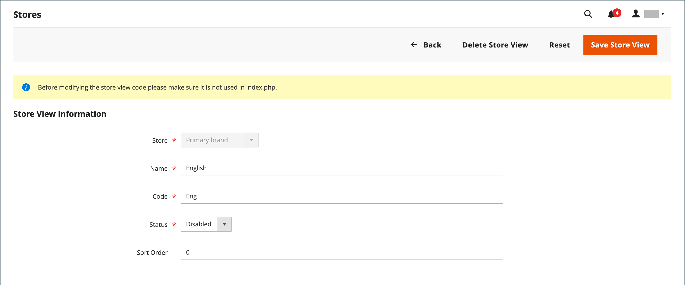

# Visualizações da loja

As exibições da loja geralmente são usadas para torná-la disponível em diferentes localidades. Os compradores podem usar o seletor de idioma no cabeçalho da loja para alterar a exibição da loja.

{width="550"}

## Status de sincronização de [!DNL Adobe Commerce Optimizer] {#optimizer-sync-status}

Se o [!DNL Adobe Commerce Optimizer Connector] estiver instalado e habilitado para uma exibição de site ou de repositório, a grade [!UICONTROL All Stores] mostrará um indicador de status de sincronização. Se o [!DNL Adobe Commerce Optimizer Connector for B2B] estiver instalado, os dados também serão sincronizados para os catálogos compartilhados B2B disponíveis. Consulte [Gerenciar exibições do catálogo](../b2b/catalog-views-manage.md).

| Coluna | Indicador | Descrição |
| ----- | ----- | ----- |
| [!UICONTROL Web Site] | [!UICONTROL Price sync enabled for Commerce Optimizer] | Os preços e catálogos de preços deste site estão sincronizados com [!DNL Adobe Commerce Optimizer]. |
| [!UICONTROL Store View] | [!UICONTROL Product sync enabled for Commerce Optimizer] | Os produtos e atributos deste modo de exibição de armazenamento estão sincronizados com [!DNL Adobe Commerce Optimizer]. |

{width="700" zoomable="yes"}

Para habilitar ou desabilitar a sincronização, edite o **[!UICONTROL Adobe Commerce Optimizer exporter settings]** ao [criar um site](stores.md#step-1-create-a-website) ou [adicionar um modo de exibição de loja](#add-a-store-view), ou ao atualizar um modo de exibição de site ou loja existente.

## Adicionar uma exibição de loja

1. Na barra lateral _Admin_, vá para **[!UICONTROL Stores]** > _[!UICONTROL Settings]_>**[!UICONTROL All Stores]**.

   {width="700" zoomable="yes"}

1. Clique em **[!UICONTROL Create Store View]**.

   {width="600" zoomable="yes"}

1. Defina **[!UICONTROL Store]** para o armazenamento pai desta exibição.

1. Insira um **[!UICONTROL Name]** para este modo de exibição de loja.

   O nome aparece no seletor de idioma no cabeçalho da loja. Por exemplo: `Spanish`.

1. Para **[!UICONTROL Code]**, insira o código que identifica a exibição (em caracteres minúsculos).

   Por exemplo: `spanish`.

1. Para ativar a exibição, defina **[!UICONTROL Status]** como `Enabled`.

1. (Opcional) Insira um número **[!UICONTROL Sort Order]** para determinar a sequência na qual esta exibição está listada com outras exibições.

1. (Opcional) Se o [!DNL Adobe Commerce Optimizer Connector] estiver instalado, selecione **[!UICONTROL Sync products and attributes]** na seção **[!UICONTROL Adobe Commerce Optimizer exporter settings]** para sincronizar os produtos e atributos deste modo de exibição de repositório com [!DNL Adobe Commerce Optimizer]. Se o [!DNL Adobe Commerce Optimizer Connector for B2B] também estiver instalado, essa configuração também sincroniza os dados do catálogo compartilhado B2B para [!DNL Adobe Commerce Optimizer]. Consulte [Gerenciar exibições do catálogo](../b2b/catalog-views-manage.md).

   {width="600" zoomable="yes"}

   A alteração dessa configuração após a sincronização inicial aciona uma reindexação completa. Consulte [Personalizar a configuração de exportação de escopos do Commerce](https://experienceleague.adobe.com/en/docs/commerce/aco-optimizer-connector/get-started#customize-the-commerce-scopes-export-configuration) no *Guia do Adobe Commerce Optimizer Connector*.

1. Clique em **[!UICONTROL Save Store View]**.

## Editar uma exibição de loja

Como o nome da exibição aparece no seletor de idioma, talvez você queira alterar o nome da exibição padrão para algo mais descritivo. O campo _Nome_ é simplesmente um rótulo e pode ser facilmente alterado.

Se sua instalação do Adobe Commerce ou Magento Open Source tiver uma configuração multissite ou multiloja, não altere o campo Código da loja sem verificar se o valor não é referenciado no arquivo `index.php`. Se você não tiver acesso ao servidor para examinar o arquivo, peça ajuda a um desenvolvedor.

| Campo | Valor original | Valor atualizado |
| ----- | -------------- | ------------- |
| [!UICONTROL Name] | `Default Store View` | `English` |
| [!UICONTROL Code] | `default` | `english` |

{style="table-layout:auto"}

1. Na barra lateral _Admin_, vá para **[!UICONTROL Stores]** > _[!UICONTROL Settings]_>**[!UICONTROL All Stores]**.

1. Na coluna _[!UICONTROL Store View]_&#x200B;da grade, clique no nome da exibição que deseja editar.

   Ao editar o modo de exibição padrão, os campos _[!UICONTROL Store]_&#x200B;e_[!UICONTROL Status]_ não estão disponíveis.

   {width="600" zoomable="yes"}

1. Atualize os seguintes campos conforme necessário:

   - **[!UICONTROL Store]** (apenas modos de exibição não padrão)
   - **[!UICONTROL Name]**
   - **[!UICONTROL Code]** (somente se não for usado em `index.php`)
   - **[!UICONTROL Status]** (apenas modos de exibição não padrão)
   - **[!UICONTROL Sort Order]**
   - **[!UICONTROL Sync products and attributes]** (somente se o [!DNL Adobe Commerce Optimizer Connector] estiver instalado)

   {width="600" zoomable="yes"}

1. Clique em **[!UICONTROL Save Store View]**.
