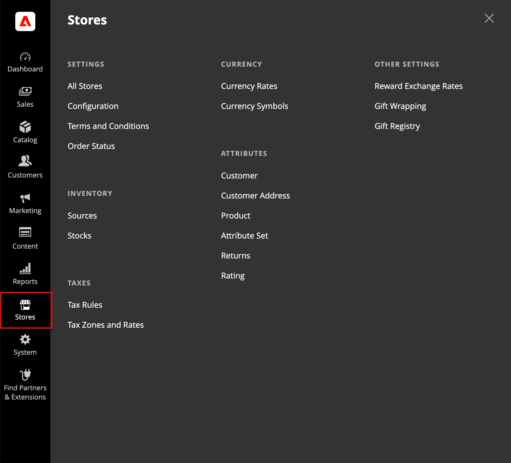

# Menu [!UICONTROL Stores]

O menu _[!UICONTROL Stores]_fornece acesso a configurações que são usadas com menos frequência, mas referenciadas durante toda a instalação do Adobe Commerce ou Magento Open Source. Essas funções incluem a definição da hierarquia da loja, a configuração, as configurações de vendas e pedidos, os impostos e a moeda, os atributos do produto, as classificações de revisão do produto e os grupos de clientes.

{width="500" zoomable="yes"}

## Exibir o menu [!UICONTROL Stores]

Na barra lateral _Admin_, clique em **[!UICONTROL Stores]**.

## Seções principais

### [!UICONTROL Settings]

Gerencie a hierarquia de [sites, lojas e exibições de loja](stores.md#store-and-site-structure) na sua instalação do Adobe Commerce ou do Magento Open Source e em todas as [configurações](../configuration-reference/guide-overview.md). Além disso, você pode configurar os [Termos e Condições](terms-and-conditions.md) de uma venda e gerenciar as [configurações de status do pedido](order-status.md#custom-order-status).

### [!UICONTROL Inventory]

[Gerencie e crie estoques](../inventory-management/introduction.md) para vincular seus canais ou sites de vendas a [fontes](../inventory-management/sources-manage.md). As existências representam uma quantidade de produtos comercializável agregada. Comerciantes individuais da Source usam o Estoque padrão, enquanto Comerciantes de vários Source usam estoques personalizados adicionais.

### [!UICONTROL Taxes]

Gerencie todos os tipos de [funções de imposto](taxes.md) em sua loja, configure as regras de imposto para sua loja, defina classes de imposto de cliente e produto e gerencie zonas de imposto e alíquotas. Você também pode importar dados de alíquota do imposto para sua loja.

### [!UICONTROL Currency]

Gerencie as taxas para as [moedas](currency.md) aceitas como pagamento em sua loja e personalize os símbolos de moeda que aparecem nos preços dos produtos e nos documentos de venda.

### [!UICONTROL Attributes]

Gerenciar atributos usados para [informações do cliente](../customers/attribute-properties.md) ou [informações do produto](../catalog/attribute-product-create.md), devoluções e classificações do produto. Você pode criar atributos, editar atributos existentes e gerenciar [conjuntos de atributos](../catalog/attribute-sets.md).

### [!UICONTROL Other Settings]

Gerencie configurações adicionais para [taxas de câmbio de premiação](../merchandising-promotions/reward-exchange-rates.md), [invólucro de presentes](cart-configuration.md#gift-wrap) e [registros de presentes](../merchandising-promotions/gift-registries.md).
