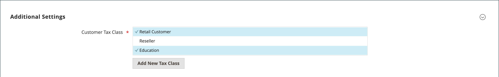

# Classes de imposto

Classes de imposto podem ser atribuídas a clientes, produtos e entregas. A Commerce analisa o carrinho de compras de cada cliente e calcula o imposto apropriado de acordo com a classe do cliente, a classe dos produtos no carrinho e a região. A região é determinada pelo endereço de entrega, endereço de faturamento ou origem da remessa do cliente. Novas classes de imposto podem ser criadas quando uma [regra de imposto](tax-rules.md) é definida.

- **Cliente** — Você pode criar quantas classes de imposto do cliente forem necessárias e atribuí-las a [grupos de clientes](../customers/customer-groups.md). Por exemplo, em algumas jurisdições, as transações grossistas não são tributadas, mas as transações retalhistas são tributadas. Você pode associar membros do grupo Cliente Atacado à classe de imposto Atacado.

- **Produto** — As classes de produto são usadas nos cálculos para determinar se a alíquota de imposto correta é aplicada ao carrinho de compras. Quando você cria o produto, ele é atribuído a uma classe de imposto específica. Por exemplo, os alimentos podem não ser tributados ou ser tributados a uma taxa diferente.

- **Envio** — Se a loja cobrar um imposto extra sobre o envio, você deverá designar uma classe de imposto do produto específica para envio. Em seguida, na configuração, especifique-a como a classe de imposto usada para entrega.

## Configurar classes de imposto

A classe de imposto usada para remessa e as classes de imposto padrão para [produtos e clientes](#add-a-product-tax-class) estão definidas na configuração _[!UICONTROL Sales]_.

1. Na barra lateral _Admin_, vá para **[!UICONTROL Stores]** > _[!UICONTROL Settings]_>**[!UICONTROL Configuration]**.

1. No painel esquerdo, expanda **[!UICONTROL Sales]** e escolha **[!UICONTROL Tax]**.

1. Expandir  a seção **[!UICONTROL Tax Classes]**.

   {width="600" zoomable="yes"}

1. Escolha a classe de imposto para cada uma das seguintes opções:

   - **[!UICONTROL Set Tax Class for Shipping]**
   - **[!UICONTROL Tax Class for Gift Options]**
   - **[!UICONTROL Default Tax Class for Product]**
   - **[!UICONTROL Default Tax Class for Customer]**

1. Quando terminar, clique em **[!UICONTROL Save Config]**.

## Adicionar classes de imposto

Classes de imposto para clientes e produtos podem ser facilmente adicionadas, atribuídas a clientes e produtos individuais e usadas em regras de imposto.

1. Na barra lateral _Admin_, vá para **[!UICONTROL Stores]** > _[!UICONTROL Taxes]_>**[!UICONTROL Tax Rules]**.

1. Clique em **[!UICONTROL Add New Tax Rule]**.

1. Expandir  a seção **[!UICONTROL Additional Settings]**.

   {width="600" zoomable="yes"}

1. Em _Classe de Imposto do Cliente_, clique em **[!UICONTROL Add New Tax Class]**.

1. Insira o **[!UICONTROL Name]** da nova classe de imposto na caixa de texto.

   {width="600" zoomable="yes"}

1. Para adicionar a nova classe à lista de classes de imposto do cliente disponíveis, clique na marca de seleção.

   {width="600" zoomable="yes"}

## Adicionar uma classe de imposto do produto

1. Em _Classe de Imposto do Produto_, clique em **[!UICONTROL Add New Tax Class]**.

1. Insira o **[!UICONTROL Name]** da nova classe de imposto na caixa de texto.

1. Para adicionar a nova classe à lista de classes de imposto do produto disponíveis, clique na marca de seleção.

1. Quando terminar, clique em **[!UICONTROL Back]** na barra de botões para retornar à grade _Regras de Imposto_.

## Destino de imposto padrão

As configurações padrão de destino do imposto determinam o país, o estado e o CEP usados como base para os cálculos do imposto.

**_Para configurar o destino de imposto padrão para cálculos:_**

1. Na barra lateral _Admin_, vá para **[!UICONTROL Stores]** > _[!UICONTROL Settings]_>**[!UICONTROL Configuration]**.

1. No painel esquerdo, expanda **[!UICONTROL Sales]** e escolha **[!UICONTROL Tax]**.

1. Expandir  a seção **[!UICONTROL Default Tax Destination Calculation]**.

   {width="600" zoomable="yes"}

1. Defina **[!UICONTROL Default Country]** como o país no qual se baseiam os cálculos de imposto.

1. Defina **[!UICONTROL Default State]** para o estado ou província que é usado como base de cálculos de imposto.

1. Defina **[!UICONTROL Default Post Code]** como CEP ou código postal usado como base de cálculos de impostos locais.

1. Quando terminar, clique em **[!UICONTROL Save Config]**.
