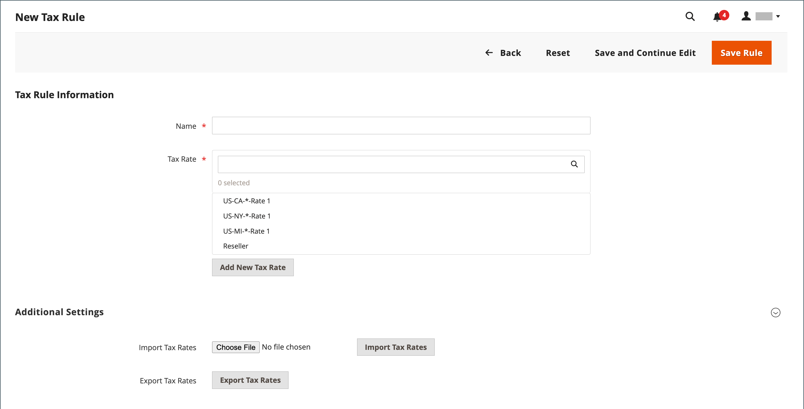

# Regras de imposto

As regras de imposto incorporam uma combinação de classe de produto, classe de cliente e alíquota de imposto. Cada cliente é atribuído a uma classe de cliente, e cada produto é atribuído a uma classe de produto. O Commerce analisa o carrinho de compras de cada cliente e calcula o imposto apropriado de acordo com o cliente, as classes de produto e a região. A região tem como base o endereço de entrega, o endereço de cobrança ou a origem da remessa do cliente.

>[!NOTE]
>
>Quando várias alíquotas de imposto devem ser definidas, é possível simplificar o processo importando-as.

{width="600" zoomable="yes"}

## Fase 1: Preencher as informações da regra de imposto

1. Na barra lateral _Admin_, vá para **[!UICONTROL Stores]** > _[!UICONTROL Taxes]_>**[!UICONTROL Tax Rules]**.

1. No canto superior direito, clique em **[!UICONTROL Add New Tax Rule]**.

1. Em _Informações de Regra de Imposto_, insira um **[!UICONTROL Name]** para a nova regra.

   {width="600" zoomable="yes"}

1. Escolha o **[!UICONTROL Tax Rate]** que se aplica à regra.

   Para editar uma alíquota de imposto existente, faça o seguinte:

   - Passe o mouse sobre a alíquota do imposto e clique no ícone de _Editar_ .

   - Atualize o formulário conforme necessário e clique em **[!UICONTROL Save]**.

1. Para informar alíquotas de imposto, use um dos seguintes métodos:

### Método 1: informar alíquotas de imposto manualmente

1. Clique em **[!UICONTROL Add New Tax Rate]**.

1. Preencha o formulário conforme necessário (consulte [Zonas e alíquotas de imposto](tax-zones-rates.md)).

1. Quando terminar, clique em **[!UICONTROL Save]**.

   {width="600" zoomable="yes"}

### Método 2: Importar alíquotas de imposto

1. Role para baixo até a seção na parte inferior da página.

1. Para importar alíquotas de imposto, faça o seguinte:

   - Clique em **[!UICONTROL Choose File]** e navegue até o arquivo CSV com as taxas de imposto a serem importadas.

   - Clique em **[!UICONTROL Import Tax Rates]**.

1. Para exportar alíquotas de imposto, clique em **[!UICONTROL Export Tax Rates]** (consulte [Alíquotas de Imposto de Importação/Exportação](../systems/data-transfer-tax-rates.md)).

{width="600" zoomable="yes"}

## Etapa 2: concluir as configurações adicionais

1. Para abrir a seção, clique em **[!UICONTROL Additional Settings]**.

   {width="600" zoomable="yes"}

1. Escolha o **[!UICONTROL Customer Tax Class]** ao qual a regra se aplica.

   - Para editar uma classe de imposto do cliente, clique no ícone _Editar_ , atualize o formulário conforme necessário e clique em **[!UICONTROL Save]**.

   - Para criar uma classe de imposto, clique em **[!UICONTROL Add New Tax Class]**, preencha o formulário conforme necessário e clique em **[!UICONTROL Save]**.

1. Escolha o **[!UICONTROL Product Tax Class]** ao qual a regra se aplica.

   - Para editar uma classe de imposto sobre produtos, clique no ícone _Editar_ , atualize o formulário conforme necessário e clique em **[!UICONTROL Save]**.

   - Para criar uma classe de imposto, clique em **[!UICONTROL Add New Tax Class]**, preencha o formulário conforme necessário e clique em **[!UICONTROL Save]**.

1. Quando mais de um imposto for aplicável, insira um número para indicar a prioridade desse imposto para **[!UICONTROL Priority]**.

   Se duas regras de imposto com a mesma prioridade forem aplicadas, os impostos serão adicionados. Se dois impostos com configurações de prioridade diferentes forem aplicados, os impostos serão compostos.

1. Se quiser que os impostos sejam baseados no subtotal do pedido, marque a caixa de seleção **[!UICONTROL Calculate off Subtotal Only]**.

1. Para **[!UICONTROL Sort Order]**, insira um número para indicar a ordem desta regra de imposto quando listada com outras pessoas.

1. Quando terminar, clique em **[!UICONTROL Save Rule]**.

## Demonstração de regras de imposto e moeda

Saiba mais sobre como gerenciar regras de moeda e impostos assistindo a este vídeo:

>[!VIDEO](https://video.tv.adobe.com/v/3411983/?captions=por_br&quality=12&learn=on)
