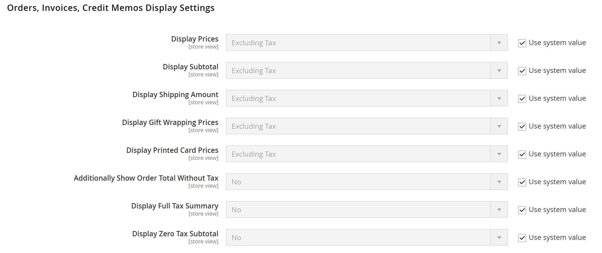

# Definições de configuração de imposto

As instruções a seguir orientam você pela configuração básica de imposto para sua instância do Commerce. Antes de configurar seus impostos, verifique se você está familiarizado com os requisitos de imposto da sua [localidade](store-localize.md#step-3-change-the-locale-of-the-store-view). Em seguida, conclua a configuração de imposto de acordo com suas necessidades.

As [permissões](../systems/permissions.md) do administrador podem ser definidas para restringir o [acesso](../systems/permissions-user-roles.md) a recursos de impostos, com base na empresa _que você precisa saber_. Para criar uma função de Administrador com acesso às configurações de imposto, escolha os recursos Vendas/Imposto e Sistema/Imposto. Se estiver configurando um site para uma região diferente do ponto de origem de remessa padrão, você também deve permitir acesso aos recursos Sistema/Remessa da função. As configurações de entrega determinam a alíquota de imposto da loja usada para preços de catálogo.

## Definir as configurações gerais de imposto

1. Na barra lateral _Admin_, vá para **[!UICONTROL Stores]** > _[!UICONTROL Settings]_>**[!UICONTROL Configuration]**.

1. Para uma configuração multissite, defina **[!UICONTROL Store View]** para o site e armazene que é o destino da configuração.

1. No painel esquerdo, expanda **[!UICONTROL Sales]** e escolha **[!UICONTROL Tax]**.

1. Complete as definições de configuração a seguir.

   Se necessário, desmarque a caixa de seleção **[!UICONTROL Use system value]** de todas as configurações esmaecidas.

### [!UICONTROL Tax Classes]

1. Expandir  a seção **[!UICONTROL Tax Classes]**.

   {width="600" zoomable="yes"}

   - **Classe de Imposto para Remessa** — Defina para a classe apropriada. As classes padrão são: `None` e `Taxable Goods`
   - **Classe de Imposto para Opções de Presente** —  (somente Adobe Commerce) Defina para a classe apropriada. As classes padrão são: `None` e `Taxable Goods`
   - **Classe de Imposto Padrão do Produto** — Defina para a classe apropriada. As classes padrão são: `None` e `Taxable Goods`
   - **Classe de Imposto Padrão do Cliente** — Defina para a classe apropriada. A classe padrão é: `Retail Customer` e `Wholesale Customer`

1. Quando terminar, clique em **[!UICONTROL Save Config]**.

### [!UICONTROL Calculation Settings]

1. Expanda a seção **[!UICONTROL Calculation Settings]**.

   {width="600" zoomable="yes"}

1. Defina **[!UICONTROL Tax Calculation Method Based On]** como um dos seguintes:

   - `Unit Price` - O preço de cada produto
   - `Row Total` - O total do item de linha no pedido, menos descontos
   - `Total` - O total do pedido

1. Defina **[!UICONTROL Tax Calculation Based On]** como um dos seguintes:

   - `Shipping Address` - O endereço para onde o pedido deve ser enviado
   - `Billing Address` - O endereço de cobrança do cliente ou da empresa
   - `Shipping Origin` - O endereço especificado como o [ponto de origem](shipping-settings.md#point-of-origin) de seu armazenamento

1. Defina **[!UICONTROL Catalog Prices]** como `Excluding Tax` ou `Including Tax`.

1. Defina **[!UICONTROL Shipping Prices]** como `Excluding Tax` ou `Including Tax`.

1. Defina **[!UICONTROL Apply Customer Tax]** como um dos seguintes valores para determinar se o imposto é aplicado ao preço original ou com desconto: `After Discount` ou `Before Discount`

1. Defina **[!UICONTROL Apply Discount on Prices]** como um dos seguintes para determinar se os descontos incluem ou excluem imposto: `Excluding Tax` ou `Including Tax`

1. Defina **[!UICONTROL Apply Tax On]** como `Custom price if available` ou `Original price only`.

1. Defina **[!UICONTROL Enable Cross-Border Trade]** como um dos seguintes:

   - `Yes` - Use preços consistentes em diferentes alíquotas de imposto. Se o preço do catálogo incluir imposto, escolha essa configuração para fixar o preço independentemente da alíquota de imposto do cliente.
   - `No` - Variar o preço por alíquota de imposto.

   >[!IMPORTANT]
   >
   >Se [comércio transfronteiriço](#cross-border-price-consistency) estiver habilitado, a margem de lucro será alterada por alíquota de imposto. O lucro é determinado pela fórmula (`Revenue - CustomerVAT - CostOfGoodsSold`). Para permitir o comércio transfronteiriço, os preços devem ser definidos para incluir o imposto.

### [!UICONTROL Default Tax Destination Calculation]

1. Expandir  a seção **[!UICONTROL Default Tax Destination Calculation]**.

   {width="600" zoomable="yes"}

1. Especifique o **[!UICONTROL Default Country]** para cálculos de imposto.

1. Se aplicável, especifique o **[!UICONTROL Default State]** para cálculos de imposto.

1. Se aplicável, especifique o **[!UICONTROL Default Post Code]** para cálculos de imposto.

1. Quando terminar, clique em **[!UICONTROL Save Config]**.

### [!UICONTROL Price Display Settings]

>[!IMPORTANT]
>
>Algumas combinações de configurações relacionadas a uma exibição de preço que incluem e excluem imposto podem ser confusas para o cliente. Para evitar o acionamento de uma mensagem de aviso, consulte as [configurações recomendadas](taxes.md#warning-messages).

1. Expandir  a seção **[!UICONTROL Price Display Settings]**.

   {width="600" zoomable="yes"}

1. Defina **[!UICONTROL Display Product Prices in Catalog]** como um dos seguintes:

   - `Excluding Tax` - Os preços de catálogo exibidos na loja não incluem imposto.
   - `Including Tax` - Os preços de catálogo na loja incluem imposto somente se uma regra de imposto corresponder à origem do imposto ou se o endereço do cliente corresponder à regra de imposto. Isso pode acontecer depois que um cliente cria uma conta, faz logon ou usa a ferramenta de Estimativa de imposto e remessa no carrinho.
   - `Including and Excluding Tax` - Os preços de catálogo que aparecem na loja são exibidos com e sem impostos.

1. Defina **[!UICONTROL Display Shipping Prices]** como `Excluding Tax`, `Including Tax` ou `Including and Excluding Tax`.

1. Quando terminar, clique em **[!UICONTROL Save Config]**.

### [!UICONTROL Shopping Cart Display Settings]

1. Expandir  a seção **[!UICONTROL Shopping Cart Display Settings]**.

   {width="600" zoomable="yes"}

1. Para cada uma das seguintes configurações, escolha como deseja que os impostos e preços sejam exibidos no carrinho, de acordo com os requisitos da loja e do local:

   - Defina **[!UICONTROL Display Prices]** como `Excluding Tax`, `Including Tax` ou `Including and Excluding Tax`.

   - Defina **[!UICONTROL Display Subtotal]** como `Excluding Tax`, `Including Tax` ou `Including and Excluding Tax`.

   - Defina **[!UICONTROL Display Shipping Amount]** como `Excluding Tax`, `Including Tax` ou `Including and Excluding Tax`.

   -  (somente Adobe Commerce) Defina **[!UICONTROL Display Gift Wrapping Prices]** como `Excluding Tax`, `Including Tax` ou `Including and Excluding Tax`.

   -  (somente Adobe Commerce) Defina **[!UICONTROL Display Printed Card Prices]** como `Excluding Tax`, `Including Tax` ou `Including and Excluding Tax`.

1. Defina as seguintes opções de exibição como `Yes` ou `No`, de acordo com suas necessidades:

   - **[!UICONTROL Include Tax in Order Total]**
   - **[!UICONTROL Display Full Tax Summary]**
   - **[!UICONTROL Display Zero Tax Subtotal]**

1. Quando terminar, clique em **[!UICONTROL Save Config]**.

### [!UICONTROL Orders, Invoices, Credit Memos Display Settings]

1. Expanda  a seção **[!UICONTROL Orders, Invoices, Credit Memos Display Settings]**.

   {width="600" zoomable="yes"}

1. Especifique como os preços e os impostos aparecem nas ordens, NFFs e avisos de crédito:

   - Defina **[!UICONTROL Display Prices]** como `Excluding Tax`, `Including Tax` ou `Including and Excluding Tax`.

   - Defina **[!UICONTROL Display Subtotal]** como `Excluding Tax`, `Including Tax` ou `Including and Excluding Tax`.

   - Defina **[!UICONTROL Display Shipping Amount]** como `Excluding Tax`, `Including Tax` ou `Including and Excluding Tax`.

   -  (somente Adobe Commerce) Defina **[!UICONTROL Display Gift Wrapping Prices]** como `Excluding Tax`, `Including Tax` ou `Including and Excluding Tax`.

   -  (somente Adobe Commerce) Defina **[!UICONTROL Display Printed Card Prices]** como `Excluding Tax`, `Including Tax` ou `Including and Excluding Tax`.

1. Defina as seguintes opções de exibição como `Yes` ou `No`, de acordo com suas necessidades:

   - **[!UICONTROL Include Tax in Order Total]**
   - **[!UICONTROL Display Full Tax Summary]**
   - **[!UICONTROL Display Zero Tax Subtotal]**

1. Quando terminar, clique em **[!UICONTROL Save Config]**.

### [!UICONTROL Fixed Product Taxes]

1. Expandir  a seção **[!UICONTROL Fixed Product Taxes]**.

   {width="600" zoomable="yes"}

1. Defina **[!UICONTROL Enable FPT]** como `Yes` ou `No`, de acordo com suas necessidades.

1. Se o FPT estiver ativado, especifique as opções de exibição do FPT:

   - **[!UICONTROL Display Prices in Product Lists]**
   - **[!UICONTROL Display Price On Product view Page]**
   - **[!UICONTROL Display Prices in Sales Modules]**
   - **[!UICONTROL Display Prices in Emails]**

   - `Including FPT Only` - Os preços exibidos incluem impostos fixos sobre o produto. O valor FPT não é exibido separadamente.
   - `Including FPT and FPT description` - Os preços exibidos incluem impostos fixos sobre o produto. O valor de FPT é exibido separadamente.
   - `Excluding FPT. Including FPT description and final price` - Os preços exibidos não incluem os impostos fixos sobre o produto. O valor de FPT é exibido separadamente.
   - `Excluding FPT` - Os preços exibidos não incluem os impostos fixos sobre o produto. O valor FPT não é exibido separadamente.

1. Defina **[!UICONTROL Apply Discounts to FPT]** como `Yes` ou `No`, de acordo com suas necessidades.

1. Defina **[!UICONTROL FPT Tax Configuration]** para determinar como o FPT é calculado.

   - `Not Taxed` - Selecione esta opção se sua jurisdição de tributação não tributar FPT. (Por exemplo, Califórnia.)
   - `Taxed` - Selecione esta opção se sua jurisdição de tributação tributa FPT. (Por exemplo, Canadá.)
   - `Loaded and Displayed with Tax` - Clique nessa opção se FPT for adicionado ao total do pedido antes de aplicar o imposto. (Por exemplo, países da UE.)

1. Defina **[!UICONTROL Include FPT in Subtotal]** como `Yes` ou `No`, de acordo com suas necessidades.

1. Quando terminar, clique em **[!UICONTROL Save Config]**.

## Coerência dos preços transfronteiras

O comércio transfronteiriço (também conhecido como consistência de preços) apoia a União Europeia (UE) e outros comerciantes que desejam manter preços consistentes para clientes cujas taxas de imposto são diferentes da taxa de imposto da loja.

Os comerciantes que operam entre regiões e geografias podem exibir um único preço incluindo o imposto no preço do produto. Os preços são limpos e desorganizados, independentemente das estruturas e taxas de imposto que variam de país para país. Essas configurações exigem que uma extensão de cálculo de imposto seja instalada do [Marketplace](../getting-started/commerce-marketplace.md), como o _Vertex Cloud_.

>[!NOTE]
>
>Quando o comércio transfronteiriço estiver habilitado, sua margem de lucro será alterada por alíquota de imposto. O lucro é determinado pela fórmula: 
>`Revenue - CustomerVAT - CostOfGoodsSold`

**_Para habilitar a consistência de preço entre fronteiras:_**

1. Na barra lateral _Admin_, vá para **[!UICONTROL Stores]** > _[!UICONTROL Settings]_>**[!UICONTROL Configuration]**.

1. Para uma configuração multissite, defina **[!UICONTROL Store View]** para o site e armazene que é o destino da configuração.

1. No painel esquerdo, expanda **[!UICONTROL Sales]** e escolha **[!UICONTROL Tax]**.

1. Expandir  a seção **[!UICONTROL Calculation Settings]**.

1. Defina **[!UICONTROL Catalog Prices]** como `Including Tax`.

1. Para habilitar a consistência de preço entre fronteiras, defina **[!UICONTROL Enable Cross Border Trade]** como `Yes`.

   {width="600" zoomable="yes"}

1. Quando terminar, clique em **[!UICONTROL Save Config]**.
