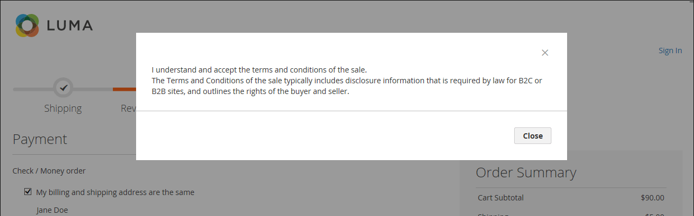

# Termos e condições para finalização da compra

Quando a funcionalidade manual dos _Termos e Condições_ estiver habilitada, os clientes deverão concordar com os termos e condições da venda antes da finalização da compra. Os Termos e condições da venda geralmente incluem informações de divulgação que podem ser exigidas por lei para sites B2C ou B2B, e descreve os direitos do comprador e do vendedor. A mensagem dos Termos e Condições é exibida após as informações de pagamento, antes do botão _Fazer pedido_.

{width="700" zoomable="yes"}

## Etapa 1: Ativar termos e condições para check-out

1. Na barra lateral _Admin_, vá para **[!UICONTROL Stores]** > _[!UICONTROL Settings]_>**[!UICONTROL Configuration]**.

1. No painel esquerdo, expanda **[!UICONTROL Sales]** e escolha **[!UICONTROL Checkout]**.

1. Expandir  a seção **[!UICONTROL Checkout Options]**.

   {width="600" zoomable="yes"}

1. Verifique se **[!UICONTROL Enable Onepage Checkout]** está definido como `Yes`.

1. Defina **[!UICONTROL Enable Terms and Conditions]** como `Yes`.

1. Clique em **[!UICONTROL Save Config]**.

## Etapa 2: adicionar suas próprias informações de termos e condições

1. Na barra lateral _Admin_, vá para **[!UICONTROL Stores]** > _[!UICONTROL Settings]_>**[!UICONTROL Terms and Conditions]**.

   {width="600" zoomable="yes"}

1. No canto superior direito, clique em **[!UICONTROL Add New Condition]**.

1. Insira o **[!UICONTROL Condition Name]** para referência interna.

   {width="600" zoomable="yes"}

1. Defina **[!UICONTROL Status]** como `Enabled`.

1. Defina **[!UICONTROL Applied]** como um dos seguintes:

   - `Automatically` - As condições são aceitas automaticamente no check-out.
   - `Manually` - Os clientes precisam aceitar manualmente as condições para fazer um pedido.

1. Defina **[!UICONTROL Show Content as]** como um dos seguintes:

   - `Text` - Exibe o conteúdo dos termos e condições como texto não formatado.
   - `HTML` - Exibe o conteúdo como HTML que pode ser formatado.

1. Selecione cada **[!UICONTROL Store View]** onde você deseja que estes Termos e Condições sejam usados.

1. Role para baixo e preencha as informações a serem exibidas:

   - Digite o **[!UICONTROL Checkbox Text]** a ser usado como texto para o link dos Termos e Condições. Por exemplo, `I understand and accept the terms and conditions of the sale`.

   - Na caixa **[!UICONTROL Content]**, insira o texto completo dos termos e condições da venda.

1. (Opcional) Insira o **[!UICONTROL Content Height (css)]** em pixels para determinar a altura da caixa de texto onde a declaração de termos e condições aparece durante o check-out.

   Por exemplo, para que a caixa de texto tenha 1 polegada de altura em uma tela de 96 dpi, digite `96`. Uma barra de rolagem será exibida se o conteúdo ultrapassar a altura da caixa.

1. Clique em **[!UICONTROL Save Condition]**.
