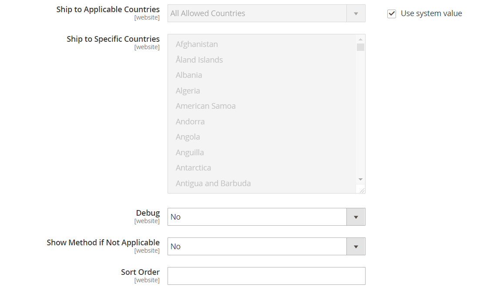

# Serviço Postal dos Estados Unidos (USPS)

O Serviço Postal dos Estados Unidos é o serviço postal independente do governo dos Estados Unidos, oferecendo serviços de transporte nacional e internacional por terra e ar.

## Etapa 1: abrir uma conta de remessa USPS

Abra uma conta do [USPS Web Tools][1]. Após concluir o processo de registro, você receberá sua ID de usuário e um URL para o servidor de teste USPS.

Você também pode abrir uma conta do [USPS Web Tools][1]. Após concluir o processo de registro, você receberá sua ID de usuário e um URL para o servidor de teste USPS. Para saber mais sobre as Ferramentas da Web do USPS, consulte a [Documentação técnica][2].

## Etapa 2: Habilitar USPS para sua loja

{{$include /help/_includes/usps-api-type-configuration-note.md}}

1. Na barra lateral _Admin_, vá para **[!UICONTROL Stores]** > _[!UICONTROL Settings]_>**[!UICONTROL Configuration]**.

1. No painel esquerdo, expanda **[!UICONTROL Sales]** e escolha **[!UICONTROL Delivery Methods]**.

1. Expandir  a seção **[!UICONTROL USPS]**.

   >[!NOTE]
   >
   >Se necessário, primeiro desmarque a caixa de seleção **[!UICONTROL Use system value]** para alterar as configurações a seguir, conforme descrito.

1. Defina **[!UICONTROL Enabled for Checkout]** como `Yes`.

1. Defina **[!UICONTROL USPS Type]** como `USPS Rest APIs` se estiver usando a API REST USPS.

   Se você estiver usando a API de Ferramentas da Web do USPS, defina **[!UICONTROL USPS Type]** como `USPS Web Tools API`.

1. Se necessário, insira o **[!UICONTROL Gateway URL]** para acessar as taxas de envio do USPS.

   O campo é predefinido por padrão e normalmente não precisa ser alterado.

1. Digite um **[!UICONTROL Title]** para este método de envio que aparece durante o check-out.

1. Use as credenciais fornecidas pelo USPS para preencher os seguintes campos:

   Se você estiver usando as APIs Rest do USPS, deverá fornecer as seguintes credenciais:

   - **[!UICONTROL Consumer Key]**
   - **[!UICONTROL Consumer Secret]**
   - **[!UICONTROL Pricing Options]**

   Se você estiver usando a API de ferramentas da Web do USPS, deverá fornecer as seguintes credenciais:

   - **[!UICONTROL User ID]**
   - **[!UICONTROL Password]**

1. Defina **[!UICONTROL Mode]** como um dos seguintes:

   - `Development` - Executa USPS em um ambiente de teste. Depois de executar a USPS em um ambiente de desenvolvimento, retorne mais tarde e defina o Modo como `Live`.
   - `Live` - Executa o USPS em um ambiente de produção ativo.

## Etapa 3: Preencha a descrição da embalagem

1. Para determinar como a ordem será gerenciada se for enviada como vários pacotes, defina **[!UICONTROL Packages Request Type]** como um dos seguintes:

   - `Divide to Equal Weight` - (Uma Solicitação) A remessa de vários pacotes pode ser enviada como uma solicitação se os pacotes forem divididos por peso igual.
   - `Use Origin Weight` - (Várias solicitações) Vários pacotes devem ser enviados como solicitações separadas se o peso de origem for usado como base para o cálculo do custo de envio.

1. Defina **[!UICONTROL Container]** como o tipo de embalagem normalmente usado para enviar produtos solicitados para sua loja.

1. Defina o **[!UICONTROL Size]** do pacote típico enviado de seu armazenamento.

1. Defina **[!UICONTROL Machinable]** como um dos seguintes:

   - `Yes` - Se o pacote típico puder ser processado por uma máquina.
   - `No` - Se o pacote típico deve ser processado manualmente.

1. Insira o **[!UICONTROL Maximum Package Weight]** de acordo com os requisitos da operadora.

   {width="600" zoomable="yes"}

## Etapa 4: Configurar taxas de manuseio

A taxa de manuseio é opcional e aparece como uma taxa extra que é adicionada ao custo de envio da DHL. Se quiser incluir uma taxa de manuseio, faça o seguinte:

1. Defina **[!UICONTROL Calculate Handling Fee]** com um dos seguintes métodos:

   - `Fixed`
   - `Percent`

1. Para determinar como a taxa de manuseio de material é aplicada, defina **[!UICONTROL Handling Applied]** como uma das seguintes opções:

   - `Per Order`
   - `Per Package`

1. Insira o valor de **[!UICONTROL Handling Fee]** a ser cobrado.

   Para inserir uma porcentagem, use o formato decimal. Por exemplo, digite `0.25` para 25%.

   {width="600" zoomable="yes"}

## Etapa 5: Especificar métodos permitidos e países aplicáveis

1. Para **[!UICONTROL Allowed Methods]**, escolha cada método de envio do USPS que estará disponível para seus clientes.

   Os métodos aparecem em USPS durante o check-out. Para selecionar vários métodos, mantenha pressionada a tecla Ctrl (PC) ou a tecla Command (Mac) e clique em cada opção.

1. Se você deseja fornecer uma opção de [Envio gratuito](shipping-free.md) por meio do USPS, defina as opções de envio gratuito:

   - Defina **[!UICONTROL Free Method]** com o método que deseja usar para envio gratuito. Se você não quiser oferecer frete gratuito por meio do USPS, escolha `None`.

   - Para exigir um valor de pedido mínimo que qualifique um pedido de remessa gratuita com USPS, defina **[!UICONTROL Enable Free Shipping Threshold]** como `Enable`. Em seguida, insira o valor mínimo em **[!UICONTROL Free Shipping Amount Threshold]**.

1. Se necessário, altere o **[!UICONTROL Displayed Error Message]**.

   Essa caixa de texto é predefinida com uma mensagem padrão, mas você pode inserir uma mensagem diferente que você deseja exibir se o USPS ficar indisponível.

   {width="600" zoomable="yes"}

1. Defina **[!UICONTROL Ship to Applicable Countries]** como um dos seguintes:

   - `All Allowed Countries` - Clientes de todos os [países](../getting-started/store-details.md#country-options) especificados na sua configuração de loja podem usar este método de entrega.
   - `Specific Countries` - Ao escolher essa opção, a lista _Remeter para Países Específicos_ é exibida. Selecione cada país na lista onde esse método de entrega pode ser usado.

   {width="600" zoomable="yes"}

1. Defina **[!UICONTROL Show Method if Not Applicable]** como um dos seguintes:

   - `Yes` - Lista todos os métodos de envio USPS disponíveis durante o check-out, incluindo métodos que não se aplicam à remessa.
   - `No` - Lista somente os métodos de envio USPS aplicáveis à remessa.

1. Para criar um arquivo de log com os detalhes das remessas USPS feitas de sua loja, defina **[!UICONTROL Debug]** como `Yes`.

1. Para **[!UICONTROL Sort Order]**, insira um número para determinar a sequência em que a USPS aparece quando listada com outros métodos de entrega durante o check-out.

   `0` = primeiro, `1` = segundo, `2` = terceiro e assim por diante.

1. Clique em **[!UICONTROL Save Config]**.

[1]: https://secure.shippingapis.com/registration/
[2]: https://www.usps.com/business/web-tools-apis/welcome.htm
