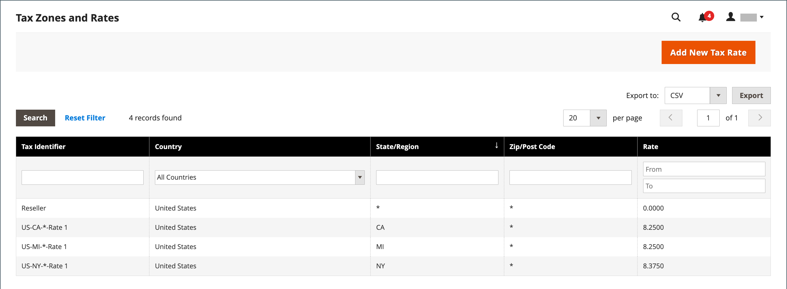

# Imposto sobre o valor acrescentado (IVA)

Alguns países cobram um imposto sobre o valor agregado, ou IVA, sobre bens e serviços. Pode haver diferentes taxas de IVA dependendo do estágio no processo de fabricação ou distribuição, materiais ou serviços que você vende a seus clientes. Você pode aplicar mais de uma taxa de IVA para calcular corretamente o imposto devido.

O Commerce pode ser configurado para cobrar um imposto de valor agregado com base no endereço do comerciante ou do cliente, se ambos estiverem no mesmo país. Os cálculos de IVA normalmente se baseiam no destino da entrega, e não no seu ponto de origem. Para a maioria dos cenários, uma configuração que calcula o IVA com base no endereço de entrega do cliente é suficiente.

## Exemplos de cenários

- Para uma empresa registrada para efeitos de IVA num país da UE que fornece bens a um particular noutro país da UE, o IVA é calculado como uma &quot;venda à distância&quot; com base na localização do comerciante.

- Uma empresa na Holanda que faz uma compra em uma loja no Reino Unido que envia para um endereço no Reino Unido é obrigada a pagar taxas de IVA do Reino Unido.

- Para a venda de [produtos baixáveis](../catalog/product-create-downloadable.md) ou _bens digitais_, a taxa de IVA é baseada no destino da remessa, e não no local do comerciante. Consulte [Local de fornecimento de bens digitais](taxes.md#place-of-supply-for-digital-goods-eu).

>[!TIP]
>
>Algumas remessas transfronteiras e B2B têm requisitos fiscais mais complexos. Para expandir os recursos nativos da sua instalação do Commerce, considere adicionar uma solução de gerenciamento de impostos do [Marketplace](https://marketplace.magento.com/extensions/accounting-finance/taxes.html).

## Configurar VAT

As instruções a seguir incluem um procedimento de amostra para configurar um IVA de 20% no Reino Unido para vendas a clientes varejistas. Para outras alíquotas de imposto e países, siga o procedimento geral, mas especifique informações específicas que correspondam ao seu país, à alíquota de IVA, aos tipos de cliente e assim por diante.

>[!NOTE]
>
>Antes de continuar, verifique quais regras e regulamentos se aplicam ao IVA na sua área.

Em certas transações entre empresas, o IVA não é avaliado. A Commerce pode validar a ID de IVA de um cliente para garantir que o IVA seja avaliado (ou não) corretamente. Consulte [Validação de ID de IVA](#vat-id-validation).

### Fase 1: Configurar classes de imposto do cliente

O processo de criação de uma regra de imposto começa com a adição de uma alíquota de imposto.

1. Na barra lateral _Admin_, vá para **[!UICONTROL Stores]** > _[!UICONTROL Taxes]_>**[!UICONTROL Tax Zones and Rates]**.

   {width="600" zoomable="yes"}

1. Verifique se há uma classe de imposto do cliente adequada para ser usada com o IVA.

   Neste exemplo, verifique se há uma classe de imposto do cliente chamada _Cliente de Varejo_. Se esta classe de imposto não existir, clique em **[!UICONTROL Add New Tax Rate]**.

1. Insira o **[!UICONTROL Tax Identifier]** para a nova classe de imposto.

   Todas as alíquotas de imposto são exibidas no campo _Alíquota de Imposto_ nas _Informações sobre Regra de Imposto_ quando você cria regras de imposto.

1. Para definir o intervalo de códigos postais (de / até), marque a caixa de seleção **[!UICONTROL Zip/Post is Range]**.

1. Escolha o **[!UICONTROL Country]** onde a alíquota do imposto se aplica.

1. Insira o **[!UICONTROL Rate Percent]** que seria usado para o cálculo da alíquota do imposto na compra.

1. Quando terminar, clique em **[!UICONTROL Save Rate]**.

Com base na alíquota de imposto enviada, você pode criar regras de imposto subsequentes. Na ausência de taxas de imposto, a criação de regras fiscais torna-se impossível.

### Fase 2: Configurar classes de imposto do produto

1. Na barra lateral _Admin_, vá para **[!UICONTROL Stores]** > _[!UICONTROL Taxes]_>**[!UICONTROL Tax Rules]**.

1. Clique em **[!UICONTROL Add New Tax Rule]**.

1. Expandir  a seção **[!UICONTROL Additional Settings]**.

   {width="600" zoomable="yes"}

1. Em _Classe de Imposto do Produto_, clique em **[!UICONTROL Add New Tax Class]**.

1. Para adicionar a nova classe à lista de classes de imposto do produto disponíveis e criar três novas classes, informe o **[!UICONTROL Name]** da nova classe de imposto e clique na marca de seleção:

   - `VAT Standard`
   - `VAT Reduced`
   - `VAT Zero`

1. Clique em **[!UICONTROL Save Class]** para cada nova classe adicionada.

1. Clique em **[!UICONTROL Save Rule]**.

### Fase 3: Configurar zonas e alíquotas de imposto

1. Na barra lateral _Admin_, vá para **[!UICONTROL Stores]** > _[!UICONTROL Taxes]_>**[!UICONTROL Tax Zones and Rates]**.

   Neste exemplo, você pode remover as taxas de imposto dos EUA ou deixá-las como estão.

1. Clique em **[!UICONTROL Add New Tax Rate]**.

   {width="600" zoomable="yes"}

1. Defina novas taxas da seguinte maneira:

   **Padrão de IVA**

   - Identificador de Imposto: `VAT Standard`
   - País e Estado: `United Kingdom`
   - Percentual de Taxa: `20.00`

   **IVA Reduzido**

   - Identificador de Imposto: `VAT Reduced`
   - País e Estado: `United Kingdom`
   - Percentual de Taxa: `5.00`

1. Clique em **[!UICONTROL Save Rate]** para cada taxa.

### Fase 4: Configurar regras de imposto

Uma regra de imposto é uma combinação de uma classe de imposto do cliente, uma classe de imposto do produto e uma alíquota do imposto.

1. Na barra lateral _Admin_, vá para **[!UICONTROL Stores]** > _[!UICONTROL Taxes]_>**[!UICONTROL Tax Rules]**.

1. Adicione novas regras de imposto da seguinte maneira:

   **Padrão de IVA**

   - Nome: `VAT Standard`
   - Classe de Imposto do Cliente: `Retail Customer`
   - Classe de Imposto do Produto: `VAT Standard`
   - Alíquota de Imposto: `VAT Standard Rate`

   **Iva Reduzido**

   - Nome: `VAT Reduced`
   - Classe de Imposto do Cliente: `Retail Customer`
   - Classe de Imposto do Produto: `VAT Reduced`
   - Alíquota de Imposto: `VAT Reduced Rate`

1. Clique em **[!UICONTROL Save Rule]** para cada taxa.

### Fase 5: Aplicar classes de imposto a produtos

1. Na barra lateral _Admin_, vá para **[!UICONTROL Catalog]** > **[!UICONTROL Manage Products]**.

1. Abra um produto no catálogo no modo de edição.

1. Na página _Geral_, localize a opção **[!UICONTROL Tax Class]** e selecione o **[!UICONTROL VAT Class]** que se aplica ao produto.

1. Quando terminar, clique em **[!UICONTROL Save]**.

   {width="600" zoomable="yes"}

## Descrições dos campos

### Armazenar informações

A Commerce usa as [configurações de Informações da Loja](../configuration-reference/general/general.md#store-information) a seguir para calcular o IVA com base nas informações do comerciante.

**[!UICONTROL VAT Number]** - O número de imposto sobre valor agregado atribuído ao comerciante.

**[!UICONTROL Validate VAT Number]** - [Validação de IVA](#vat-id-validation) confirma que o número de IVA corresponde ao registro correspondente no banco de dados da [Comissão Europeia](https://ec.europa.eu/taxation_customs/vies/).

### Informações do cliente

A Commerce usa os campos a seguir para calcular o IVA com base em [informações do cliente](../customers/account-dashboard-account-information.md)).

#### Informações da conta

**[!UICONTROL Tax/VAT Number]** - Se aplicável, o número do imposto ou o número do imposto sobre valor agregado atribuído ao cliente.

#### Endereços

**[!UICONTROL VAT Number]** - Se aplicável, o número de imposto sobre valor agregado que está associado a um endereço de entrega ou cobrança específico do cliente. Para a venda de [bens digitais](taxes.md#place-of-supply-for-digital-goods-eu)) na UE, o valor do IVA é baseado no destino da remessa.

### Conta do cliente

A Commerce usa as [configurações do cliente](../customers/account-options-new.md) a seguir para calcular o IVA.

**[!UICONTROL Show VAT Number on Storefront]** - Determina se o campo Número IVA do cliente está incluído no Catálogo de Endereços disponível na conta do cliente.

**[!UICONTROL Default Value for Disable Automatic Group Changes Based on VAT ID]** - A ID de IVA é um identificador interno do Número de IVA do cliente quando usada na Validação de IVA. Durante a validação do IVA, a Commerce confirma que o número corresponde ao banco de dados da [Comissão Europeia](https://ec.europa.eu/taxation_customs/vies/). Os clientes podem ser atribuídos automaticamente a um dos quatro grupos de clientes padrão com base nos resultados da validação.

## Validação de ID de IVA

A _Validação da ID de IVA_ calcula automaticamente o imposto necessário para transações B2B que ocorrem na União Europeia (UE), com base no comerciante e na localidade do cliente. A Commerce executa a validação de ID de IVA usando os serviços Web do servidor [Comissão Europeia][1].

>[!NOTE]
>
>As regras fiscais relacionadas com o IVA não influenciam outras regras fiscais e não impedem a aplicação de outras regras fiscais. Somente uma regra de imposto pode ser aplicada em um determinado momento.

- O IVA é cobrado se o comerciante e o cliente estiverem no mesmo país da UE.
- O IVA não é cobrado se o comerciante e o cliente estiverem em diferentes países da UE e se ambas as partes forem entidades comerciais registradas na UE.

O administrador da loja cria mais de um grupo de clientes padrão que pode ser atribuído automaticamente ao cliente durante a criação, a criação ou atualização de endereço e o check-out da conta. O resultado é que são utilizadas regras fiscais diferentes para as vendas intra-país (nacionais) e intra-UE.

>[!IMPORTANT]
>
>Se você vender produtos virtuais ou para download, que não exigem entrega, a taxa de IVA do país de localização de um cliente deve ser usada para vendas intra-união e internas. Crie regras de imposto individuais adicionais para classes de imposto do produto que correspondam aos produtos virtuais.

### Fluxo de trabalho de registro do cliente

Se a Validação de ID de IVA estiver habilitada, após o registro, cada cliente será proposto para inserir o número de ID de IVA. No entanto, apenas os compradores que são clientes registrados do IVA devem preencher este campo.

Depois que um cliente especifica o número de IVA e outros campos de endereço e opta por salvar, o sistema salva o endereço e envia a solicitação de validação da ID de IVA para o servidor da Comissão Europeia. De acordo com os resultados da validação, um dos grupos padrão é atribuído a um cliente. Esse grupo pode ser alterado se um cliente ou um administrador alterar a ID de IVA do endereço padrão ou alterar todo o endereço padrão. Às vezes, o grupo pode ser alterado temporariamente (a alteração de grupo é emulada) durante o check-out de uma página.

Se habilitado, você pode substituir a Validação de ID de IVA para clientes individuais marcando a caixa de seleção na página _[!UICONTROL Customer Information]_.

### Fluxo de trabalho de check-out

Se a validação de IVA de um cliente for executada durante a finalização da compra, o identificador da solicitação de IVA e a data da solicitação de IVA serão salvos na seção Histórico de comentários do pedido.

O comportamento do sistema relacionado à validação da ID de IVA e à alteração do grupo de clientes durante o check-out depende de como as configurações Validar em cada transação e Desativar alteração automática de grupo são definidas. Esta seção descreve a implementação da funcionalidade de Validação de ID de IVA para o check-out no front-end.

Se o cliente usar o Check-out expresso do Google, o Check-out expresso do PayPal ou outro método de check-out externo, o check-out será executado completamente na lateral do gateway de pagamento externo. Para este cenário, a configuração _Validar em Cada Transação_ não pode ser aplicada e o grupo de clientes não pode ser alterado durante o check-out.

{width="550" zoomable="yes"}

### Configurar validação de ID de IVA

Para configurar a validação do ID de IVA, primeiro você deve configurar os grupos de clientes necessários e criar as classes de imposto, taxas e regras relacionadas. Em seguida, habilite a validação da ID de IVA para o armazenamento e conclua a configuração.

Os exemplos a seguir mostram como as classes e alíquotas de imposto são usadas para a Validação de ID de IVA. Revise os exemplos e siga as instruções para configurar as classes e regras de imposto necessárias para a loja.

#### Exemplo: regras de imposto mínimo necessárias para validação de ID de IVA

| Regra de Imposto #1 |  |
|--- |--- |
| Classe de Imposto do Cliente | As classes de imposto do cliente devem incluir:  Uma classe para clientes domésticos.  Uma classe para clientes com IDs de IVA formatadas incorretamente. Uma classe para clientes cuja validação de ID de IVA falhou. |
| Classe de Imposto do Produto | As classes de imposto do produto devem incluir uma classe para produtos de todos os tipos, exceto pacote e virtual. |
| Alíquota de Imposto | A taxa de imposto deve incluir a taxa de IVA do país do comerciante. |

{style="table-layout:auto"}

| Regra de Imposto #2 |   |
|--- |--- |
| Classe de Imposto do Cliente | Uma classe para clientes intra-união. |
| Classe de Imposto do Produto | Uma classe para produtos de todos os tipos, exceto virtuais. |
| Alíquota de Imposto | Taxas de IVA para todos os países da UE, exceto o país do comerciante. Atualmente, essa taxa é de 0%. |

{style="table-layout:auto"}

| Regra de Imposto #3 | (Obrigatório para produtos virtuais e baixáveis) |
|--- |--- |
| Classe de Imposto do Cliente | As classes de imposto do cliente devem incluir:  Uma classe para clientes domésticos  Uma classe para clientes com ID de IVA inválida Uma classe para clientes, para os quais a validação da ID de IVA falhou |
| Classe de Imposto do Produto | Uma classe para produtos virtuais. |
| Alíquota de Imposto | Taxa de IVA do país do comerciante. |

{style="table-layout:auto"}

| Regra de Imposto #4 | (Obrigatório para produtos virtuais e baixáveis) |
|--- |--- |
| Classe de Imposto do Cliente | Uma classe para clientes intra-união. |
| Classe de Imposto do Produto | Uma classe para produtos virtuais. |
| Alíquota de Imposto | Taxas de IVA para todos os países da UE, exceto o país do comerciante. Atualmente, essa taxa é de 0%. |

{style="table-layout:auto"}

#### Etapa 1: Criar grupos de clientes relacionados a IVA

A Validação do ID IVA atribui automaticamente um dos quatro grupos de clientes padrão aos clientes de acordo com os resultados da validação do ID IVA:

- Doméstico
- IntraUE
- ID de IVA inválida
- Erro de validação

Você pode criar grupos de clientes para Validação de ID de IVA ou usar grupos existentes, se eles estiverem em conformidade com a lógica de negócios. Ao configurar a Validação de ID de IVA, você deve atribuir cada um dos grupos de clientes criados como padrão para clientes com resultados apropriados de validação de ID de IVA.

#### Etapa 2: Criar classes, taxas e regras relacionadas a IVA

Cada regra de imposto é definida por três entidades:

- Classes de Imposto do Cliente
- Classes de Imposto do Produto
- Alíquotas de Imposto

Crie as [regras de imposto](tax-rules.md) para usar a Validação de ID de IVA de maneira eficaz.

- As regras de imposto incluem alíquotas de imposto e [classes de imposto](tax-class.md).
- Classes de imposto são atribuídas a [grupos de clientes](../customers/customer-groups.md).

#### Etapa 3: habilitar e configurar a validação da ID de IVA

1. Na barra lateral _Admin_, vá para **[!UICONTROL Stores]** > _[!UICONTROL Settings]_>**[!UICONTROL Configuration]**.

1. Se necessário, defina o **[!UICONTROL Store View]** para a configuração.

1. No painel esquerdo, expanda **[!UICONTROL Customers]** e escolha **[!UICONTROL Customer Configuration]**.

1. Expandir  a seção **[!UICONTROL Create New Account Options]**.

   No exemplo a seguir, as configurações gerais do cliente que não estão relacionadas à Validação de IVA são esmaecidas.

   {width="600" zoomable="yes"}

1. Defina **[!UICONTROL Enable Automatic Assignment to Customer Group]** como `Yes` e preencha os campos a seguir conforme necessário.

   - **[!UICONTROL Default Group]**
   - **[!UICONTROL Default Value for Disable Automatic Group Changes Based on VAT ID]**
   - **[!UICONTROL Show VAT Number on Storefront]**

1. Quando terminar, clique em **[!UICONTROL Save Config]**.

#### Etapa 4: definir a ID de IVA e o país da localização

1. No painel esquerdo, expanda **[!UICONTROL General]** e escolha **[!UICONTROL General]** abaixo de.

1. Expandir  a seção **[!UICONTROL Store Information]**.

   {width="600" zoomable="yes"}

1. Selecione seu **[!UICONTROL Country]**.

1. Insira seu **[!UICONTROL VAT Number]** e clique em **[!UICONTROL Validate VAT Number]**.

   O resultado aparece imediatamente.

1. Quando terminar, clique em **[!UICONTROL Save Config]**.

#### Etapa 5: Verificar a lista de países membros da UE

1. Continuando na página de configuração _Geral_, expanda  a seção **[!UICONTROL Countries Options]**.

   {width="600" zoomable="yes"}

1. Na lista **[!UICONTROL European Union Countries]**, verifique se cada país membro da UE está selecionado.

   Para alterar a configuração padrão, desmarque a caixa de seleção **Usar valores do sistema**. Mantenha pressionada a tecla Ctrl (PC) ou a tecla Command (Mac) e clique em cada país que deseja adicionar ou remover.

1. Quando terminar, clique em **[!UICONTROL Save Config]**.

[1]: https://ec.europa.eu/taxation_customs/vies/
