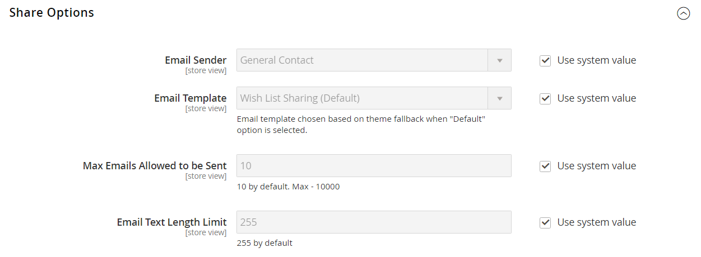
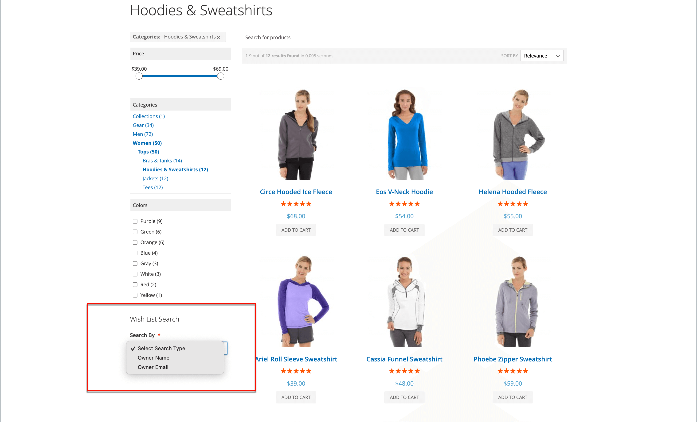

# Configurar listas de desejos

A configuração da lista de desejos ativa as listas de desejos e determina o modelo de email e o remetente de mensagens de email que são usadas quando uma lista de desejos é compartilhada.

## Ativar funcionalidade da lista de desejos

1. Na barra lateral _Admin_, vá para **[!UICONTROL Stores]** > _[!UICONTROL Settings]_>**[!UICONTROL Configuration]**.

1. No painel esquerdo, expanda **[!UICONTROL Customers]** e escolha **[!UICONTROL Wish List]**.

1. Expanda  a seção **[!UICONTROL General Options]** e faça o seguinte:

   {width="600" zoomable="yes"}

   - Alternar **[!UICONTROL Enabled]** para `Yes`, que ativa o módulo da lista de desejos para o armazenamento.

   -  (somente Adobe Commerce) alternar **[!UICONTROL Enable Multiple Wish Lists]** para `Yes`, o que permite que os clientes criem e mantenham várias listas de desejos.

   -  (somente Adobe Commerce) Para limitar o número de listas de desejos que os clientes podem ter associado à sua conta, digite o valor de **[!UICONTROL Number of Multiple Wish Lists]**.

   - Alternar de **[!UICONTROL Show in Sidebar]** para `Yes`, o que exibe as listas de desejos na barra lateral.

1. Expanda  a seção **[!UICONTROL Share Options]** e faça o seguinte:

   {width="600" zoomable="yes"}

   - Defina **[!UICONTROL Email Sender]** como o contato de armazenamento que deve aparecer como remetente da mensagem. Opções: Contato Geral, Representante De Vendas, Suporte Ao Cliente, E-Mail Personalizado.

   - Defina o **[!UICONTROL Email Template]** a ser usado quando um cliente compartilhar uma lista de desejos.

   - Para limitar o número total de emails que um cliente pode enviar, insira um valor de **[!UICONTROL Max Emails Allowed to be Sent]**. O padrão é 10 e o máximo permitido é 10.000.

   - Para limitar o tamanho da mensagem, insira um valor para **[!UICONTROL Email Text Length Limit]**. O padrão é 255.

1. Expanda  a seção **[!UICONTROL My Wish List Link]** e defina **[!UICONTROL Display Wish List Summary]** como um dos seguintes:

   - `Display number of items in wish list`
   - `Display item quantities`

   {width="600" zoomable="yes"}

1. Quando terminar, clique em **[!UICONTROL Save Config]**.

## Adicionar pesquisa da lista de desejos

 (somente Adobe Commerce)

Qualquer lista de desejos pública pode ser encontrada usando o [widget](../content-design/widgets.md) da Pesquisa de Lista de Desejos. O widget permite que um cliente pesquise pelo nome ou endereço de email do proprietário da lista de desejos. Os clientes da loja podem encontrar listas de desejos que pertencem a outros clientes, visualizá-las e solicitar produtos deles ou adicionar os produtos a suas próprias listas de desejos. Se um item for comprado de uma lista pública de desejos por outro cliente, ele não será removido da lista original de desejos. O widget _Pesquisa da lista de desejos_ pode ser adicionado a qualquer página da sua loja para facilitar a localização, pelos clientes, das listas de desejos de amigos e familiares.

{width="700" zoomable="yes"}

1. Na barra lateral _Admin_, vá para **[!UICONTROL Content]** > _[!UICONTROL Elements]_>**[!UICONTROL Widgets]**.

1. No canto superior direito, clique em **[!UICONTROL Add Widget]**.

1. Na guia _[!UICONTROL Settings]_, faça o seguinte:

   - Defina **[!UICONTROL Type]** como `Wish List Search`.

   - Defina **[!UICONTROL Design Theme]** com o tema do armazenamento onde a lista de desejos é adicionada.

   - Clique em **[!UICONTROL Continue]**.

1. Conclua o _[!UICONTROL Storefront Properties]_:

   - Insira o **[!UICONTROL Widget Title]**.

   - Defina **[!UICONTROL Assign to Store Views]** para o modo de exibição ou site em que o widget será usado.

   - Para **[!UICONTROL Sort Order]**, insira um número para determinar o posicionamento do widget em seu container.

     `0` = primeiro (padrão), `1` = segundo, `2` = terceiro e assim por diante.

1. Na seção _[!UICONTROL Layout Updates]_, clique em **[!UICONTROL Add Layout Update]**&#x200B;e defina **[!UICONTROL Display on]**&#x200B;como um dos seguintes:

   - _[!UICONTROL Categories]_

      - `Anchor Categories`
      - `Non-Anchor Categories`

   - _[!UICONTROL Products]_

      - `All Product Type`
      - `Simple Product`
      - `Virtual Product`
      - `Bundle Product`
      - `Configurable Product`
      - `Downloadable Product`
      - `Gift Card`
      - `Grouped Product`

   - _[!UICONTROL Generic Page]_

      - `All Pages`
      - `Specified Page`
      - `Page Layouts`

1. Na lista **[!UICONTROL Container]**, escolha a área do layout de página onde ele deve ser colocado.

   {width="700" zoomable="yes"}

1. No painel esquerdo, escolha **[!UICONTROL Widget Options]**.

1. Defina **[!UICONTROL Quick Search Form Types]** como um dos seguintes:

   - `All Forms` - Os clientes podem pesquisar por todos os parâmetros disponíveis.
   - `Owner Name` - Os clientes podem procurar listas de desejos por nome de proprietário.
   - `Owner Email` - Os clientes podem procurar listas de desejos por endereço de email do proprietário.

   >[!NOTE]
   >
   >Os endereços de envio não estão incluídos nas listas de desejos.

1. Configure as propriedades restantes do widget, conforme necessário, seguindo as [instruções](../content-design/widget-create.md) padrão.

1. Quando terminar, clique em **[!UICONTROL Save]**.

1. Quando solicitado, atualize todos os caches inválidos.
