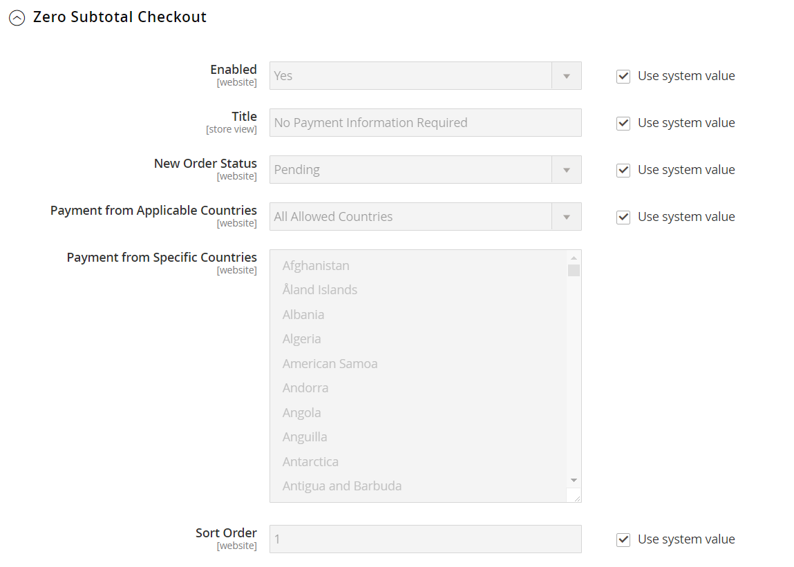

# Checkout de subtotal zero

_O check-out de subtotal zero_ pode ser usado para pedidos com um subtotal de zero que são tributados após a aplicação de um desconto. Por exemplo, o check-out de subtotal zero pode ser usado nas seguintes situações:

- Um desconto cobre todo o preço da compra, sem custo adicional para o frete.

- O cliente adiciona um produto [disponível para download](../catalog/product-create-downloadable.md) ou [virtual](../catalog/product-create-virtual.md) ao carrinho de compras e o preço é igual a zero.

- O preço de um produto [simples](../catalog/product-create-simple.md) é zero e o método de [envio gratuito](shipping-free.md) está disponível.

- Um [código de cupom](../merchandising-promotions/price-rules-cart-coupon.md) cobre o preço total de produtos e remessas.

Para economizar tempo, as ordens de subtotal zero podem ser definidas para faturar automaticamente.

**_Para configurar check-out de subtotal zero:_**

1. Na barra lateral _Admin_, vá para **[!UICONTROL Stores]** > _[!UICONTROL Settings]_>**[!UICONTROL Configuration]**.

1. No painel esquerdo, expanda **[!UICONTROL Sales]** e escolha **[!UICONTROL Payment Methods]**.

1. Em _[!UICONTROL Other Payment Methods]_, expanda  a seção **[!UICONTROL Zero Subtotal Checkout]**.

   {width="600" zoomable="yes"}

   >[!NOTE]
   >
   >Se necessário, primeiro desmarque a caixa de seleção **[!UICONTROL Use system value]** para alterar essas configurações.

1. Para ativar o check-out de subtotal zero, defina **[!UICONTROL Enabled]** como `Yes`.

1. Para **[!UICONTROL Title]**, insira um título que identifique o método Subtotal Zero durante o check-out.

1. Se os pedidos normalmente esperam por aprovação, aceite o padrão **[!UICONTROL New Order Status]** como `Pending"` até que o pedido seja aprovado.

   Se preferir, você pode usar o status `Processing` ou `Suspected Fraud` para novos pedidos com esta forma de pagamento.

1. Defina **[!UICONTROL Automatically Invoice All Items]** como `Yes` se desejar faturar automaticamente todos os itens que tenham um saldo zero.

   Esta opção só estará disponível se a opção **[!UICONTROL New Order Status]** estiver definida como `Processing`.

   >[!NOTE]
   >
   >Se _[!UICONTROL New Order Status]_estiver definido como `Processing` e_[!UICONTROL Automatically Invoice All Items]_ estiver definido como `No`, você também deve atribuir **[!UICONTROL Order Status]** = `Processing` para o mapeamento **[!UICONTROL Order State]** = `Pending` e **[!UICONTROL Default Status]** = `No` na página [Status do Pedido](order-status.md#custom-order-status).

1. Defina **[!UICONTROL Payment from Applicable Countries]** como um dos seguintes:

   - `All Allowed Countries` - Clientes de todos os [países](../getting-started/store-details.md#country-options) especificados na sua configuração de loja podem usar esta forma de pagamento.
   - `Specific Countries` - Depois que você escolher essa opção, a lista _[!UICONTROL Payment from Specific Countries]_será exibida. Para selecionar vários países, mantenha pressionada a tecla Ctrl (PC) ou a tecla Command (Mac) e clique em cada opção.

1. Para **[!UICONTROL Sort Order]**, insira um número que determine a posição deste item na lista de métodos de pagamento exibidos durante o check-out.

   Esse número é relativo aos outros métodos de pagamento. (`0` = primeiro, `1` = segundo, `2` = terceiro e assim por diante.)

1. Quando terminar, clique em **[!UICONTROL Save Config]**.
