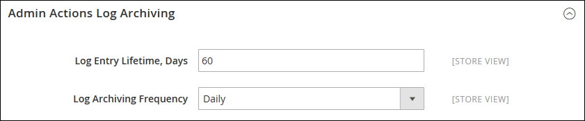

# Arquivo de log de ações

{{ee-feature}}

O arquivo morto Admin [actions](action-log.md) lista os arquivos de log CSV armazenados no servidor. Na configuração, você pode especificar por quanto tempo as entradas de log são armazenadas e com que frequência elas são arquivadas. Por padrão, o nome de arquivo inclui a data atual no formato ISO: `yyyyMMddHH`

>[!NOTE]
>
>O arquivamento de logs requer a configuração de um [trabalho do cron](cron.md).

## Configurar o arquivo de log

1. Na barra lateral _Admin_, vá para **[!UICONTROL Stores]** > _[!UICONTROL Settings]_>**[!UICONTROL Configuration]**.

1. No painel esquerdo, expanda **[!UICONTROL Advanced]** e escolha **[!UICONTROL System]**.

1. Expanda  a seção **[!UICONTROL Admin Actions Log Archiving]** e defina estas opções:

   - **[!UICONTROL Log Entry Lifetime, Days]** — Digite o número de dias que você deseja manter as entradas de log no banco de dados antes de elas serem removidas.
   - **[!UICONTROL Log Archiving Frequency]** — Defina como `Daily`, `Weekly` ou `Monthly`.

   {width="600" zoomable="yes"}

   Para obter uma lista detalhada das definições de configuração, consulte [Arquivamento do Log de Ações do Administrador](../configuration-reference/advanced/system.md) na _Referência de Configuração_.

1. Quando terminar, clique em **[!UICONTROL Save Config]**.

## Exibir o arquivo

Na barra lateral _Admin_, vá para **[!UICONTROL System]** > _[!UICONTROL Actions Logs]_>**[!UICONTROL Archive]**.

{width="600" zoomable="yes"}
