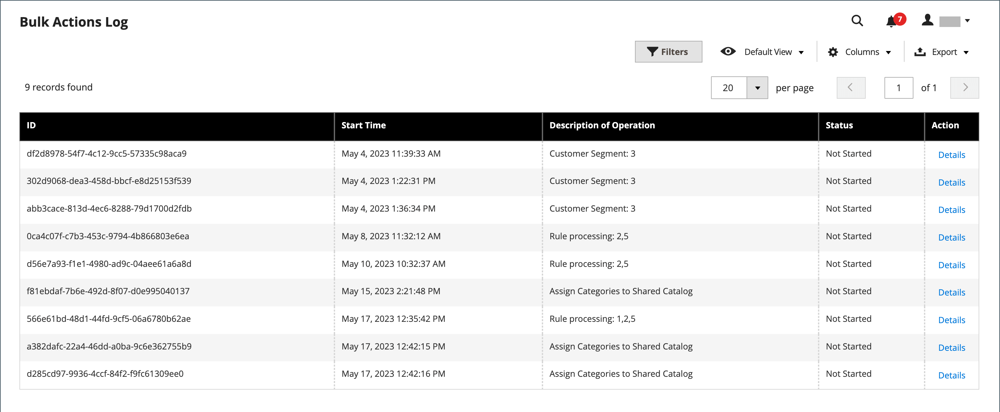
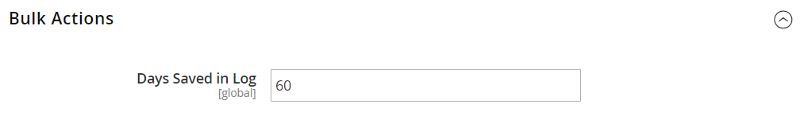

# Ações em massa

{{ee-feature}}

O log de ações em massa registra os detalhes de operações em massa assíncronas executadas em segundo plano, como importação/exportação ou atribuição de [preços personalizados](../b2b/catalog-shared-manage.md#update-custom-pricing) para vários produtos em um [catálogo compartilhado](../b2b/catalog-shared.md).

{width="600" zoomable="yes"}

## Configurar ações em massa

1. Na barra lateral _Admin_, vá para **[!UICONTROL Stores]** > _[!UICONTROL Settings]_>**[!UICONTROL Configuration]**.

1. No painel esquerdo, expanda **[!UICONTROL Advanced]** e escolha **[!UICONTROL System]**.

1. Expanda  a seção **[!UICONTROL Bulk Actions]** e defina a opção de salvamento do log:

   **[!UICONTROL Days Saved in Log]** — Digite o número de dias em que as ações em massa são salvas em um log.

   {width="600" zoomable="yes"}

   Para obter uma lista detalhada das definições de configuração, consulte [_Ações em massa_](../configuration-reference/advanced/system.md) na _Referência de Configuração_.

1. Quando terminar, clique em **[!UICONTROL Save Config]**.

## Exibir ações em massa

1. Na barra lateral _Admin_, vá para **[!UICONTROL System]** > _[!UICONTROL Actions Logs]_>**[!UICONTROL Bulk Actions]**.

1. Localize a ação desejada no log.

1. Na coluna _[!UICONTROL Action]_, clique em **[!UICONTROL Details]**.
