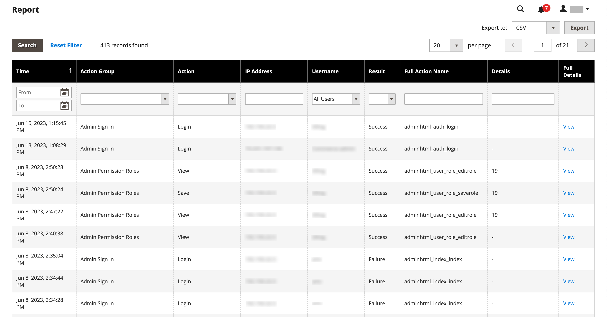
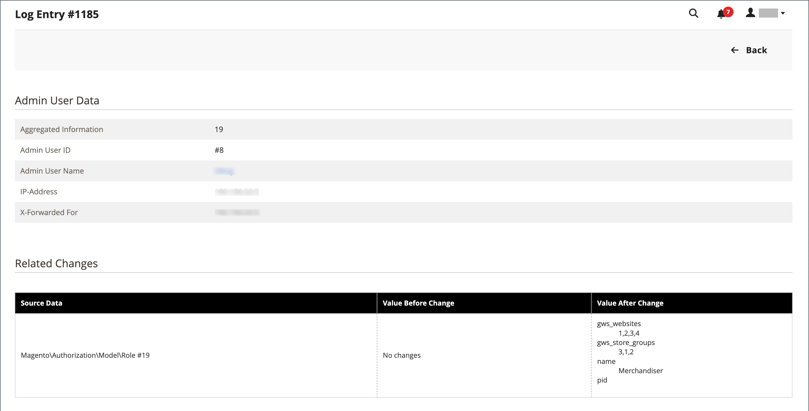
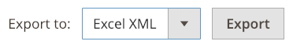

# Relatório de logs de ação

{{ee-feature}}

O relatório _Logs de Ação_ exibe um registro detalhado de todas as ações de Administrador habilitadas para log. Cada registro recebe um carimbo de data e hora e registra o endereço IP e o nome do usuário. Os detalhes do log incluem dados do usuário administrador e alterações relacionadas que foram feitas durante a ação.

As ações que você deseja exibir no relatório devem ser habilitadas na tela [Log de Ações do Administrador](action-log.md) nas configurações de armazenamento. Se o tipo de ação estiver marcado (ativado), esses tipos de ações de Admin serão exibidos no relatório de Logs de ação.

O relatório pode ser filtrado usando as opções em cada coluna. Você pode definir uma única opção de filtro ou definir opções de filtro para várias colunas para restringir o relatório e listar ações específicas. Você também pode exportar dados de relatório nos formatos CSV ou XML do Excel.

O Relatório de Logs de Ação inclui as seguintes informações:

- **[!UICONTROL Time]** - A data e a hora em que a ação ocorreu
- **[!UICONTROL Action Group]** - Exibe o tipo de ação, correlaciona-se com as ações habilitadas na tela _Log de Ações de Administrador_ nas configurações do repositório
- **[!UICONTROL Action]** - Exibe a ação que foi registrada
- **[!UICONTROL IP Address]** - Exibe o endereço IP do computador no qual a ação foi executada
- **[!UICONTROL Username]** - Exibe a ID de logon do usuário que executou a ação
- **[!UICONTROL Result]** - Exibe o sucesso ou falha da ação do usuário
- **[!UICONTROL Full Action Name]** - Exibe o nome da ação de back-end
- **[!UICONTROL Details]** - Exibe a categoria de ação de back-end
- **[!UICONTROL Full Details]** - Exibe todos os detalhes registrados da ação do administrador

## Exibir o relatório de Logs de Ação

1. Na barra lateral _Admin_, vá para **[!UICONTROL System]** > _[!UICONTROL Actions Logs]_>**[!UICONTROL Report]**.

   {width="600" zoomable="yes"}

1. Para exibir os detalhes completos de uma ação de administrador listada, clique em **[!UICONTROL View]**.

   {width="600" zoomable="yes"}

## Filtrar o relatório Logs de ação

Você pode definir os campos de opções de filtro e clicar em **[!UICONTROL Search]** para restringir as ações exibidas.

Para limpar as opções de filtro e retornar ao relatório completo, clique em **[!UICONTROL Reset Filter]**.

{width="600" zoomable="yes"}

| Campo | descrição |
|--- |--- |
| [!UICONTROL Time] | Em **[!UICONTROL From]**, clique para selecionar uma data no calendário dinâmico para definir a data de início do filtro. Em **[!UICONTROL To]**, clique em para selecionar uma data para definir a data de término do filtro. |
| [!UICONTROL Action Group] | Escolha um grupo de ação. |
| [!UICONTROL Action] | Escolha uma ação. |
| [!UICONTROL IP Address] | Insira o endereço IP da máquina usada para uma ação. |
| [!UICONTROL Username] | Escolha um nome de usuário. O padrão é `All Users`. |
| [!UICONTROL Result] | Escolha Sucesso ou Falha. |
| [!UICONTROL Full Action Name] | Digite o texto para que a pesquisa corresponda no campo. |
| [!UICONTROL Details] | Digite o texto para que a pesquisa corresponda no campo. |

{style="table-layout:auto"}

## Exportar o relatório de Logs de Ação

1. Para **[!UICONTROL Export to]**, escolha um formato de exportação:

   - `CSV` - Um arquivo de valores separados por vírgula contendo dados de texto sem formatação
   - `Excel XML` - Um formato de dados de planilha baseado em XML

1. Clique em **[!UICONTROL Export]**.

   O arquivo gerado é salvo automaticamente na pasta designada para downloads.

   {width="200"}
