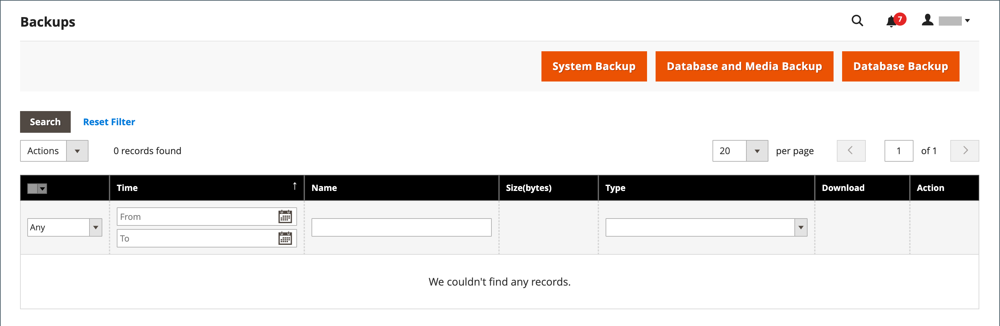

# Backups do sistema

O Adobe Commerce e o Magento Open Source oferecem a capacidade de fazer backup de diferentes partes do sistema — como sistema de arquivos, banco de dados e arquivos de mídia — e de reverter automaticamente. Um registro para cada backup é exibido na grade no _Backups_ página. A exclusão de um registro da lista também exclui o arquivo arquivado. Os arquivos de backup do banco de dados são compactados usando o formato GZ. Para os backups de sistema e de banco de dados e de mídia, o formato TGZ é usado. Como prática recomendada, você deve restringir o acesso às ferramentas de backup e fazer backup antes de instalar extensões e atualizações.

- **Restringir o acesso às ferramentas de backup.** O acesso à ferramenta de gerenciamento de backups e reversões pode ser restrito configurando [funções de usuário](permissions-user-roles.md) para recursos de backup e reversão. Para restringir o acesso, deixe a caixa de seleção correspondente desmarcada. Para conceder acesso a recursos de rollback, você também deve conceder acesso a recursos de backup.

- **Faça backup antes de instalar extensões e atualizações.** Sempre faça um backup antes de instalar uma extensão ou atualização.

{{$include /help/_includes/backups-note.md}}

## Habilitar e agendar backups

1. No _Admin_ barra lateral, vá para **[!UICONTROL Stores]** > _[!UICONTROL Settings]_>**[!UICONTROL Configuration]**.

1. No painel esquerdo, expanda **[!UICONTROL Advanced]** e escolha **[!UICONTROL System]**.

1. Expandir  o **[!UICONTROL Backup Settings]**.

1. Definir **[!UICONTROL Enabled Schedule Backup]** para `Yes`.

1. Para programar os backups automáticos, defina as opções de programação:

   - Definir **[!UICONTROL Enabled Schedule Backup]** para `Yes`.
   - Definir **[!UICONTROL Scheduled Backup Type]** ao tipo de backup a ser executado no intervalo programado.
   - Definir **[!UICONTROL Start Time]** para a hora do dia em que a operação de backup será executada.
   - Definir **[!UICONTROL Frequency]** para `Daily`, `Weekly`ou `Monthly`.
   - Definir **[!UICONTROL Maintenance Mode]** para `Yes`.

   {width="600" zoomable="yes"}

1. Quando terminar, clique em **[!UICONTROL Save Config]**.

## Criar um backup

1. No _Admin_ barra lateral, vá para **[!UICONTROL System]** > _[!UICONTROL Tools]_>**[!UICONTROL Backups]**.

1. No canto superior direito, clique no tipo de backup que deseja criar:

   - **[!UICONTROL System Backup]** - Cria um backup completo do banco de dados e do sistema de arquivos. Durante o processo, você pode optar por incluir a pasta de mídia no backup.

   - **[!UICONTROL Database and Media Backup]** - Cria um backup do banco de dados e da pasta de mídia.

   - **[!UICONTROL Database Backup]** - Cria um backup do banco de dados.

   {width="600" zoomable="yes"}

1. Para colocar o armazenamento no modo de manutenção durante o backup, marque a caixa de seleção.

   Quando o backup é concluído, o modo de manutenção é desativado automaticamente.

1. Para um backup do sistema, selecione a **[!UICONTROL Include Media folder to System Backup]** para incluir a pasta de mídia.

1. Quando solicitado, confirme a ação.

